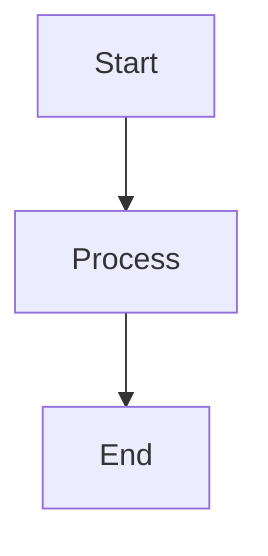
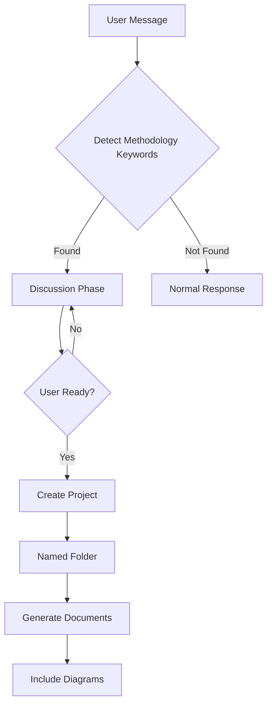
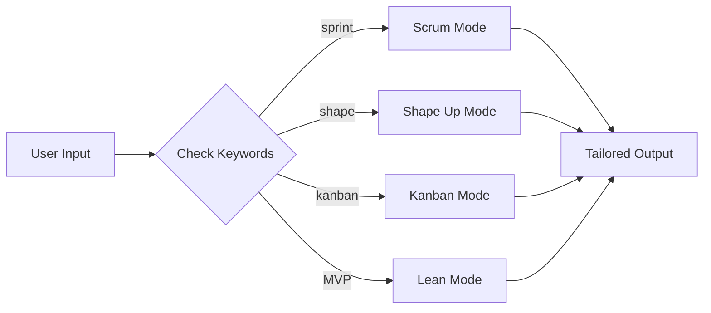
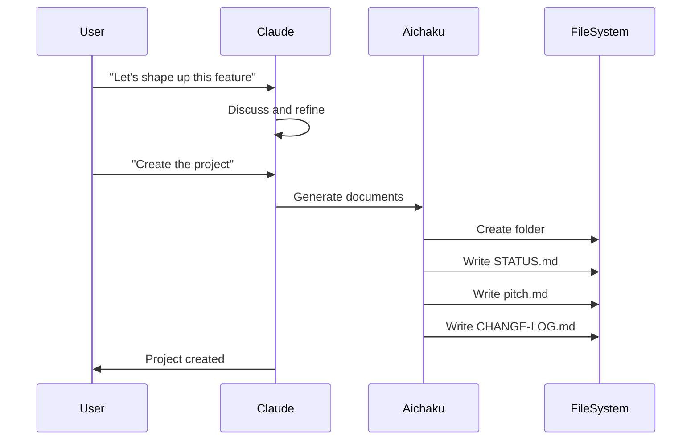
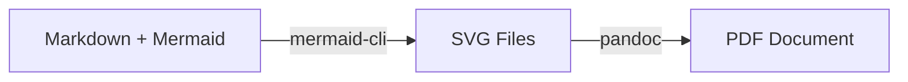
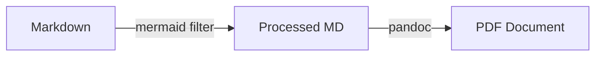
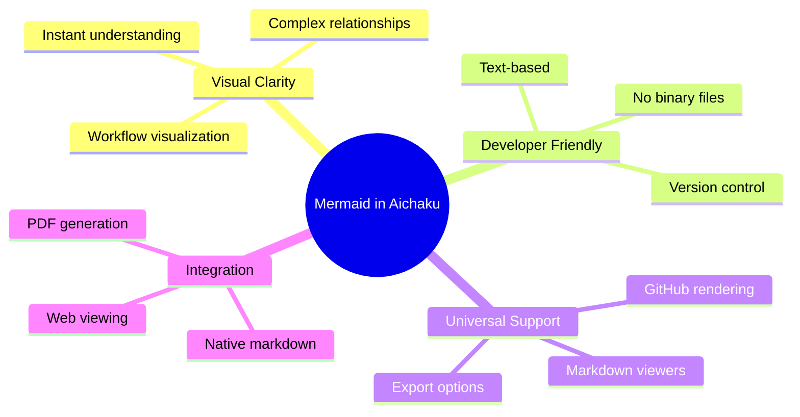
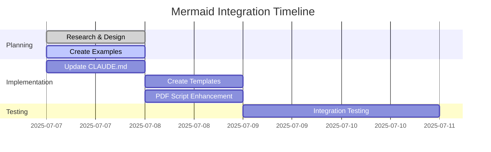

# Mermaid Diagram Examples for Aichaku

## How Mermaid Works

Mermaid diagrams are created using markdown code blocks with the `mermaid` language identifier:

````markdown

````

## Aichaku Workflow Visualization

### Overall Aichaku Flow


### Methodology Detection


### Document Generation Pipeline


## PDF Generation Approaches

### Option 1: Pre-rendered SVG


### Option 2: Inline Processing


## Benefits Visualization


## Implementation Status


## Notes on PDF Generation

The key challenge is that Mermaid blocks need to be converted to images for PDF. Here's a working approach:

```bash
# Install mermaid CLI
npm install -g @mermaid-js/mermaid-cli

# Convert mermaid blocks to SVG
mmdc -i document.md -o document-with-svg.md

# Generate PDF with pandoc
pandoc document-with-svg.md -o document.pdf
```

For Aichaku integration, we could:
1. Add this to the existing PDF generation script
2. Make it optional (only if mermaid blocks detected)
3. Cache rendered diagrams for performance