# Installer Upgrade Fix

## Project Status
**Started**: 2025-07-08
**Type**: Bug Fix / Enhancement
**Methodology**: Shape Up (Small Batch)
**Status**: Shaping Complete → Implementation

```mermaid
graph LR
    A[🌱 Shaping] --> B[🌿 Implementation]
    B --> C[🌳 Testing]
    C --> D[🍃 Complete]
    style A fill:#90EE90
```

## Problem Summary
The `init.ts` installer fails to upgrade Aichaku despite showing success messages. Users must manually intervene, defeating the purpose of automation.

## Solution Approach
1. Fix version specification in install command
2. Add cache busting with --reload flag
3. Verify installation actually worked
4. Provide clear recovery steps on failure

## Progress
- [x] Identify root causes
- [x] Shape solution
- [x] Create analysis documents
- [x] Update init.ts with fixes
- [ ] Test upgrade scenarios
- [ ] Commit and push changes
- [ ] Update GitHub Pages
- [ ] Document changes

## Key Issues Found
1. **No version pinning** - Deno uses cached old version
2. **No verification** - Reports success without checking
3. **Confusing errors** - Suggests commands that will fail
4. **No cache clearing** - --force doesn't clear module cache

## Implementation Checklist
- [x] Add version to JSR URL: `jsr:@rick/aichaku@${version}/cli`
- [x] Add --reload flag for upgrades
- [x] Implement installation verification
- [x] Enhance error messages with recovery steps
- [ ] Test fresh install scenario
- [ ] Test upgrade scenario
- [ ] Test already-latest scenario
- [x] Update init.ts on main branch
- [ ] Ensure GitHub Pages serves updated version

## Files
- `pitch.md` - Problem and solution overview
- `init-installer-analysis.md` - Detailed technical analysis
- `init-fixed.ts` - Fixed version of installer
- `init-fix-comparison.md` - Before/after comparison