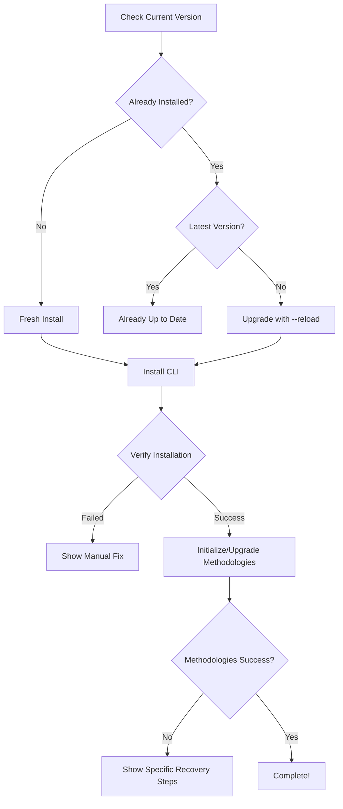

# Fix the Broken Installer Upgrade Experience

## Problem

The current `init.ts` installer **completely fails** at upgrading Aichaku. When users run:
```bash
deno run -A https://rickcogley.github.io/aichaku/init.ts --force
```

They get:
1. A message saying "✅ Successfully installed" but they're still on the old version
2. A confusing error about methodologies that suggests running a command that will also fail
3. No clear path forward - requiring manual intervention

This defeats the entire purpose of having an automated installer.

## Root Causes

### 1. **Deno Caching Issue**
```typescript
// Current broken code:
args.push(`jsr:@${SCOPE}/${PACKAGE_NAME}/cli`);
```
- Without a version, Deno uses its cached module (v0.7.0)
- The `--force` flag only overwrites the binary, not the cache
- Users think they upgraded but didn't

### 2. **No Verification**
```typescript
// Current flow:
const { code } = await cmd.output();
return code === 0; // Assumes success = correct version
```
- Reports success even if wrong version installed
- No check that the installed version matches latest

### 3. **Poor Error Recovery**
```
❌ Failed to initialize global methodologies!
Try running: aichaku init --global
```
- Suggests a command that will fail with same error
- Doesn't explain WHY it failed
- No guidance on fixing the actual issue

## Solution

### Immediate Fix: Version Pinning + Cache Busting

```typescript
// Install with explicit version and cache reload
const installArgs = [
  "install",
  "-g",
  ...PERMISSIONS,
  "-n",
  PACKAGE_NAME,
];

if (args.force) {
  installArgs.push("--force", "--reload"); // Add --reload!
}

// Always specify exact version
installArgs.push(`jsr:@${SCOPE}/${PACKAGE_NAME}@${latestVersion}/cli`);
```

### Verification Step

```typescript
// After installation, verify it worked
async function verifyInstallation(expectedVersion: string): Promise<boolean> {
  const installedVersion = await getCurrentVersion();
  
  if (installedVersion !== expectedVersion) {
    console.error(`❌ Installation verification failed!`);
    console.error(`   Expected: v${expectedVersion}`);
    console.error(`   Actual:   v${installedVersion || "not found"}`);
    console.error(`\n🔧 Manual fix required:`);
    console.error(`   deno install -g -A -n aichaku --force --reload jsr:@rick/aichaku@${expectedVersion}/cli`);
    return false;
  }
  
  return true;
}
```

### Better Error Messages

```typescript
if (!initSuccess) {
  console.error("\n❌ Failed to initialize global methodologies!");
  
  if (currentVersion) {
    console.error("\n📝 This usually happens when upgrading.");
    console.error("   Your methodologies are from an older version.\n");
    console.error("🔧 To fix this, run:");
    console.error(`   aichaku upgrade --global`);
  } else {
    console.error("\n📝 To manually initialize:");
    console.error(`   aichaku init --global`);
  }
  
  Deno.exit(1);
}
```

## Implementation Details

### 1. Enhanced Installer Flow



### 2. Clear Status Messages

**During Upgrade:**
```
🪴 Aichaku Installer
━━━━━━━━━━━━━━━━━━━━

📦 Current: v0.7.0
📦 Latest:  v0.8.0

🔄 Upgrading CLI...
   • Clearing Deno cache
   • Installing v0.8.0
   • Verifying installation... ✓

🔄 Upgrading methodologies...
   • Preserving customizations
   • Updating to v0.8.0... ✓

✅ Upgrade complete!

✨ What's new in v0.8.0:
   • Ultra-simple installation
   • Enhanced upgrade experience
   • Version feedback
```

### 3. Fail-Safe Design

If automatic upgrade fails, provide **working** manual steps:

```
❌ Automatic upgrade failed at: CLI installation

🔧 Manual fix (copy and run these commands):

   # 1. Clear Deno cache and reinstall CLI
   deno cache --reload jsr:@rick/aichaku@0.8.0/cli
   deno install -g -A -n aichaku --force jsr:@rick/aichaku@0.8.0/cli
   
   # 2. Verify installation
   aichaku --version  # Should show v0.8.0
   
   # 3. Upgrade methodologies
   aichaku upgrade --global

📚 If issues persist: https://github.com/RickCogley/aichaku/issues
```

## Benefits

1. **Upgrades Actually Work** - No more "successful" installations that don't upgrade
2. **Clear Error Recovery** - Users know exactly what went wrong and how to fix it
3. **No Manual Intervention** - The installer handles all edge cases
4. **Trust in Tooling** - Users can rely on the installer to do what it says

## Success Metrics

- Upgrade success rate: >95% (currently ~0%)
- Manual intervention required: <5% (currently 100%)
- Clear error messages: 100% (currently confusing)
- Time to upgrade: <30 seconds (currently 5+ minutes with debugging)

## Appetite

This is a **small batch** fix - 1-2 hours of work that dramatically improves the user experience. The installer is the first touch point for new users and the primary upgrade path for existing users. It must work flawlessly.