# Shape Up Pitch: Aichaku Enhancement Suite

## Problem

Aichaku currently provides excellent methodology support but lacks several modern capabilities that would significantly improve the developer experience:

1. **No Claude Code Hooks Integration**: The new hooks feature in Claude Code could automate many Aichaku workflows, but we're not leveraging it
2. **Limited Prompt Engineering**: Documentation generation could be improved with role-based perspectives
3. **Single-Purpose Guidance**: Only methodologies are supported; teams need OWASP, 12-factor, ISO 27001, and custom standards
4. **Hidden Security Workflows**: Valuable security documentation exists but isn't discoverable or integrated

Users are manually enforcing methodology rules, missing opportunities for automation, and not benefiting from role-based documentation improvements.

## Appetite

**2 weeks** - This is a focused enhancement that builds on existing architecture without fundamental changes.

## Solution

We'll create four interconnected features that work together to enhance Aichaku:

### 1. Claude Code Hooks Integration


**New Command**: `aichaku hooks`
- Install pre-configured hook templates
- Categories: basic, advanced, security, custom
- Automatic methodology enforcement
- Zero-friction integration

**Example Hook**:
```json
{
  "PreToolUse": [{
    "name": "Aichaku Path Validator",
    "matcher": "Write",
    "command": "aichaku validate-path '${TOOL_INPUT_FILE_PATH}'"
  }]
}
```

### 2. Lightweight Role System

```mermaid
graph LR
    A[Context Detection] --> B{Active Role}
    B -->|Planning| C[🎯 Shaper]
    B -->|Building| D[🔨 Builder]
    B -->|Review| E[📊 Reviewer]
    
    F[Keywords] --> G{Perspective}
    G -->|User needs| H[👤 Customer]
    G -->|Technical| I[⚙️ Technical]
    G -->|Business| J[💼 Business]
```



**Implementation**:
- Role definitions in `.claude/methodologies/roles/`
- Automatic role selection based on mode/context
- Enhanced prompts for better documentation
- No complex personas or hierarchies

### 3. Modular Guidance Sections


**New Architecture**:
```
.claude/
├── methodologies/     # Existing
├── standards/         # New
│   ├── owasp/
│   ├── 12-factor/
│   └── iso-27001/
├── hooks/            # New
│   └── templates/
└── user/
    ├── standards/    # Custom
    └── hooks/        # Custom
```

**CLI Enhancement**:
```bash
aichaku integrate --sections=methodology,security,standards
```

### 4. SECURITY_WORKFLOWS.md Integration

Move from `.github/` to `.claude/methodologies/security/` and make it:
- Discoverable via `aichaku help security`
- Part of the security guidance section
- Installable as security-focused hooks
- Referenced in main documentation

## Rabbit Holes

1. **Over-engineering roles**: Keep it simple - 3 work modes, 3 perspectives max
2. **Hook complexity**: Hooks should be simple shell commands, not complex scripts
3. **Breaking changes**: Must maintain backward compatibility with existing CLAUDE.md files
4. **Runtime modifications**: Aichaku won't modify prompts in real-time, only through documentation
5. **External dependencies**: Don't add requirements for hook functionality

## No-gos

1. **Dynamic prompt injection**: All prompt engineering through static documentation
2. **Complex role hierarchies**: No inheritance, no nested roles, no role conflicts
3. **Mandatory sections**: All guidance sections remain optional
4. **Network operations**: No fetching external standards or templates
5. **Hook requirements**: Hooks are optional enhancements, not required

## Nice-to-haves

If time permits:
- Hook validation command (`aichaku hooks --validate`)
- Auto-detection of applicable standards (e.g., detect Node.js → suggest 12-factor)
- Visual role indicators in Claude's responses
- Hook performance metrics
- Template gallery for common team patterns

## User Experience

### Before (Current State)
```
You: Let's create a sprint plan
Claude: [Creates files wherever]
You: [Manually moves files, updates status, checks guidelines]
```

### After (With Enhancements)
```
You: Let's create a sprint plan
Claude: 🪴 Aichaku: Creating project: sprint-planning
[Hooks validate path, enforce structure]
[Role system enhances documentation quality]
[Status auto-updates]
[Security guidelines checked automatically]
```

## Success Metrics

1. **Adoption**: 80% of users install at least basic hooks
2. **Automation**: 90% reduction in manual status updates
3. **Quality**: Measurable improvement in documentation consistency
4. **Discoverability**: Users find and use security/standards guidance
5. **Satisfaction**: Positive feedback on reduced friction

## Implementation Order

1. **Week 1**:
   - Design and implement hook templates
   - Create `aichaku hooks` command
   - Test basic hook integration
   - Move SECURITY_WORKFLOWS.md

2. **Week 2**:
   - Implement role system
   - Create modular guidance sections
   - Update `aichaku integrate` command
   - Documentation and examples

## Technical Notes

- Leverage existing marker system for modular sections
- Use existing `.claude/user/` structure for customization
- Build on current file organization patterns
- Maintain zero-dependency philosophy
- Keep all features optional and backward compatible