# MCP Code Reviewer Implementation - Status

🪴 Aichaku: Building Automated Security & Standards Review

[**Planning**] → [Building] → [Testing] → [Integration] → [Complete]
    ▲

## Project Overview

Implementing the Model Context Protocol (MCP) server for automated code review based on Aichaku methodologies and standards.

## Current Status 🌱

```mermaid
graph LR
    A[🌱 Started] --> B[🌿 Active]
    B --> C[🌳 Review]
    C --> D[🍃 Complete]
    style A fill:#90EE90
```

## Architecture

```mermaid
graph TB
    subgraph "Aichaku MCP Server"
        API[MCP API Handler]
        RE[Review Engine]
        SM[Standards Manager]
        MM[Methodology Manager]
        SC[Scanner Controller]
        FB[Feedback Builder]
    end
    
    subgraph "External Tools"
        CQL[CodeQL ❓]
        DS[DevSkim ❓]
        SG[Semgrep ❓]
    end
    
    subgraph "Claude Code"
        CC[Claude Client]
        HOOKS[Aichaku Hooks]
    end
    
    CC -->|Review Request| API
    HOOKS -->|Auto Trigger| API
    API --> RE
    RE --> SM
    RE --> MM
    RE --> SC
    SC -.->|If Available| CQL
    SC -.->|If Available| DS
    SC -.->|If Available| SG
    RE --> FB
    FB -->|Educational Feedback| CC
```

## Progress Tracking

- [x] Review MCP design documents
- [ ] Create MCP server project structure
- [ ] Implement core MCP server
- [ ] Add methodology checking
- [ ] Add standards checking
- [ ] Implement educational feedback
- [ ] Create security tool integration
- [ ] Build distribution mechanism
- [ ] Add MCP commands to Aichaku
- [ ] Create documentation
- [ ] Test with Claude Code

## Key Decisions

1. **TypeScript + Deno**: For consistency with Aichaku
2. **Local-Only**: Privacy-first, no cloud dependencies
3. **Educational Focus**: Teach, don't just criticize
4. **Progressive Enhancement**: Works without external tools
5. **Methodology-Aware**: Checks against Shape Up, Scrum, etc.

## Implementation Plan

### Phase 1: Core Server (Today)
- Basic MCP protocol implementation
- File reading and analysis
- Simple pattern-based checks

### Phase 2: Standards Integration
- Load Aichaku standards
- Implement OWASP checks
- Add methodology compliance

### Phase 3: Educational Feedback
- Multi-shot examples
- Step-by-step guidance
- Context explanations

### Phase 4: Distribution
- Compile binaries
- GitHub releases
- Integration with Aichaku CLI

## Next Steps

1. Create project structure
2. Implement basic MCP server
3. Add simple security patterns
4. Test with Claude Code