# Software Reference Documentation Analysis - Status

🪴 Aichaku: Project Status Tracking

## Project Overview
Analyzing and categorizing essential types of permanent reference documents for software projects.

## Status

```mermaid
graph LR
    A[🌱 Started] --> B[🌳 Complete]
    style B fill:#90EE90
```

## Progress Summary
✅ **Analysis Complete** - Comprehensive research and categorization of 8 major document types

## Key Deliverables
1. **Architecture Documents** - System design and component relationships
2. **API References** - REST, GraphQL, and CLI documentation patterns  
3. **Data Models and Schemas** - ERDs, data dictionaries, and schema documentation
4. **Security Documentation** - Threat models, policies, and compliance docs
5. **Deployment and Operations Guides** - Runbooks and deployment procedures
6. **Integration Specifications** - External system integration patterns
7. **Protocol/Format Specifications** - Custom protocols and formats
8. **Architecture Decision Records (ADRs)** - Decision tracking and rationale

## Research Sources
- PostgreSQL and Linux kernel documentation examples
- OpenAPI/Swagger best practices
- STRIDE threat modeling methodology
- DevOps runbook patterns
- Database schema documentation standards

## Key Findings
- Each document type serves a specific purpose in the project lifecycle
- Mermaid diagrams are valuable for visualizing architecture, data models, workflows, and state machines
- Living documentation with automation and version control is essential
- Cross-referencing between document types creates a comprehensive knowledge base
- Update frequencies vary from real-time (API docs) to annual (threat models)

## Next Steps
This analysis can be used to:
- Create document templates for each type
- Establish documentation standards for projects
- Build automation tools for documentation generation
- Design documentation review cycles

## Files Created
- `reference-document-analysis.md` - Complete analysis with examples and best practices
- `STATUS.md` - This status tracking document