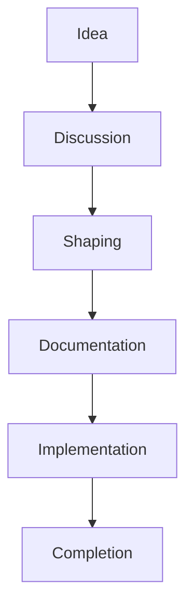
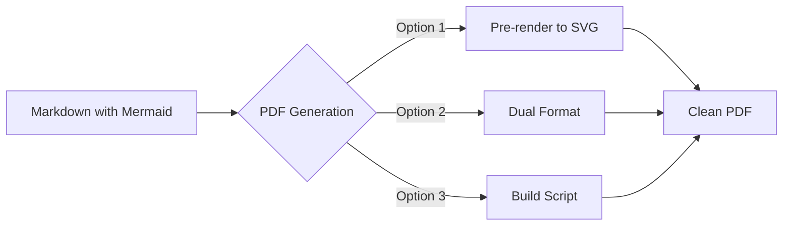

# Mermaid Diagram Integration

## Project Status
**Started**: 2025-07-07
**Type**: Enhancement
**Methodology**: Shape Up
**Status**: Active

## Progress
- [x] Research Mermaid capabilities
- [x] Design integration approach
- [x] Plan PDF generation strategy
- [ ] Create diagram templates
- [ ] Update CLAUDE.md directives
- [ ] Enhance PDF generation script
- [ ] Test with example projects

## Updates
### 2025-07-07T11:38:00Z
- Created project structure
- Researched Mermaid's markdown integration
- Designed three-tier approach:
  1. Standard project diagrams
  2. Methodology-specific diagrams
  3. Custom effort diagrams
- Identified PDF generation solutions

## Diagram Examples

### Project Lifecycle

### PDF Strategy

## Next Steps
1. Create template library for common diagrams
2. Update integrate.ts to include diagram directives
3. Test Mermaid rendering in various contexts
4. Implement PDF generation enhancement