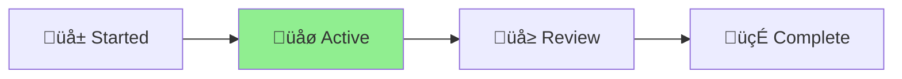

# CLAUDE.md

This file provides guidance to Claude Code (claude.ai/code) when working with
the Aichaku methodology library.

<!-- AICHAKU:START -->

<!-- AICHAKU:METHODOLOGY:START -->
## 🎯 MANDATORY: Aichaku Integration Rules

YOU ARE REQUIRED TO FOLLOW THESE RULES WITHOUT EXCEPTION:

### 1. Discussion-First Document Creation

**Phase 1: DISCUSSION MODE (Default when methodology keywords detected)**
✅ Acknowledge the methodology context: "🪴 Aichaku: I see you're thinking about [topic]"
✅ Ask clarifying questions to understand the goal
✅ Help shape and refine the idea
❌ DO NOT create any project folders yet
❌ DO NOT create any documents yet

**Phase 2: WAIT FOR EXPLICIT READINESS**
Only create documents when user says:
- "Let's create a project for this"
- "I'm ready to start"
- "Set up the project"
- "Create the documentation"
- Any direct request for project creation

**Phase 3: CREATE NAMED PROJECT (After user signals readiness)**
✅ Confirm name: "🪴 Aichaku: Based on our discussion, creating project: [descriptive-name]"
✅ Create ALL documents in: `.claude/output/active-YYYY-MM-DD-{descriptive-name}/`
✅ Create STATUS.md FIRST
✅ Create methodology-specific documents
✅ Read guides from `~/.claude/methodologies/`

**YOU MUST NEVER:**
❌ Create documents in the project root directory
❌ Create documents in .claude/user/ (that's for customizations)
❌ Ask where to put files (always use .claude/output/)
❌ Create folders before user is ready to formalize

### 2. CRITICAL: DISCUSSION FIRST, THEN CREATE WITHOUT ASKING

**During Discussion Phase:**
✅ DO say: "🪴 Aichaku: I understand you're exploring [topic]. Let me help you think through this..."
✅ DO say: "What specific challenges are you looking to address?"
❌ NEVER say: "Would you like me to create documents for this?"

**Once User Signals Readiness:**
❌ NEVER say: "Would you like me to..."
❌ NEVER say: "Shall I create..."
❌ NEVER say: "Should I go ahead and..."
✅ IMMEDIATELY say: "🪴 Aichaku: Creating project: [descriptive-name]"
✅ IMMEDIATELY say: "Setting up Shape Up documentation..."
✅ IMMEDIATELY say: "Generating sprint planning templates..."

**THE RULE:** Discuss and refine FIRST. Once user signals readiness, CREATE IMMEDIATELY without asking. This provides thoughtful structure while respecting user autonomy.

### 3. Methodology Detection & Discussion

When you hear these keywords, ENTER DISCUSSION MODE:

**Planning Keywords** → Will create in `.claude/output/active-*/` (when ready):
- "shape"/"pitch" → Discuss Shape Up approach → Later: pitch.md
- "sprint"/"scrum" → Discuss Scrum planning → Later: sprint-planning.md
- "kanban"/"board" → Discuss Kanban flow → Later: kanban-board.md
- "mvp"/"lean" → Discuss Lean experiments → Later: experiment-plan.md

**Discussion Mode Actions:**
1. Acknowledge: "🪴 Aichaku: I see you're interested in [methodology]"
2. Read the appropriate guide SILENTLY:
   - `~/.claude/methodologies/[methodology]/[METHODOLOGY]-AICHAKU-GUIDE.md`
   - `~/.claude/methodologies/core/[MODE].md`
3. Ask clarifying questions based on the methodology
4. Help refine the approach
5. WAIT for explicit "create project" signal

### 4. Visual Identity & Progress Indicators

**MANDATORY Visual Identity:**
✅ ALWAYS prefix Aichaku messages with: 🪴 Aichaku:
✅ Use growth phase indicators: 🌱 (new) → 🌿 (active) → 🌳 (mature) → 🍃 (complete)
✅ Show current phase in status updates with **bold** text and arrow: [Planning] → [**Executing**] → [Complete]
                                                                                    ▲

**Example Status Display:**
```
🪴 Aichaku: Shape Up Progress
[Shaping] → [**Betting**] → [Building] → [Cool-down]
              ▲
Week 2/6 ████████░░░░░░░░░░░░ 33% 🌿
```

**Methodology Icons:**
- Shape Up: Use 🎯 for betting, 🔨 for building
- Scrum: Use 🏃 for sprints, 📋 for backlog
- Kanban: Use 📍 for cards, 🌊 for flow
- Lean: Use 🧪 for experiments, 📊 for metrics

**NEVER:**
❌ Use garden metaphors in text (no "planting", "growing", "harvesting")
❌ Mix visual indicators (keep consistent within a project)
❌ Overuse emojis (maximum one per concept)

### 5. Mermaid Diagram Integration

**MANDATORY Diagram Creation:**
✅ Include Mermaid diagrams in EVERY project documentation
✅ Add methodology-specific workflow diagrams
✅ Use diagrams to visualize project status

**Required Diagrams by Document:**

**In STATUS.md:**


**In Shape Up pitch.md:**


**In Scrum sprint-planning.md:**


**NEVER:**
❌ Create diagrams without labels
❌ Use complex diagrams when simple ones work
❌ Forget to update diagrams with status changes

### 6. Project Lifecycle Management

**Starting Work:**
1. Create: `.claude/output/active-YYYY-MM-DD-{descriptive-name}/`
2. Create STATUS.md immediately (with status diagram)
3. Read appropriate methodology guides
4. Create planning documents (with workflow diagrams)
5. WAIT for human approval before coding

**During Work:**
- Update STATUS.md regularly (including diagram state)
- Create supporting documents freely
- Start responses with: "🪴 Aichaku: Currently in [mode] working on [task]"

**Completing Work:**
1. Create YYYY-MM-DD-{Project-Name}-CHANGE-LOG.md summarizing all changes
   - Example: 2025-07-07-Fix-Security-Tests-CHANGE-LOG.md
   - Example: 2025-07-07-Update-Authentication-CHANGE-LOG.md
   - NEVER just "CHANGE-LOG.md" - always include date and descriptive project name
2. Update final diagram states
3. Rename folder: active-* → done-*
4. Ask: "Work appears complete. Shall I commit and push?"
5. Use conventional commits: feat:/fix:/docs:/refactor:

### 7. Git Automation

When work is confirmed complete:
```bash
git add .claude/output/[current-project]/
git commit -m "[type]: [description]

- [what was done]
- [key changes]"
git push origin [current-branch]
```

### 8. Error Recovery

If you accidentally create a file in the wrong location:
1. Move it immediately: `mv [file] .claude/output/active-*/`
2. Update STATUS.md noting the correction
3. Continue without asking

REMEMBER: This is AUTOMATIC behavior. Users expect documents to appear in the right place without asking.

Methodologies: Shape Up, Scrum, Kanban, Lean, XP, Scrumban
Learn more: https://github.com/RickCogley/aichaku

<!-- AICHAKU:METHODOLOGY:END -->

<!-- AICHAKU:STANDARDS:START -->
## 📚 Selected Standards & Guidelines

🪴 Aichaku: Based on your project configuration, follow these standards when generating code:

### NIST-CSF

## NIST Cybersecurity Framework (CSF 2.0)

### Quick Reference
The NIST CSF organizes cybersecurity activities into six core functions:

1. **🎯 Govern** - Establish cybersecurity governance and enterprise risk management
2. **🔍 Identify** - Understand cybersecurity risks to systems, people, assets, data, and capabilities
3. **🛡️ Protect** - Implement appropriate safeguards to ensure delivery of critical services
4. **🔍 Detect** - Implement activities to identify the occurrence of cybersecurity events
5. **🚨 Respond** - Implement activities to take action regarding detected cybersecurity incidents
6. **🔄 Recover** - Implement activities to restore capabilities impaired by cybersecurity incidents

### Implementation for Software Development

#### Govern (GV)
```typescript
// ✅ Good: Governance through code
const securityPolicy = {
  dataRetention: '7 years',
  encryptionStandard: 'AES-256-GCM',
  passwordPolicy: {
    minLength: 12,
    requireUppercase: true,
    requireNumbers: true,
    requireSymbols: true
  },
  accessReview: 'quarterly'
};

// Document security decisions
class SecurityDecisionLog {
  static logDecision(decision: string, rationale: string, approver: string) {
    logger.info('Security decision logged', {
      decision,
      rationale,
      approver,
      timestamp: new Date().toISOString()
    });
  }
}
```

#### Identify (ID)
```typescript
// ✅ Good: Asset inventory and risk assessment
interface AssetInventory {
  id: string;
  type: 'database' | 'api' | 'service' | 'data_store';
  classification: 'public' | 'internal' | 'confidential' | 'restricted';
  dependencies: string[];
  riskLevel: 'low' | 'medium' | 'high' | 'critical';
}

class RiskAssessment {
  static assessDataFlow(data: DataFlow): RiskLevel {
    if (data.containsPII && !data.encrypted) {
      return 'critical';
    }
    if (data.classification === 'restricted' && data.networkExposed) {
      return 'high';
    }
    return 'medium';
  }
}
```

#### Protect (PR)
```typescript
// ✅ Good: Implement protection measures
class DataProtection {
  static encryptSensitiveData(data: string): string {
    return crypto.encrypt(data, {
      algorithm: 'AES-256-GCM',
      key: process.env.ENCRYPTION_KEY
    });
  }
  
  static enforceAccessControl(user: User, resource: Resource): boolean {
    return user.permissions.includes(resource.requiredPermission) &&
           user.clearanceLevel >= resource.clearanceLevel;
  }
}

// Implement secure defaults
const secureDefaults = {
  sessionTimeout: 30 * 60 * 1000, // 30 minutes
  maxLoginAttempts: 5,
  passwordExpiry: 90 * 24 * 60 * 60 * 1000, // 90 days
  httpsOnly: true,
  secureCookies: true
};
```

#### Detect (DE)
```typescript
// ✅ Good: Security monitoring and alerting
class SecurityMonitoring {
  static monitorFailedLogins(attempts: LoginAttempt[]) {
    const recentFailures = attempts.filter(
      attempt => !attempt.successful && 
      attempt.timestamp > Date.now() - (5 * 60 * 1000)
    );
    
    if (recentFailures.length > 5) {
      this.alertSecurityTeam('Potential brute force attack', {
        ip: recentFailures[0].ip,
        username: recentFailures[0].username,
        attemptCount: recentFailures.length
      });
    }
  }
  
  static detectAnomalousActivity(userActivity: UserActivity) {
    if (userActivity.dataAccessVolume > userActivity.normalBaseline * 10) {
      this.flagSuspiciousActivity('Unusual data access pattern', userActivity);
    }
  }
}
```

#### Respond (RS)
```typescript
// ✅ Good: Incident response procedures
class IncidentResponse {
  static async containThreat(incident: SecurityIncident) {
    // Immediate containment
    if (incident.severity === 'critical') {
      await this.disableAffectedAccounts(incident.affectedUsers);
      await this.isolateAffectedSystems(incident.affectedSystems);
    }
    
    // Notification
    await this.notifySecurityTeam(incident);
    
    // Documentation
    await this.logIncident(incident);
  }
  
  static async investigateIncident(incident: SecurityIncident) {
    const evidence = await this.collectEvidence(incident);
    const analysis = await this.analyzeEvidence(evidence);
    
    return {
      rootCause: analysis.rootCause,
      impact: analysis.impact,
      recommendations: analysis.recommendations
    };
  }
}
```

#### Recover (RC)
```typescript
// ✅ Good: Recovery and restoration procedures
class RecoveryManager {
  static async restoreFromBackup(system: string, pointInTime: Date) {
    // Validate backup integrity
    const backup = await this.validateBackup(system, pointInTime);
    
    if (!backup.isValid) {
      throw new Error('Backup integrity check failed');
    }
    
    // Restore system
    await this.restoreSystem(system, backup);
    
    // Verify restoration
    await this.verifySystemIntegrity(system);
    
    // Update recovery metrics
    this.updateRecoveryMetrics(system, {
      recoveryTime: Date.now() - incident.detectionTime,
      dataLoss: backup.dataLoss
    });
  }
}
```

### CSF Implementation Tiers

#### Tier 1: Partial
```typescript
// Basic security measures
const basicSecurity = {
  authentication: 'username/password',
  logging: 'error logs only',
  updates: 'manual, irregular'
};
```

#### Tier 2: Risk Informed
```typescript
// Risk-based security decisions
const riskInformedSecurity = {
  authentication: 'multi-factor authentication',
  logging: 'comprehensive audit logging',
  updates: 'regular, risk-prioritized patches',
  riskAssessment: 'annual assessments'
};
```

#### Tier 3: Repeatable
```typescript
// Formal policies and procedures
const repeatableSecurity = {
  policies: 'documented and approved',
  procedures: 'standardized and tested',
  training: 'regular security awareness',
  metrics: 'security KPIs tracked'
};
```

#### Tier 4: Adaptive
```typescript
// Continuous improvement
const adaptiveSecurity = {
  threatIntelligence: 'real-time threat feeds',
  automation: 'automated response to known threats',
  learning: 'lessons learned incorporated',
  innovation: 'proactive security measures'
};
```

### Development Integration

#### Secure Development Lifecycle
```typescript
// Integrate security into development workflow
class SecureSDLC {
  static async preCommitChecks(code: string): Promise<SecurityCheckResult> {
    const results = await Promise.all([
      this.scanForSecrets(code),
      this.performStaticAnalysis(code),
      this.checkDependencyVulnerabilities(),
      this.validateSecurityRequirements(code)
    ]);
    
    return this.consolidateResults(results);
  }
  
  static async deploymentChecks(artifact: DeploymentArtifact): Promise<void> {
    await this.verifySignature(artifact);
    await this.scanForVulnerabilities(artifact);
    await this.validateSecurityConfiguration(artifact);
  }
}
```

#### Security Metrics
```typescript
// Track security metrics
interface SecurityMetrics {
  vulnerabilityCount: number;
  patchingTime: number; // Time to patch vulnerabilities
  incidentResponseTime: number;
  securityTrainingCompletion: number;
  complianceScore: number;
}

class SecurityMetricsCollector {
  static collectMetrics(): SecurityMetrics {
    return {
      vulnerabilityCount: this.countOpenVulnerabilities(),
      patchingTime: this.calculateAveragePatchTime(),
      incidentResponseTime: this.calculateResponseTime(),
      securityTrainingCompletion: this.getTrainingCompletionRate(),
      complianceScore: this.calculateComplianceScore()
    };
  }
}
```

### CSF Profile for Software Development

#### Core Requirements
- **Data Protection**: Encrypt sensitive data at rest and in transit
- **Access Control**: Implement role-based access with least privilege
- **Vulnerability Management**: Regular scanning and patching
- **Incident Response**: Documented procedures and contact information
- **Security Testing**: Integrate security testing into CI/CD pipeline

#### Risk-Based Priorities
1. **High Priority**: Authentication, encryption, input validation
2. **Medium Priority**: Logging, monitoring, backup procedures
3. **Low Priority**: Advanced threat detection, security automation

### Compliance Considerations

#### Documentation Requirements
```typescript
// Maintain compliance documentation
class ComplianceDocumentation {
  static generateSecurityAssessment(): SecurityAssessment {
    return {
      assessmentDate: new Date(),
      scope: this.getSystemScope(),
      findings: this.getSecurityFindings(),
      riskLevel: this.calculateOverallRisk(),
      remediationPlan: this.generateRemediationPlan()
    };
  }
}
```

#### Audit Trail
```typescript
// Maintain comprehensive audit logs
class AuditLogger {
  static logSecurityEvent(event: SecurityEvent) {
    const auditEntry = {
      timestamp: new Date().toISOString(),
      userId: event.userId,
      action: event.action,
      resource: event.resource,
      outcome: event.outcome,
      ipAddress: event.ipAddress,
      userAgent: event.userAgent
    };
    
    this.writeToAuditLog(auditEntry);
  }
}
```

Remember: The NIST CSF is a risk-based approach to cybersecurity. Focus on implementing controls that address your specific risks and business requirements, starting with the most critical assets and highest-risk scenarios.

---

### TDD

## Test-Driven Development (TDD)

### Quick Reference
TDD follows a simple three-step cycle:

1. **🔴 Red** - Write a failing test
2. **🟢 Green** - Write minimal code to make it pass
3. **🔵 Refactor** - Improve the code while keeping tests green

### Core Principles

#### Write Tests First
```typescript
// ✅ Good: Test first approach
describe('UserService', () => {
  it('should create a user with valid data', async () => {
    const userData = { email: 'test@example.com', name: 'Test User' };
    const user = await userService.createUser(userData);
    
    expect(user.id).toBeDefined();
    expect(user.email).toBe('test@example.com');
    expect(user.name).toBe('Test User');
    expect(user.createdAt).toBeInstanceOf(Date);
  });
});

// Then implement the minimal code to pass
class UserService {
  async createUser(userData: UserData): Promise<User> {
    return {
      id: generateId(),
      email: userData.email,
      name: userData.name,
      createdAt: new Date()
    };
  }
}
```

#### Test Behavior, Not Implementation
```typescript
// ✅ Good: Testing behavior
describe('Calculator', () => {
  it('should add two numbers correctly', () => {
    const result = calculator.add(2, 3);
    expect(result).toBe(5);
  });
  
  it('should handle decimal numbers', () => {
    const result = calculator.add(0.1, 0.2);
    expect(result).toBeCloseTo(0.3);
  });
});

// ❌ Bad: Testing implementation details
describe('Calculator', () => {
  it('should call the internal sum method', () => {
    const spy = jest.spyOn(calculator, 'sum');
    calculator.add(2, 3);
    expect(spy).toHaveBeenCalled();
  });
});
```

### The TDD Cycle in Practice

#### 1. Red Phase - Write a Failing Test
```typescript
// Start with a failing test
describe('Order', () => {
  it('should calculate total with tax', () => {
    const order = new Order([
      { price: 100, quantity: 2 },
      { price: 50, quantity: 1 }
    ]);
    
    const total = order.calculateTotal(0.1); // 10% tax
    expect(total).toBe(275); // (200 + 50) * 1.1
  });
});

// This will fail because Order class doesn't exist yet
```

#### 2. Green Phase - Make It Pass
```typescript
// Write minimal code to make the test pass
class Order {
  constructor(private items: OrderItem[]) {}
  
  calculateTotal(taxRate: number): number {
    const subtotal = this.items.reduce(
      (sum, item) => sum + (item.price * item.quantity), 
      0
    );
    return subtotal * (1 + taxRate);
  }
}
```

#### 3. Refactor Phase - Improve the Code
```typescript
// Refactor while keeping tests green
class Order {
  constructor(private items: OrderItem[]) {}
  
  calculateTotal(taxRate: number): number {
    const subtotal = this.calculateSubtotal();
    return this.applyTax(subtotal, taxRate);
  }
  
  private calculateSubtotal(): number {
    return this.items.reduce(
      (sum, item) => sum + (item.price * item.quantity), 
      0
    );
  }
  
  private applyTax(amount: number, rate: number): number {
    return amount * (1 + rate);
  }
}
```

### TDD Best Practices

#### Test Structure (AAA Pattern)
```typescript
describe('UserValidator', () => {
  it('should reject invalid email addresses', () => {
    // Arrange
    const validator = new UserValidator();
    const invalidEmail = 'not-an-email';
    
    // Act
    const result = validator.validateEmail(invalidEmail);
    
    // Assert
    expect(result.isValid).toBe(false);
    expect(result.error).toBe('Invalid email format');
  });
});
```

#### One Assert Per Test
```typescript
// ✅ Good: Single assertion
it('should create user with correct email', () => {
  const user = userService.createUser({ email: 'test@example.com' });
  expect(user.email).toBe('test@example.com');
});

it('should create user with generated ID', () => {
  const user = userService.createUser({ email: 'test@example.com' });
  expect(user.id).toBeDefined();
});

// ❌ Bad: Multiple assertions
it('should create user correctly', () => {
  const user = userService.createUser({ email: 'test@example.com' });
  expect(user.email).toBe('test@example.com');
  expect(user.id).toBeDefined();
  expect(user.createdAt).toBeInstanceOf(Date);
});
```

#### Test Naming Convention
```typescript
// ✅ Good: Descriptive test names
describe('EmailService', () => {
  describe('sendEmail', () => {
    it('should send email successfully with valid data', () => {});
    it('should throw error when recipient is invalid', () => {});
    it('should retry sending on temporary failure', () => {});
  });
});
```

### Testing Different Scenarios

#### Happy Path Testing
```typescript
it('should successfully process valid order', async () => {
  const order = createValidOrder();
  const result = await orderService.processOrder(order);
  
  expect(result.status).toBe('processed');
  expect(result.orderId).toBeDefined();
});
```

#### Edge Cases
```typescript
it('should handle empty order', async () => {
  const emptyOrder = new Order([]);
  const result = await orderService.processOrder(emptyOrder);
  
  expect(result.status).toBe('error');
  expect(result.error).toBe('Order cannot be empty');
});

it('should handle extremely large orders', async () => {
  const largeOrder = createOrderWithItems(10000);
  const result = await orderService.processOrder(largeOrder);
  
  expect(result.status).toBe('processed');
});
```

#### Error Conditions
```typescript
it('should handle payment failure gracefully', async () => {
  const order = createValidOrder();
  mockPaymentService.processPayment.mockRejectedValue(new PaymentError('Card declined'));
  
  const result = await orderService.processOrder(order);
  
  expect(result.status).toBe('payment_failed');
  expect(result.error).toBe('Payment processing failed');
});
```

### Mocking and Test Doubles

#### Dependency Injection for Testability
```typescript
// ✅ Good: Injectable dependencies
class OrderService {
  constructor(
    private paymentService: PaymentService,
    private inventoryService: InventoryService,
    private emailService: EmailService
  ) {}
  
  async processOrder(order: Order): Promise<OrderResult> {
    // Implementation
  }
}

// Test with mocks
describe('OrderService', () => {
  let orderService: OrderService;
  let mockPaymentService: jest.Mocked<PaymentService>;
  
  beforeEach(() => {
    mockPaymentService = {
      processPayment: jest.fn()
    };
    
    orderService = new OrderService(
      mockPaymentService,
      mockInventoryService,
      mockEmailService
    );
  });
});
```

### TDD Benefits

1. **Better Design** - Forces you to think about interfaces first
2. **Faster Feedback** - Catch issues immediately
3. **Higher Confidence** - Comprehensive test coverage
4. **Refactoring Safety** - Tests catch regressions
5. **Documentation** - Tests serve as living documentation
6. **Reduced Debugging** - Failures are caught early

### Common TDD Antipatterns

#### Testing Implementation Details
```typescript
// ❌ Bad: Testing private methods
it('should call private validation method', () => {
  const spy = jest.spyOn(service, 'validateInternal');
  service.process(data);
  expect(spy).toHaveBeenCalled();
});
```

#### Writing Tests After Code
```typescript
// ❌ Bad: Tests written after implementation
// This often results in tests that just confirm what the code does,
// not what it should do
```

#### Over-Mocking
```typescript
// ❌ Bad: Mocking everything
it('should process order', () => {
  const mockOrder = { id: 1 };
  const mockResult = { status: 'success' };
  
  jest.spyOn(orderService, 'processOrder').mockResolvedValue(mockResult);
  
  const result = orderService.processOrder(mockOrder);
  expect(result).resolves.toBe(mockResult);
  // This test doesn't verify any real behavior
});
```

### Integration with CI/CD

```typescript
// package.json
{
  "scripts": {
    "test": "jest",
    "test:watch": "jest --watch",
    "test:coverage": "jest --coverage",
    "test:ci": "jest --ci --coverage --watchAll=false"
  }
}
```

Remember: TDD is not just about testing - it's a design methodology that leads to better, more maintainable code through the discipline of writing tests first.

---

### TEST-PYRAMID

Standard content not found. Please ensure the standard is properly installed.

---

### SOLID

Standard content not found. Please ensure the standard is properly installed.

---

### CONVENTIONAL-COMMITS

Standard content not found. Please ensure the standard is properly installed.

---


<!-- AICHAKU:STANDARDS:END -->

<!-- AICHAKU:END -->

## Security & Compliance Standards

Following the security-first approach established in
[Salty](https://github.com/eSolia/salty.esolia.pro) and
[Nagare](https://github.com/rick-cogley/nagare), Aichaku maintains strict
security standards adapted for a methodology support library.

### OWASP Top 10 Compliance for Methodology Libraries

While Aichaku doesn't handle cryptographic operations or release management,
security principles still apply:

#### A01 - Broken Access Control ✅

- **File System Safety**: Validate all paths for output generation
- **Directory Traversal Prevention**: Use absolute paths with validation
- **Principle of Least Privilege**: Only write to designated output directories

#### A02 - Cryptographic Failures ✅

- **No Secrets in Code**: Never store API keys or tokens in methodology files
- **Secure Examples**: When providing examples, use placeholder values
- **Environment Variables**: Document secure practices in templates

#### A03 - Injection ✅

- **Template Safety**: Sanitize all user inputs in generated documents
- **Command Injection Prevention**: Never execute user-provided commands
- **Path Sanitization**: Validate file names and paths rigorously

#### A04 - Insecure Design ✅

- **Separation of Concerns**: Methodologies separate from implementation
- **Fail-Safe Defaults**: Conservative file permissions on generated output
- **Minimal Attack Surface**: No network operations, no external dependencies

#### A05 - Security Misconfiguration ✅

- **Secure Defaults**: Generated files with appropriate permissions
- **Error Handling**: No sensitive information in error messages
- **Documentation**: Clear security guidelines in all templates

#### A06 - Vulnerable Components ✅

- **Zero Dependencies**: Pure Deno implementation
- **No npm Packages**: Reduced supply chain risks
- **Version Pinning**: Lock Deno standard library versions

#### A07 - Authentication Failures ✅

- **No Authentication Required**: Design eliminates auth vulnerabilities
- **Stateless Operation**: No session management needed
- **Local-Only**: No network authentication risks

#### A08 - Software/Data Integrity ✅

- **Version Tracking**: Clear version information in generated files
- **No Auto-Updates**: Static installation prevents injection
- **Checksum Validation**: Verify file integrity when needed

#### A09 - Logging/Monitoring ✅

- **Activity Tracking**: Log methodology usage without sensitive data
- **No Personal Information**: Never log user details or project specifics
- **Audit Trail**: Clear history in output directories

#### A10 - SSRF ✅

- **No Network Operations**: Completely offline operation
- **No External Resources**: All templates bundled
- **No URL Processing**: Eliminates SSRF risks entirely

### Security Principles as Rules

Following Salty's security-first approach:

1. **Never Trust User Input**: Validate all paths, names, and content
2. **Fail Securely**: Invalid operations should fail safely with clear messages
3. **Minimize Privileges**: Only request necessary file system permissions
4. **Defense in Depth**: Multiple validation layers for file operations
5. **Secure by Default**: Conservative settings out of the box
6. **No Sensitive Data**: Never store or log personal/project information

## Initial Setup

### Development Setup

```bash
# Clone repository
git clone https://github.com/RickCogley/aichaku.git
cd aichaku

# IMPORTANT: Setup git hooks for automatic formatting
git config core.hooksPath .githooks
```

This ensures all commits are properly formatted, preventing CI failures.

### Installation

```bash
# Install globally from JSR
deno install -A -n aichaku jsr:@rick/aichaku

# Or add to import map
{
  "imports": {
    "@aichaku/aichaku": "jsr:@rick/aichaku@^1.0.0"
  }
}
```

### Directory Structure

```
.claude/
├── methodologies/      # Core methodology files (from Aichaku)
├── output/            # Your generated documents
│   ├── active-*/      # Current projects
│   └── done-*/        # Completed projects
├── commands.json      # Quick access commands
└── scripts/           # Helper scripts (PDF generation, etc.)
```

## Development Commands

### Core Tasks

```bash
# Development
deno task dev           # Run with watch mode
deno task test          # Run all tests
deno task test:watch    # Run tests in watch mode

# Code Quality
deno task fmt           # Format code
deno task lint          # Run linter
deno task check         # Type check all TypeScript files
deno task preflight     # Run all checks before commit

# Release Management (using Nagare)
deno task release:patch # Patch release (1.0.0 -> 1.0.1)
deno task release:minor # Minor release (1.0.0 -> 1.1.0)
deno task release:major # Major release (1.0.0 -> 2.0.0)
```

### Non-Interactive Releases

Always use `--skip-confirmation` for automation:

```bash
deno task release:patch -- --skip-confirmation
deno task release:minor -- --skip-confirmation
deno task release:major -- --skip-confirmation
```

## Architecture Overview

### Core Design Principles

1. **Simplicity First**: 3 modes instead of complex personas
2. **Natural Language**: Detection based on user intent
3. **Methodology Agnostic**: Support multiple approaches equally
4. **Zero Configuration**: Works out of the box
5. **Security by Design**: Safe file operations only

### Mode System

```
User Input → Context Detection → Mode Selection → Methodology Rules → Output
```

- **PLANNING MODE**: When starting something new
- **EXECUTION MODE**: When actively working
- **IMPROVEMENT MODE**: When reflecting and optimizing

### File Organization

Following Nagare's convention:

- **Root Directory**: Entry points and configuration
  - `cli.ts` - Command line interface
  - `mod.ts` - Library exports
  - `deno.json` - Configuration
  - `version.ts` - Auto-generated by Nagare

- **/methodologies**: Core methodology rules
  - `/core` - Universal mode definitions
  - `/[methodology]` - Specific methodology rules

- **/scripts**: Development tools (not distributed)
  - Helper utilities
  - Build scripts

## Programming Paradigm

Following the hybrid approach established in Salty and Nagare:

### Functional Core

- Pure functions for rule processing
- Immutable methodology definitions
- Predictable transformations

### Object-Oriented Shell

- CLI handling with classes
- File operations encapsulation
- Clear interfaces

### TypeScript Requirements

- **NO `any` types**: Full type safety required
- **Strict mode**: All strict checks enabled
- **Explicit types**: No implicit any
- **Type imports**: Use proper imports from types.ts

## Critical Development Notes

1. **Security First**: Every file operation must be validated
2. **Path Safety**: Always use absolute paths with validation
3. **Error Messages**: Generic messages, no path disclosure
4. **No Network**: This library should never make network requests
5. **Testing**: Security tests for all file operations
6. **Documentation**: Update README.md after changes
7. **Attribution**: Don't add "Generated with Claude Code" to commits
8. **Conventional Commits**: Use clear, descriptive commit messages with InfoSec
   notes when applicable:
   ```
   feat: add path validation to output generation

   InfoSec: Prevents directory traversal attacks in file generation
   ```

## Security Testing

Run security-focused tests:

```bash
# Test path validation
deno test --allow-read --allow-write tests/security/

# Test input sanitization
deno test tests/validation/

# Full security suite
deno task test:security
```

## Common Issues and Solutions

### Issue: Output directory not created

**Solution**: Aichaku creates directories as needed, ensure write permissions

### Issue: Methodology not detected

**Solution**: Use clear keywords like "sprint", "cycle", "kanban board"

### Issue: PDF generation fails

**Solution**: Ensure pandoc is installed: `brew install pandoc`

## InfoSec Considerations

When modifying Aichaku:

1. **File Operations**: Validate all paths against traversal attacks
2. **Template Processing**: Sanitize user inputs in templates
3. **Error Handling**: Never expose system paths in errors
4. **Generated Content**: Set appropriate file permissions
5. **Documentation**: No sensitive examples in docs

## Contribution Guidelines

1. Read this CLAUDE.md thoroughly
2. Follow security principles from Salty's SECURITY.md
3. Use Nagare's commit conventions
4. Add tests for security-relevant changes
5. Update documentation accordingly

---

**Security Contact**: Report issues via GitHub Issues with [SECURITY] tag
