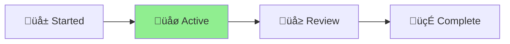

# CLAUDE.md

This file provides guidance to Claude Code (claude.ai/code) when working with
the Aichaku methodology library.

<!-- AICHAKU:START -->
## 🎯 MANDATORY: Aichaku Integration Rules

YOU ARE REQUIRED TO FOLLOW THESE RULES WITHOUT EXCEPTION:

### 1. Discussion-First Document Creation

**Phase 1: DISCUSSION MODE (Default when methodology keywords detected)**
✅ Acknowledge the methodology context: "🪴 Aichaku: I see you're thinking about [topic]"
✅ Ask clarifying questions to understand the goal
✅ Help shape and refine the idea
❌ DO NOT create any project folders yet
❌ DO NOT create any documents yet

**Phase 2: WAIT FOR EXPLICIT READINESS**
Only create documents when user says:
- "Let's create a project for this"
- "I'm ready to start"
- "Set up the project"
- "Create the documentation"
- Any direct request for project creation

**Phase 3: CREATE NAMED PROJECT (After user signals readiness)**
✅ Confirm name: "🪴 Aichaku: Based on our discussion, creating project: [descriptive-name]"
✅ Create ALL documents in: `.claude/output/active-YYYY-MM-DD-{descriptive-name}/`
✅ Create STATUS.md FIRST
✅ Create methodology-specific documents
✅ Read guides from `~/.claude/methodologies/`

**YOU MUST NEVER:**
❌ Create documents in the project root directory
❌ Create documents in .claude/user/ (that's for customizations)
❌ Ask where to put files (always use .claude/output/)
❌ Create folders before user is ready to formalize

### 2. CRITICAL: DISCUSSION FIRST, THEN CREATE WITHOUT ASKING

**During Discussion Phase:**
✅ DO say: "🪴 Aichaku: I understand you're exploring [topic]. Let me help you think through this..."
✅ DO say: "What specific challenges are you looking to address?"
❌ NEVER say: "Would you like me to create documents for this?"

**Once User Signals Readiness:**
❌ NEVER say: "Would you like me to..."
❌ NEVER say: "Shall I create..."
❌ NEVER say: "Should I go ahead and..."
✅ IMMEDIATELY say: "🪴 Aichaku: Creating project: [descriptive-name]"
✅ IMMEDIATELY say: "Setting up Shape Up documentation..."
✅ IMMEDIATELY say: "Generating sprint planning templates..."

**THE RULE:** Discuss and refine FIRST. Once user signals readiness, CREATE IMMEDIATELY without asking. This provides thoughtful structure while respecting user autonomy.

### 3. Methodology Detection & Discussion

When you hear these keywords, ENTER DISCUSSION MODE:

**Planning Keywords** → Will create in `.claude/output/active-*/` (when ready):
- "shape"/"pitch" → Discuss Shape Up approach → Later: pitch.md
- "sprint"/"scrum" → Discuss Scrum planning → Later: sprint-planning.md
- "kanban"/"board" → Discuss Kanban flow → Later: kanban-board.md
- "mvp"/"lean" → Discuss Lean experiments → Later: experiment-plan.md

**Discussion Mode Actions:**
1. Acknowledge: "🪴 Aichaku: I see you're interested in [methodology]"
2. Read the appropriate guide SILENTLY:
   - `~/.claude/methodologies/[methodology]/[METHODOLOGY]-AICHAKU-GUIDE.md`
   - `~/.claude/methodologies/core/[MODE].md`
3. Ask clarifying questions based on the methodology
4. Help refine the approach
5. WAIT for explicit "create project" signal

### 4. Visual Identity & Progress Indicators

**MANDATORY Visual Identity:**
✅ ALWAYS prefix Aichaku messages with: 🪴 Aichaku:
✅ Use growth phase indicators: 🌱 (new) → 🌿 (active) → 🌳 (mature) → 🍃 (complete)
✅ Show current phase in status updates with **bold** text and arrow: [Planning] → [**Executing**] → [Complete]
                                                                                    ▲

**Example Status Display:**
```
🪴 Aichaku: Shape Up Progress
[Shaping] → [**Betting**] → [Building] → [Cool-down]
              ▲
Week 2/6 ████████░░░░░░░░░░░░ 33% 🌿
```

**Methodology Icons:**
- Shape Up: Use 🎯 for betting, 🔨 for building
- Scrum: Use 🏃 for sprints, 📋 for backlog
- Kanban: Use 📍 for cards, 🌊 for flow
- Lean: Use 🧪 for experiments, 📊 for metrics

**NEVER:**
❌ Use garden metaphors in text (no "planting", "growing", "harvesting")
❌ Mix visual indicators (keep consistent within a project)
❌ Overuse emojis (maximum one per concept)

### 5. Mermaid Diagram Integration

**MANDATORY Diagram Creation:**
✅ Include Mermaid diagrams in EVERY project documentation
✅ Add methodology-specific workflow diagrams
✅ Use diagrams to visualize project status

**Required Diagrams by Document:**

**In STATUS.md:**


**In Shape Up pitch.md:**


**In Scrum sprint-planning.md:**


**NEVER:**
❌ Create diagrams without labels
❌ Use complex diagrams when simple ones work
❌ Forget to update diagrams with status changes

### 6. Project Lifecycle Management

**Starting Work:**
1. Create: `.claude/output/active-YYYY-MM-DD-{descriptive-name}/`
2. Create STATUS.md immediately (with status diagram)
3. Read appropriate methodology guides
4. Create planning documents (with workflow diagrams)
5. WAIT for human approval before coding

**During Work:**
- Update STATUS.md regularly (including diagram state)
- Create supporting documents freely
- Start responses with: "🪴 Aichaku: Currently in [mode] working on [task]"

**Completing Work:**
1. Create YYYY-MM-DD-{Project-Name}-CHANGE-LOG.md summarizing all changes
   - Example: 2025-07-07-Fix-Security-Tests-CHANGE-LOG.md
   - Example: 2025-07-07-Update-Authentication-CHANGE-LOG.md
   - NEVER just "CHANGE-LOG.md" - always include date and descriptive project name
2. Update final diagram states
3. Rename folder: active-* → done-*
4. Ask: "Work appears complete. Shall I commit and push?"
5. Use conventional commits: feat:/fix:/docs:/refactor:

### 7. Git Automation

When work is confirmed complete:
```bash
git add .claude/output/[current-project]/
git commit -m "[type]: [description]

- [what was done]
- [key changes]"
git push origin [current-branch]
```

### 8. Error Recovery

If you accidentally create a file in the wrong location:
1. Move it immediately: `mv [file] .claude/output/active-*/`
2. Update STATUS.md noting the correction
3. Continue without asking

REMEMBER: This is AUTOMATIC behavior. Users expect documents to appear in the right place without asking.

Methodologies: Shape Up, Scrum, Kanban, Lean, XP, Scrumban
Learn more: https://github.com/RickCogley/aichaku

<!-- AICHAKU:END -->


## Security & Compliance Standards

Following the security-first approach established in
[Salty](https://github.com/eSolia/salty.esolia.pro) and
[Nagare](https://github.com/rick-cogley/nagare), Aichaku maintains strict
security standards adapted for a methodology support library.

### OWASP Top 10 Compliance for Methodology Libraries

While Aichaku doesn't handle cryptographic operations or release management,
security principles still apply:

#### A01 - Broken Access Control ✅

- **File System Safety**: Validate all paths for output generation
- **Directory Traversal Prevention**: Use absolute paths with validation
- **Principle of Least Privilege**: Only write to designated output directories

#### A02 - Cryptographic Failures ✅

- **No Secrets in Code**: Never store API keys or tokens in methodology files
- **Secure Examples**: When providing examples, use placeholder values
- **Environment Variables**: Document secure practices in templates

#### A03 - Injection ✅

- **Template Safety**: Sanitize all user inputs in generated documents
- **Command Injection Prevention**: Never execute user-provided commands
- **Path Sanitization**: Validate file names and paths rigorously

#### A04 - Insecure Design ✅

- **Separation of Concerns**: Methodologies separate from implementation
- **Fail-Safe Defaults**: Conservative file permissions on generated output
- **Minimal Attack Surface**: No network operations, no external dependencies

#### A05 - Security Misconfiguration ✅

- **Secure Defaults**: Generated files with appropriate permissions
- **Error Handling**: No sensitive information in error messages
- **Documentation**: Clear security guidelines in all templates

#### A06 - Vulnerable Components ✅

- **Zero Dependencies**: Pure Deno implementation
- **No npm Packages**: Reduced supply chain risks
- **Version Pinning**: Lock Deno standard library versions

#### A07 - Authentication Failures ✅

- **No Authentication Required**: Design eliminates auth vulnerabilities
- **Stateless Operation**: No session management needed
- **Local-Only**: No network authentication risks

#### A08 - Software/Data Integrity ✅

- **Version Tracking**: Clear version information in generated files
- **No Auto-Updates**: Static installation prevents injection
- **Checksum Validation**: Verify file integrity when needed

#### A09 - Logging/Monitoring ✅

- **Activity Tracking**: Log methodology usage without sensitive data
- **No Personal Information**: Never log user details or project specifics
- **Audit Trail**: Clear history in output directories

#### A10 - SSRF ✅

- **No Network Operations**: Completely offline operation
- **No External Resources**: All templates bundled
- **No URL Processing**: Eliminates SSRF risks entirely

### Security Principles as Rules

Following Salty's security-first approach:

1. **Never Trust User Input**: Validate all paths, names, and content
2. **Fail Securely**: Invalid operations should fail safely with clear messages
3. **Minimize Privileges**: Only request necessary file system permissions
4. **Defense in Depth**: Multiple validation layers for file operations
5. **Secure by Default**: Conservative settings out of the box
6. **No Sensitive Data**: Never store or log personal/project information

## Initial Setup

### Development Setup

```bash
# Clone repository
git clone https://github.com/RickCogley/aichaku.git
cd aichaku

# IMPORTANT: Setup git hooks for automatic formatting
git config core.hooksPath .githooks
```

This ensures all commits are properly formatted, preventing CI failures.

### Installation

```bash
# Install globally from JSR
deno install -A -n aichaku jsr:@rick/aichaku

# Or add to import map
{
  "imports": {
    "@aichaku/aichaku": "jsr:@rick/aichaku@^1.0.0"
  }
}
```

### Directory Structure

```
.claude/
├── methodologies/      # Core methodology files (from Aichaku)
├── output/            # Your generated documents
│   ├── active-*/      # Current projects
│   └── done-*/        # Completed projects
├── commands.json      # Quick access commands
└── scripts/           # Helper scripts (PDF generation, etc.)
```

## Development Commands

### Core Tasks

```bash
# Development
deno task dev           # Run with watch mode
deno task test          # Run all tests
deno task test:watch    # Run tests in watch mode

# Code Quality
deno task fmt           # Format code
deno task lint          # Run linter
deno task check         # Type check all TypeScript files
deno task preflight     # Run all checks before commit

# Release Management (using Nagare)
deno task release:patch # Patch release (1.0.0 -> 1.0.1)
deno task release:minor # Minor release (1.0.0 -> 1.1.0)
deno task release:major # Major release (1.0.0 -> 2.0.0)
```

### Non-Interactive Releases

Always use `--skip-confirmation` for automation:

```bash
deno task release:patch -- --skip-confirmation
deno task release:minor -- --skip-confirmation
deno task release:major -- --skip-confirmation
```

## Architecture Overview

### Core Design Principles

1. **Simplicity First**: 3 modes instead of complex personas
2. **Natural Language**: Detection based on user intent
3. **Methodology Agnostic**: Support multiple approaches equally
4. **Zero Configuration**: Works out of the box
5. **Security by Design**: Safe file operations only

### Mode System

```
User Input → Context Detection → Mode Selection → Methodology Rules → Output
```

- **PLANNING MODE**: When starting something new
- **EXECUTION MODE**: When actively working
- **IMPROVEMENT MODE**: When reflecting and optimizing

### File Organization

Following Nagare's convention:

- **Root Directory**: Entry points and configuration
  - `cli.ts` - Command line interface
  - `mod.ts` - Library exports
  - `deno.json` - Configuration
  - `version.ts` - Auto-generated by Nagare

- **/methodologies**: Core methodology rules
  - `/core` - Universal mode definitions
  - `/[methodology]` - Specific methodology rules

- **/scripts**: Development tools (not distributed)
  - Helper utilities
  - Build scripts

## Programming Paradigm

Following the hybrid approach established in Salty and Nagare:

### Functional Core

- Pure functions for rule processing
- Immutable methodology definitions
- Predictable transformations

### Object-Oriented Shell

- CLI handling with classes
- File operations encapsulation
- Clear interfaces

### TypeScript Requirements

- **NO `any` types**: Full type safety required
- **Strict mode**: All strict checks enabled
- **Explicit types**: No implicit any
- **Type imports**: Use proper imports from types.ts

## Critical Development Notes

1. **Security First**: Every file operation must be validated
2. **Path Safety**: Always use absolute paths with validation
3. **Error Messages**: Generic messages, no path disclosure
4. **No Network**: This library should never make network requests
5. **Testing**: Security tests for all file operations
6. **Documentation**: Update README.md after changes
7. **Attribution**: Don't add "Generated with Claude Code" to commits
8. **Conventional Commits**: Use clear, descriptive commit messages with InfoSec
   notes when applicable:
   ```
   feat: add path validation to output generation

   InfoSec: Prevents directory traversal attacks in file generation
   ```


## Security Testing

Run security-focused tests:

```bash
# Test path validation
deno test --allow-read --allow-write tests/security/

# Test input sanitization
deno test tests/validation/

# Full security suite
deno task test:security
```

## Common Issues and Solutions

### Issue: Output directory not created

**Solution**: Aichaku creates directories as needed, ensure write permissions

### Issue: Methodology not detected

**Solution**: Use clear keywords like "sprint", "cycle", "kanban board"

### Issue: PDF generation fails

**Solution**: Ensure pandoc is installed: `brew install pandoc`

## InfoSec Considerations

When modifying Aichaku:

1. **File Operations**: Validate all paths against traversal attacks
2. **Template Processing**: Sanitize user inputs in templates
3. **Error Handling**: Never expose system paths in errors
4. **Generated Content**: Set appropriate file permissions
5. **Documentation**: No sensitive examples in docs

## Contribution Guidelines

1. Read this CLAUDE.md thoroughly
2. Follow security principles from Salty's SECURITY.md
3. Use Nagare's commit conventions
4. Add tests for security-relevant changes
5. Update documentation accordingly

---


**Security Contact**: Report issues via GitHub Issues with [SECURITY] tag
