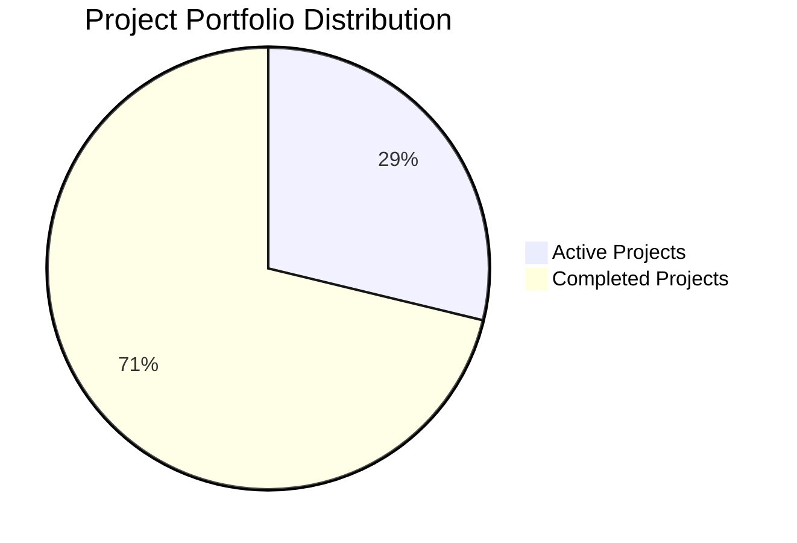

# Aichaku Project Checkpoint - 2025-07-24

## Executive Summary

**Project Health**: 🌳 **Excellent** - Mature codebase with active development across multiple enhancement streams\
**Current Version**: 0.35.7\
**Architecture Status**: Well-established with sophisticated MCP integration\
**Strategic Position**: Definitive methodology integration platform for AI-assisted development

## Key Metrics

### Codebase Health

- **Total Files**: 588 source files (TypeScript, Markdown, YAML)
- **Architecture**: Mature TypeScript-based CLI with comprehensive MCP server integration
- **Test Coverage**: 36 tests passing with coverage reporting
- **Documentation**: Diátaxis-compliant structure with visual Mermaid diagrams

### Development Activity

- **Active Projects**: 21 concurrent enhancement streams
- **Completed Projects**: 52 delivered projects demonstrating strong execution capability
- **Recent Commits**: 10 commits in recent history focused on documentation standards and Markdown formatting
- **Git Status**: Clean with targeted changes to documentation standards

### Project Distribution by Status

## Current Development Streams Analysis

### High Priority Active Projects

#### 1. **Contextual Guidance Implementation** (Near Completion)

- **Status**: 🌱 Shaping Phase (Week 1/6, 16% complete)
- **Focus**: Enhanced location context for `aichaku upgrade --global`
- **Validation**: Real user feedback confirmed exact problem identification
- **Risk**: Low - builds on existing visual guidance framework
- **Next**: Ready for betting phase transition

#### 2. **CLI Enhancement and Fixes** (Critical Foundation)

- **Status**: 🏁 Testing Complete (Day 1/3, 95% complete)
- **Achievements**:
  - Eliminated legacy RULES-REMINDER.md creation
  - Fixed help screen bypassing
  - Implemented configuration-as-code patterns
  - All 36 tests passing
- **Impact**: Foundation for exceptional user experience
- **Next**: Final documentation and commit

#### 3. **Unified MCP Enhancement** (Strategic Integration)

- **Status**: 🌿 Phase 1 Implementation
- **Completed**:
  - Branded feedback system with 🪴 Aichaku branding
  - Real-time progress tracking
  - HTTP/SSE server for session management
- **In Progress**: Enhanced process management commands
- **Strategic Value**: Seamless MCP management and documentation generation

### Technical Architecture Assessment

#### Core Infrastructure

- **CLI Framework**: Sophisticated TypeScript-based command system
- **MCP Integration**: Multi-server management with HTTP/SSE capabilities
- **Configuration System**: YAML-based configuration-as-code approach
- **Visual Guidance**: Established framework for spatial awareness and user context

#### Methodology Support

- **Supported Methodologies**: Shape Up, Scrum, Kanban, Lean, Scrumban, XP
- **Standards Integration**:
  - Security: NIST CSF, OWASP Top 10
  - Development: TDD, Clean Architecture, SOLID, Google Style
  - Documentation: Diátaxis, Microsoft Style, WriteTheDocs
  - Testing: BDD, Test Pyramid
  - DevOps: DORA metrics

#### Quality Indicators

- **Code Organization**: Clear separation of concerns with `/src/commands/`, `/src/utils/`, `/src/config/`
- **Documentation Structure**: Diátaxis-compliant with tutorials, how-tos, reference, and explanation docs
- **Testing**: Comprehensive test suite with 36 passing tests
- **Security**: OWASP integration with InfoSec comment requirements

## Strategic Analysis

### Strengths

1. **Mature Architecture**: Well-established patterns with 588+ source files
2. **Active Development**: 21 concurrent projects showing strong development velocity
3. **User-Centric Design**: Real user feedback driving contextual guidance improvements
4. **Technical Excellence**: Configuration-as-code, comprehensive testing, security integration
5. **Documentation Quality**: Diátaxis compliance with visual diagrams

### Areas of Focus

1. **Foundation Stability**: CLI Enhancement project addressing legacy issues
2. **User Experience**: Contextual guidance implementation for spatial awareness
3. **MCP Integration**: Unified enhancement for seamless tool management
4. **Standards Compliance**: Ongoing documentation standards refinement

### Risk Assessment

- **Low Risk**: Most active projects are enhancement-focused, not foundational changes
- **Mitigation Strategy**: Foundation fixes prioritized before feature expansion
- **Technical Debt**: Being actively addressed through CLI enhancement project

## Recommendations

### Immediate Priorities (Next 2 weeks)

1. **Complete Foundation Fixes**: Finish CLI Enhancement project to establish stable base
2. **Ship Contextual Guidance**: Complete user-validated improvement for upgrade commands
3. **Stabilize MCP Integration**: Complete Phase 1 of unified MCP enhancement

### Medium-term Strategy (Next month)

1. **Consolidate Active Projects**: Focus on completing high-impact projects before starting new ones
2. **Documentation Standards**: Complete the Markdown formatting standardization
3. **MCP Ecosystem**: Build out Phase 2 automatic documentation generation

### Long-term Vision (Next quarter)

1. **Platform Maturity**: Position as definitive AI-assisted methodology platform
2. **Community Growth**: Leverage sophisticated architecture for broader adoption
3. **Integration Expansion**: Explore additional methodology and standards integrations

## Technical Health Indicators

### Code Quality

- ✅ TypeScript strict mode enabled
- ✅ Comprehensive linting and formatting
- ✅ Test coverage with 36 passing tests
- ✅ Security standards integration (OWASP, NIST CSF)
- ✅ Clean architecture patterns

### Development Workflow

- ✅ Git hooks for quality gates
- ✅ Automated testing and coverage
- ✅ Consistent commit message format
- ✅ Release automation with Nagare
- ✅ Documentation generation pipeline

### User Experience

- ✅ Visual branding with 🪴 Aichaku identity
- ✅ Spatial awareness through directory trees
- ✅ Contextual guidance framework
- ✅ Progressive disclosure of information
- 🔄 Enhanced location context (in progress)

## Success Metrics

### Development Velocity

- **Project Completion Rate**: 52 completed vs 21 active (71% completion rate)
- **Quality Gates**: All tests passing, comprehensive linting
- **Release Cadence**: Regular version increments (currently v0.35.7)

### User Impact

- **Problem Validation**: Real user feedback confirming problem identification
- **Feature Adoption**: Multiple methodology and standards options
- **Technical Excellence**: Configuration-as-code eliminating hardcoded patterns

### Ecosystem Health

- **Documentation Coverage**: Comprehensive Diátaxis-compliant structure
- **Standards Compliance**: Multiple security, development, and documentation standards
- **Tool Integration**: Sophisticated MCP server ecosystem

## Conclusion

The Aichaku project demonstrates exceptional health with mature architecture, active development across 21 concurrent
streams, and strong user-centric focus. The foundation is solid, with 588+ source files organized in clean patterns and
comprehensive testing.

Current priorities appropriately focus on foundation stabilization through the CLI Enhancement project while delivering
user-validated improvements through Contextual Guidance implementation. The sophisticated MCP integration positions
Aichaku as a definitive platform for AI-assisted development methodology management.

**Recommendation**: Continue current trajectory with emphasis on completing foundation fixes before expanding new
features. The project is well-positioned for sustained growth and broader adoption in the AI-assisted development
ecosystem.

---

**Generated**: 2025-07-24\
**Analyst**: Claude Code\
**Next Review**: 2025-08-07 (2 weeks) Test change to trigger formatting
