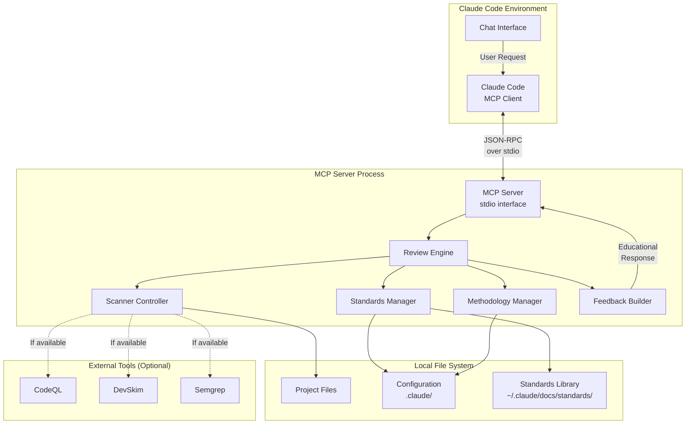
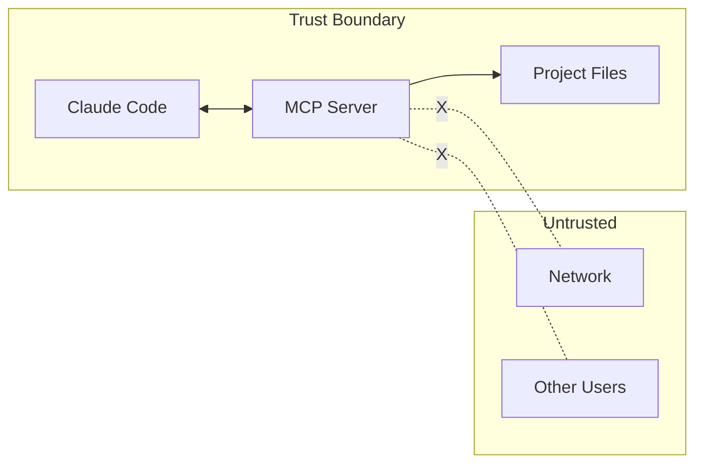
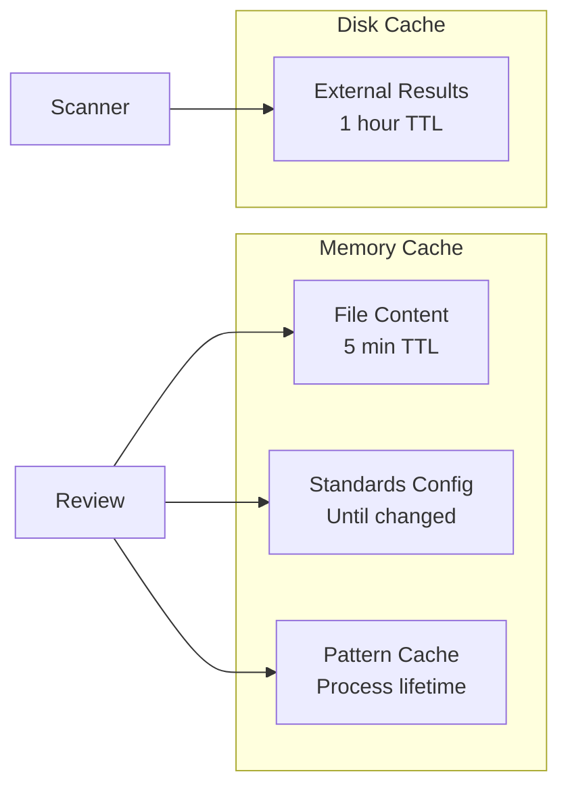
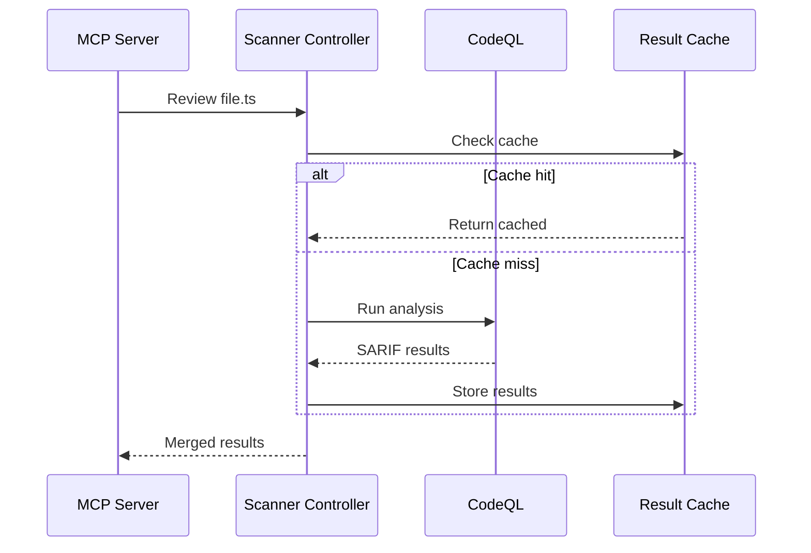

# MCP Architecture

Understand the Model Context Protocol (MCP) and how Aichaku's MCP server integrates with Claude Code to provide
automated code review capabilities.

## What is MCP?

The Model Context Protocol (MCP) is a standard that enables AI assistants like Claude to interact with external tools
and services. Think of it as a bridge between Claude's AI capabilities and specialized tools on your computer.

### Key concepts

1. **MCP Server** - A program that provides tools to AI assistants
2. **MCP Client** - The AI assistant (Claude Code) that uses these tools
3. **Tools** - Specific functions the server exposes (like `review_file`)
4. **Transport** - How client and server communicate (stdio, not network)

### Why MCP matters

Without MCP:

- Claude can only work with information you provide
- No access to specialized tools or local resources
- Limited ability to verify or validate code

With MCP:

- Claude can use security scanners
- Access project-specific configurations
- Provide real-time code analysis
- Maintain privacy (everything stays local)

## Aichaku MCP Server Architecture

### System Overview



### Component Details

#### MCP Server (`mcp-code-reviewer`)

The main server process that:

- Implements the MCP protocol
- Handles tool requests from Claude
- Manages the lifecycle of reviews
- Returns structured responses

Key characteristics:

- **Stateless** - No persistent state between requests
- **Ephemeral** - Spawned on demand, exits when done
- **Isolated** - Each request is independent
- **Fast startup** - < 100ms to initialize

#### Review Engine

Orchestrates the review process:

1. Parses the review request
2. Loads project configuration
3. Runs security patterns
4. Checks standards compliance
5. Aggregates results
6. Generates educational feedback

#### Standards Manager

Handles standards-related operations:

- Loads selected standards from `.claude/.aichaku-standards.json`
- Reads standard definitions from `~/.claude/docs/standards/`
- Applies standard-specific rules
- Tracks violations and suggestions

#### Methodology Manager

Detects and validates methodologies:

- Scans project structure for methodology artifacts
- Loads methodology rules from `~/.claude/methodologies/`
- Checks compliance with methodology practices
- Provides improvement suggestions

#### Scanner Controller

Manages external security scanners:

- Detects available scanners in PATH
- Runs scanners with appropriate parameters
- Parses scanner output (SARIF format)
- Merges results with built-in patterns

#### Feedback Builder

Creates educational responses:

- Formats issues with context
- Provides good/bad examples
- Includes step-by-step fixes
- Adds learning resources
- Maintains encouraging tone

## Communication Protocol

### JSON-RPC over stdio

MCP uses JSON-RPC 2.0 for communication:

1. **Request from Claude:**

```json
{
  "jsonrpc": "2.0",
  "id": 1,
  "method": "tools/call",
  "params": {
    "name": "review_file",
    "arguments": {
      "file": "/path/to/file.ts",
      "includeExternal": true
    }
  }
}
```

2. **Response from MCP Server:**

```json
{
  "jsonrpc": "2.0",
  "id": 1,
  "result": {
    "content": [
      {
        "type": "text",
        "text": "Security review complete..."
      }
    ]
  }
}
```

### Why stdio instead of network?

1. **Security** - No network exposure, no ports to secure
2. **Simplicity** - No authentication, no TLS certificates
3. **Performance** - Direct process communication
4. **Privacy** - Impossible to accidentally expose to internet
5. **Compatibility** - Works the same on all platforms

## Security Architecture

### Threat Model

The MCP server is designed to be secure by default:

| Threat                 | Mitigation                                 |
| ---------------------- | ------------------------------------------ |
| Code injection         | Read-only operations, no code execution    |
| Path traversal         | Strict path validation, project boundaries |
| Information disclosure | No network access, local only              |
| Privilege escalation   | Runs as user, no elevated permissions      |
| Supply chain attacks   | Minimal dependencies, signed releases      |

### Security Boundaries



### Privacy Guarantees

1. **No telemetry** - Zero usage tracking
2. **No network calls** - Everything stays local
3. **No persistent storage** - No databases or logs by default
4. **No credentials** - No API keys or authentication
5. **Project isolation** - Reviews don't cross project boundaries

## Performance Architecture

### Startup Performance

The MCP server optimizes startup time:

```text
Process spawn:      ~10ms
Deno runtime init:  ~30ms
Code loading:       ~20ms
First review ready: ~60ms
-----------------------
Total:             ~120ms
```

### Memory Usage

- **Base footprint**: ~50MB (Deno runtime + code)
- **Per review**: +5-10MB (file content + analysis)
- **Garbage collected**: Memory released after each review

### Caching Strategy



## Integration Patterns

### Project Detection

How the MCP server finds project configuration:

```text
Given: /Users/alice/projects/app/src/auth/login.ts

1. Check: /Users/alice/projects/app/src/auth/.claude/ ❌
2. Check: /Users/alice/projects/app/src/.claude/ ❌
3. Check: /Users/alice/projects/app/.claude/ ✅
   Found: Project root with configuration
```

### Standards Resolution

How standards are loaded:

```text
1. Read .claude/.aichaku-standards.json
   → ["nist-csf", "tdd", "solid"]

2. Load each standard:
   ~/.claude/docs/standards/security/nist-csf.md
   ~/.claude/docs/standards/testing/tdd.md
   ~/.claude/docs/standards/development/solid.md

3. Parse rules and patterns from each standard

4. Apply during review
```

### External Scanner Integration

How external scanners are invoked:



## Extensibility

### Adding New Security Patterns

Security patterns in `patterns/security-patterns.ts`:

```typescript
export const securityPatterns = [
  {
    id: "sql-injection",
    severity: "critical",
    owasp: "A03",
    pattern: /query.*\+.*user|user.*\+.*query/i,
    message: "Potential SQL injection",
    fix: "Use parameterized queries",
  },
  // Add new patterns here
];
```

### Adding New Standards Support

1. Create standard definition in `~/.claude/docs/standards/`
2. Add parsing logic in `standards-manager.ts`
3. Include standard-specific patterns
4. Update documentation

### Adding New Scanners

Scanner integration in `scanner-controller.ts`:

```typescript
const scanners = {
  newscanner: {
    command: "newscanner",
    args: ["--format", "sarif"],
    parse: (output) => JSON.parse(output),
  },
};
```

## Benefits of MCP Architecture

### For developers

1. **Automated review** - Consistent code quality checks
2. **Educational feedback** - Learn while you code
3. **Privacy-first** - Your code never leaves your machine
4. **Zero configuration** - Works out of the box
5. **Fast feedback** - Results in seconds, not minutes

### For teams

1. **Standardization** - Consistent standards across projects
2. **Knowledge sharing** - Best practices embedded in tools
3. **Security by default** - Catch issues before commit
4. **Flexible adoption** - Use what works for your team
5. **No infrastructure** - No servers to maintain

### For Claude

1. **Enhanced capabilities** - Access to security tools
2. **Project awareness** - Understand project context
3. **Accurate feedback** - Based on real analysis
4. **Educational responses** - Teach, don't just report
5. **Trust building** - Reliable, consistent results

## Limitations and Considerations

### Current limitations

1. **File size** - Large files may timeout (default 5MB)
2. **Binary files** - Cannot analyze compiled code
3. **Language support** - Best for JS/TS, Python, Go
4. **External scanners** - Optional, not required
5. **Async operations** - Sequential file processing

### Design trade-offs

| Choice           | Benefit                | Trade-off              |
| ---------------- | ---------------------- | ---------------------- |
| Stdio transport  | Security, simplicity   | No remote access       |
| Stateless design | Scalability, isolation | No cross-file analysis |
| Local only       | Privacy, performance   | No cloud features      |
| Read-only        | Security               | Cannot auto-fix issues |

## Future Architecture Considerations

### Potential enhancements

1. **Incremental analysis** - Analyze only changed code
2. **Project-wide analysis** - Cross-file relationships
3. **Custom rules** - User-defined patterns
4. **IDE integration** - Beyond Claude Code
5. **Metrics dashboard** - Track improvement over time

### Maintaining simplicity

The architecture prioritizes:

- **Simplicity over features**
- **Security over convenience**
- **Privacy over analytics**
- **Education over enforcement**
- **Local over cloud**

## Summary

The Aichaku MCP server architecture provides:

✅ **Secure** - Multiple layers of protection\
✅ **Private** - Everything stays on your machine\
✅ **Fast** - Sub-second response times\
✅ **Educational** - Teaches while reviewing\
✅ **Extensible** - Add patterns and scanners

The architecture makes Claude Code a more capable development partner while maintaining the security and privacy
developers expect.

## Related Documentation

- [Setup MCP Server](../tutorials/setup-mcp-server.md) - Get started
- [MCP API Reference](../reference/mcp-api.md) - Technical details
- [Using MCP with Multiple Projects](../how-to/use-mcp-with-multiple-projects.md) - Practical usage
