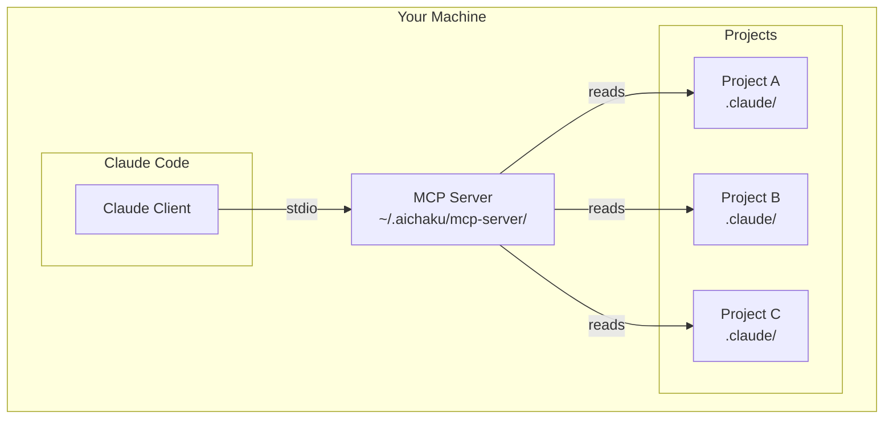

# How to Use MCP with Multiple Projects

This guide shows you how to use a single Aichaku MCP server installation across all your projects. You'll learn the
global installation model and how to manage MCP for multiple projects efficiently.

## Before you begin

Ensure you have:

- Aichaku installed on your system
- Claude Code configured and working
- Access to multiple projects that need code review
- Basic understanding of command-line operations

## Overview

The Aichaku MCP server works as a **global service**, not a per-project tool. This means:

- **Install once** - The MCP server lives in `~/.aichaku/mcp-server/`
- **Use everywhere** - All projects on your machine can use the same server
- **Single configuration** - Configure Claude Code once for all projects
- **Automatic detection** - Projects with Aichaku automatically benefit
- **No port conflicts** - MCP uses stdio by default (HTTP/SSE mode available on port 7182)

## Understanding the architecture



Key points:

- Claude Code spawns the MCP server as needed
- Communication uses stdio (no network ports)
- The server reads project configurations dynamically
- No background services or daemons required

## Setting up for multiple projects

### Step 1: Global MCP installation

If you haven't already, install the MCP server globally:

```bash
aichaku mcp --install
```

This installs to `~/.aichaku/mcp-server/` - a location accessible from any project.

### Step 2: Configure Claude Code once

Add the MCP configuration to Claude Code:

```bash
aichaku mcp --config
```

This configuration in Claude's settings file works for all projects:

```json
{
  "mcpServers": {
    "aichaku-reviewer": {
      "command": "/Users/yourname/.aichaku/mcp-server/mcp-code-reviewer",
      "args": [],
      "env": {}
    }
  }
}
```

### Step 3: Initialize each project

For each project that needs code review, initialize Aichaku:

```bash
cd /path/to/project-a
aichaku init
aichaku integrate
aichaku standards --add nist-csf,tdd

cd /path/to/project-b
aichaku init
aichaku integrate
aichaku standards --add owasp-web,solid
```

Each project gets its own:

- `.claude/` directory with methodologies
- `.claude/.aichaku-standards.json` with selected standards
- Custom CLAUDE.md with project rules

## How the MCP server finds project configuration

When Claude asks the MCP server to review a file, the server:

1. **Identifies the project root** by looking for `.claude/` directory
2. **Reads project standards** from `.claude/.aichaku-standards.json`
3. **Detects methodologies** from project structure
4. **Applies the correct rules** for that specific project

Example project detection:

```text
/Users/yourname/projects/web-app/src/auth.ts
                         ↑
            Finds .claude/ here
            Reads this project's standards
```

## Managing different standards per project

Each project can have completely different standards:

### Project A: Web Application

```bash
cd ~/projects/web-app
aichaku standards --add owasp-web,clean-arch,tdd
```

Configuration in `.claude/.aichaku-standards.json`:

```json
{
  "version": "1.0.0",
  "selected": ["owasp-web", "clean-arch", "tdd"],
  "methodologies": ["scrum"]
}
```

### Project B: CLI Tool

```bash
cd ~/projects/cli-tool
aichaku standards --add nist-csf,solid,conventional-commits
```

Configuration in `.claude/.aichaku-standards.json`:

```json
{
  "version": "1.0.0",
  "selected": ["nist-csf", "solid", "conventional-commits"],
  "methodologies": ["shape-up"]
}
```

### Project C: Microservice

```bash
cd ~/projects/microservice
aichaku standards --add 15-factor,dora,test-pyramid
```

The MCP server automatically applies the right standards for each project.

## Working with monorepos

For monorepos with multiple sub-projects:

### Option 1: Root-level configuration

```text
monorepo/
├── .claude/                  # Shared configuration
│   └── .aichaku-standards.json
├── packages/
│   ├── frontend/
│   ├── backend/
│   └── shared/
```

All packages share the same standards.

### Option 2: Per-package configuration

```text
monorepo/
├── packages/
│   ├── frontend/
│   │   └── .claude/         # Frontend-specific standards
│   ├── backend/
│   │   └── .claude/         # Backend-specific standards
│   └── shared/
│       └── .claude/         # Shared library standards
```

Each package has its own standards.

## Switching between projects

The MCP server handles project switching automatically:

```bash
# Work on project A
cd ~/projects/web-app
# Ask Claude to review auth.ts - uses web-app standards

# Switch to project B
cd ~/projects/cli-tool
# Ask Claude to review parser.ts - uses cli-tool standards

# No restart needed - it just works!
```

## Using HTTP/SSE mode for better performance

When you frequently switch between projects or run multiple terminals:

```bash
# Start the shared HTTP/SSE server once
aichaku mcp --start-server

# Now in any project, reviews are faster:
cd ~/projects/web-app
aichaku review src/auth.ts  # Uses shared server automatically

# In another terminal simultaneously
cd ~/projects/cli-tool
aichaku review src/parser.ts  # Also uses the same shared server
```

The HTTP/SSE server:

- Eliminates process startup time
- Handles multiple concurrent requests
- Maintains project isolation
- Runs on port 7182

## Updating the MCP server

When updating Aichaku, update the MCP server for all projects:

```bash
# Check current version
aichaku mcp --status

# Update Aichaku
aichaku upgrade

# Reinstall MCP server with new version
aichaku mcp --install
```

All projects automatically use the updated server.

## Troubleshooting multiple projects

### Projects not detected

**Problem:** MCP server doesn't find project configuration

**Solution:** Ensure each project has:

```text
project-root/
├── .claude/                     # Required
│   ├── .aichaku-standards.json  # Required for standards
│   └── CLAUDE.md               # Required for methodology detection
```

### Wrong standards applied

**Problem:** Project A standards used in Project B

**Solution:** Check the working directory:

1. Ensure you're in the correct project root
2. Run `pwd` to verify location
3. Check `.claude/.aichaku-standards.json` exists

### Performance with many projects

The MCP server is stateless and lightweight:

- No background processes
- No memory usage when not reviewing
- Fast startup (< 100ms)
- No cleanup needed

## Best practices

### 1. Consistent initialization

Create a script for new projects:

```bash
#!/bin/bash
# init-aichaku-project.sh
aichaku init
aichaku integrate
aichaku standards --add nist-csf,tdd,conventional-commits
echo "✅ Aichaku configured with security-first standards"
```

### 2. Document project standards

In each project's README:

```markdown
## Code Standards

This project uses Aichaku with:

- NIST CSF - Security framework
- TDD - Test-driven development
- Conventional Commits - Standardized commit messages

Run `aichaku standards --list --selected` to see current standards.
```

### 3. Team synchronization

Share standards across team:

```bash
# Export standards
cat .claude/.aichaku-standards.json > project-standards.json

# Import on teammate's machine
cp project-standards.json .claude/.aichaku-standards.json
```

### 4. CI/CD integration

While MCP is for local development, document standards for CI:

```yaml
# .github/workflows/standards.yml
name: Verify Standards
on: [push]
jobs:
  check:
    runs-on: ubuntu-latest
    steps:
      - uses: actions/checkout@v3
      - name: Check standards file exists
        run: test -f .claude/.aichaku-standards.json
```

## Security considerations

### Global installation security

The MCP server installation is secure because:

- **User-specific** - Installed in your home directory
- **No elevated privileges** - Runs as your user
- **No network access** - Communicates via stdio only
- **Read-only** - Only reads files, never modifies

### Project isolation

Each project is isolated:

- Standards are project-specific
- No cross-project data sharing
- File access limited to project directory
- No persistent state between reviews

### Audit trail

Track MCP usage across projects:

```bash
# See all projects with Aichaku
find ~ -maxdepth 10 -name ".aichaku-standards.json" -type f 2>/dev/null | \
  xargs -I {} dirname {} | \
  xargs -I {} dirname {}
```

## Summary

The Aichaku MCP server's global installation model provides:

✅ **Simplicity** - Install once, use everywhere ✅ **Flexibility** - Different standards per project ✅
**Performance** - No overhead or background services ✅ **Security** - Isolated, read-only operation ✅
**Maintainability** - Single binary to update

Remember: Think of the MCP server as a tool like `git` or `npm` - installed globally but aware of project context.

## Related guides

- [Setup MCP Server](../tutorials/setup-mcp-server.md) - Initial installation
- [MCP API Reference](../reference/mcp-api.md) - Available tools
- [Configure Your Project](configure-project.md) - Project setup
