# Mermaid Diagram Patterns for Technical Documentation

## Overview

This guide provides comprehensive patterns for using Mermaid diagrams in
technical reference documentation. Each pattern includes syntax examples, use
cases, best practices, and version control considerations.

## Table of Contents

1. [System Architecture Diagrams (C4 Model)](#system-architecture-diagrams-c4-model)
2. [Data Flow Diagrams](#data-flow-diagrams)
3. [State Machines](#state-machines)
4. [Sequence Diagrams](#sequence-diagrams)
5. [Entity Relationship Diagrams](#entity-relationship-diagrams)
6. [Deployment Diagrams](#deployment-diagrams)
7. [Component Interaction Diagrams](#component-interaction-diagrams)
8. [Decision Trees](#decision-trees)
9. [Tools and Automation](#tools-and-automation)
10. [Best Practices](#best-practices)

## System Architecture Diagrams (C4 Model)

### Context Diagram (Level 1)

**When to use**: Show the system in its environment with external actors and
systems.

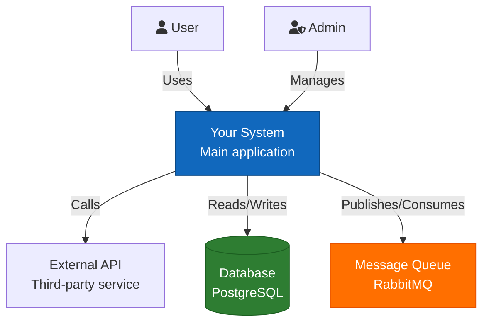
```mermaid
graph TB
    User[fa:fa-user User]
    Admin[fa:fa-user-shield Admin]

    System[Your System<br/>Main application]

    ExtAPI[External API<br/>Third-party service]
    Database[(Database<br/>PostgreSQL)]
    Queue[Message Queue<br/>RabbitMQ]

    User -->|Uses| System
    Admin -->|Manages| System
    System -->|Calls| ExtAPI
    System -->|Reads/Writes| Database
    System -->|Publishes/Consumes| Queue

    style System fill:#1168bd,stroke:#0b4884,color:#ffffff
    style Database fill:#2e7d32,stroke:#1b5e20,color:#ffffff
    style Queue fill:#ff6f00,stroke:#e65100,color:#ffffff
```

### Container Diagram (Level 2)

**When to use**: Show high-level technology choices and communication between
containers.

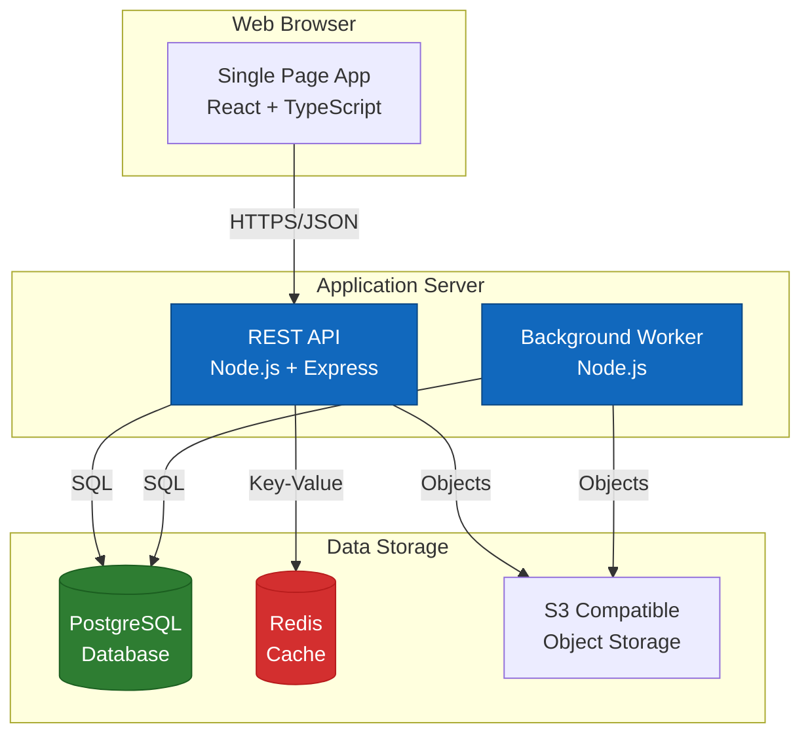
```mermaid
graph TB
    subgraph "Web Browser"
        SPA[Single Page App<br/>React + TypeScript]
    end

    subgraph "Application Server"
        API[REST API<br/>Node.js + Express]
        Worker[Background Worker<br/>Node.js]
    end

    subgraph "Data Storage"
        DB[(PostgreSQL<br/>Database)]
        Cache[(Redis<br/>Cache)]
        S3[S3 Compatible<br/>Object Storage]
    end

    SPA -->|HTTPS/JSON| API
    API -->|SQL| DB
    API -->|Key-Value| Cache
    API -->|Objects| S3
    Worker -->|SQL| DB
    Worker -->|Objects| S3

    style API fill:#1168bd,stroke:#0b4884,color:#ffffff
    style Worker fill:#1168bd,stroke:#0b4884,color:#ffffff
    style DB fill:#2e7d32,stroke:#1b5e20,color:#ffffff
    style Cache fill:#d32f2f,stroke:#b71c1c,color:#ffffff
```

### Component Diagram (Level 3)

**When to use**: Show internal structure of a container and its components.

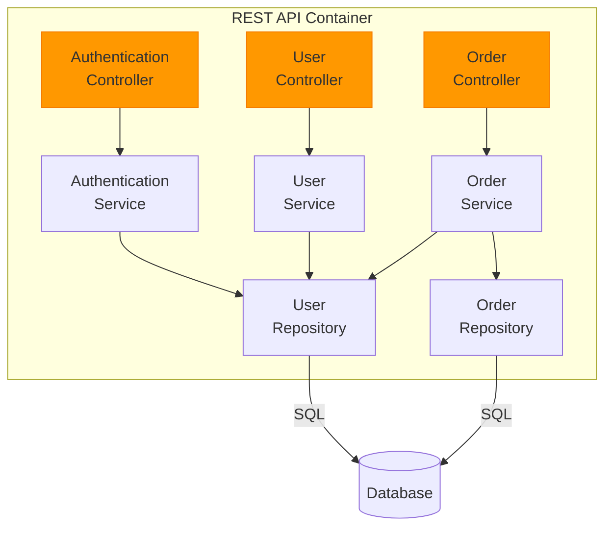
```mermaid
graph TB
    subgraph "REST API Container"
        AuthCtrl[Authentication<br/>Controller]
        UserCtrl[User<br/>Controller]
        OrderCtrl[Order<br/>Controller]

        AuthSvc[Authentication<br/>Service]
        UserSvc[User<br/>Service]
        OrderSvc[Order<br/>Service]

        UserRepo[User<br/>Repository]
        OrderRepo[Order<br/>Repository]
    end

    AuthCtrl --> AuthSvc
    UserCtrl --> UserSvc
    OrderCtrl --> OrderSvc

    AuthSvc --> UserRepo
    UserSvc --> UserRepo
    OrderSvc --> OrderRepo
    OrderSvc --> UserRepo

    UserRepo -->|SQL| DB[(Database)]
    OrderRepo -->|SQL| DB

    style AuthCtrl fill:#ff9800,stroke:#f57c00
    style UserCtrl fill:#ff9800,stroke:#f57c00
    style OrderCtrl fill:#ff9800,stroke:#f57c00
```

### Code Diagram (Level 4)

**When to use**: Show relationships between classes and interfaces.

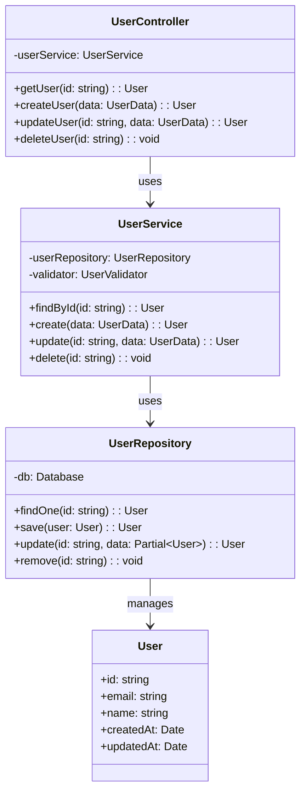
```mermaid
classDiagram
    class UserController {
        -userService: UserService
        +getUser(id: string): User
        +createUser(data: UserData): User
        +updateUser(id: string, data: UserData): User
        +deleteUser(id: string): void
    }

    class UserService {
        -userRepository: UserRepository
        -validator: UserValidator
        +findById(id: string): User
        +create(data: UserData): User
        +update(id: string, data: UserData): User
        +delete(id: string): void
    }

    class UserRepository {
        -db: Database
        +findOne(id: string): User
        +save(user: User): User
        +update(id: string, data: Partial~User~): User
        +remove(id: string): void
    }

    class User {
        +id: string
        +email: string
        +name: string
        +createdAt: Date
        +updatedAt: Date
    }

    UserController --> UserService : uses
    UserService --> UserRepository : uses
    UserRepository --> User : manages
```

## Data Flow Diagrams

### Simple Data Flow

**When to use**: Show how data moves through the system.

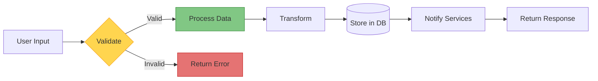
```mermaid
graph LR
    Input[User Input] --> Validate{Validate}
    Validate -->|Valid| Process[Process Data]
    Validate -->|Invalid| Error[Return Error]

    Process --> Transform[Transform]
    Transform --> Store[(Store in DB)]
    Store --> Notify[Notify Services]
    Notify --> Response[Return Response]

    style Validate fill:#ffd54f,stroke:#f9a825
    style Process fill:#81c784,stroke:#388e3c
    style Error fill:#e57373,stroke:#c62828
```

### Complex Data Pipeline

**When to use**: Show multi-stage data processing with branches.

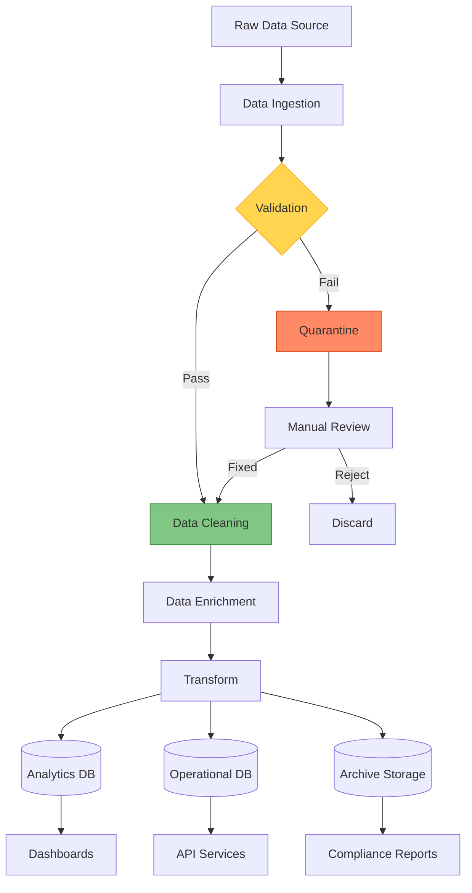
```mermaid
graph TD
    Raw[Raw Data Source] --> Ingest[Data Ingestion]

    Ingest --> Validate{Validation}
    Validate -->|Pass| Clean[Data Cleaning]
    Validate -->|Fail| Quarantine[Quarantine]

    Clean --> Enrich[Data Enrichment]
    Enrich --> Transform[Transform]

    Transform --> Analytics[(Analytics DB)]
    Transform --> Operational[(Operational DB)]
    Transform --> Archive[(Archive Storage)]

    Analytics --> Dashboard[Dashboards]
    Operational --> API[API Services]
    Archive --> Compliance[Compliance Reports]

    Quarantine --> Review[Manual Review]
    Review -->|Fixed| Clean
    Review -->|Reject| Discard[Discard]

    style Validate fill:#ffd54f,stroke:#f9a825
    style Clean fill:#81c784,stroke:#388e3c
    style Quarantine fill:#ff8a65,stroke:#d84315
```

## State Machines

### Simple State Machine

**When to use**: Show state transitions for entities or workflows.

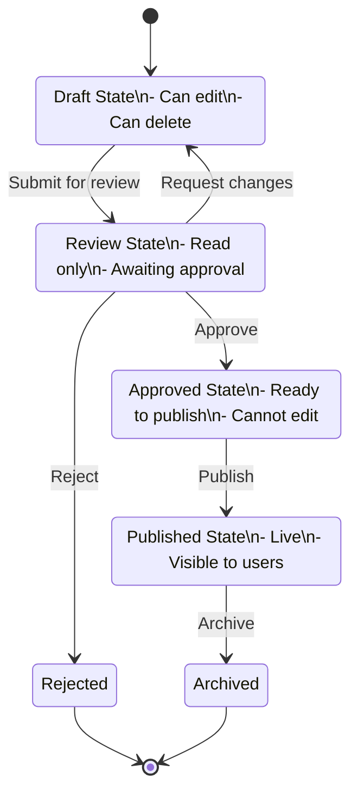
```mermaid
stateDiagram-v2
    [*] --> Draft
    Draft --> Review: Submit for review
    Review --> Approved: Approve
    Review --> Draft: Request changes
    Review --> Rejected: Reject
    Approved --> Published: Publish
    Published --> Archived: Archive
    Rejected --> [*]
    Archived --> [*]

    Draft: Draft State\n- Can edit\n- Can delete
    Review: Review State\n- Read only\n- Awaiting approval
    Approved: Approved State\n- Ready to publish\n- Cannot edit
    Published: Published State\n- Live\n- Visible to users
```

### Complex State Machine with Substates

**When to use**: Show nested states and parallel states.

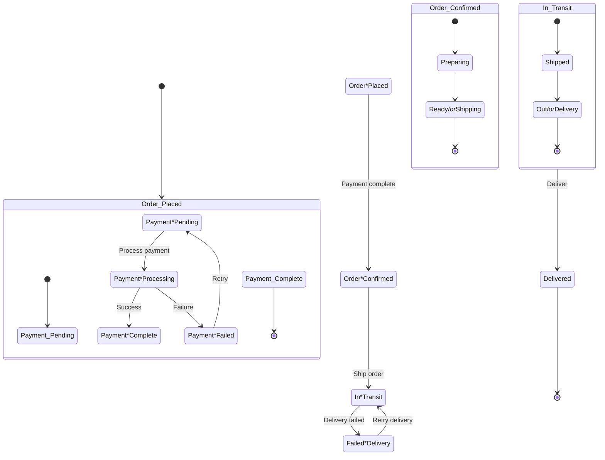
```mermaid
stateDiagram-v2
    [*] --> Order_Placed

    state Order_Placed {
        [*] --> Payment_Pending
        Payment*Pending --> Payment*Processing: Process payment
        Payment*Processing --> Payment*Complete: Success
        Payment*Processing --> Payment*Failed: Failure
        Payment*Failed --> Payment*Pending: Retry
        Payment_Complete --> [*]
    }

    Order*Placed --> Order*Confirmed: Payment complete

    state Order_Confirmed {
        [*] --> Preparing
        Preparing --> Ready*for*Shipping
        Ready*for*Shipping --> [*]
    }

    Order*Confirmed --> In*Transit: Ship order

    state In_Transit {
        [*] --> Shipped
        Shipped --> Out*for*Delivery
        Out*for*Delivery --> [*]
    }

    In_Transit --> Delivered: Deliver
    In*Transit --> Failed*Delivery: Delivery failed
    Failed*Delivery --> In*Transit: Retry delivery
    Delivered --> [*]
```

## Sequence Diagrams

### HTTP Request Flow

**When to use**: Show interaction between components over time.

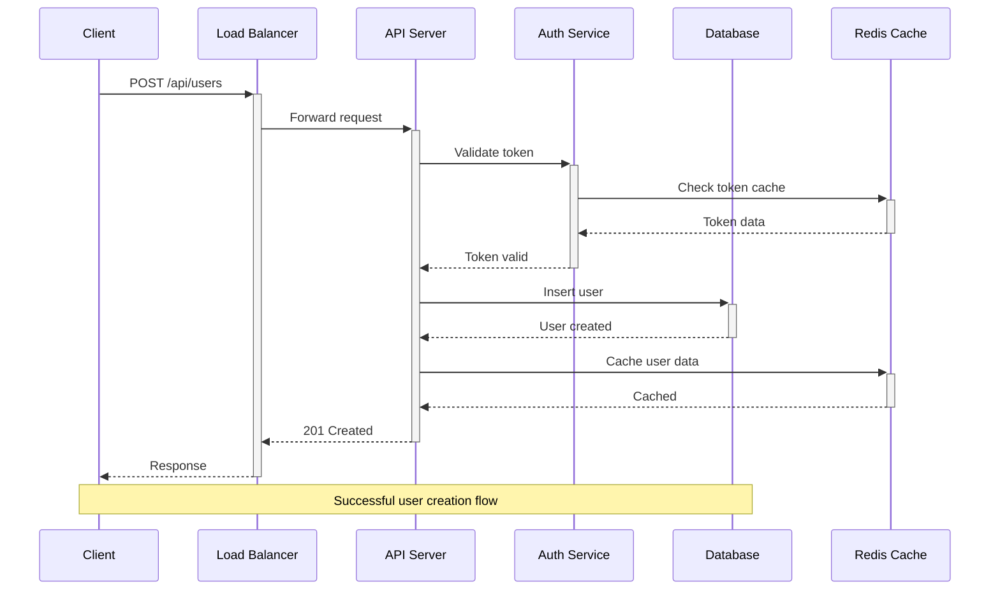
```mermaid
sequenceDiagram
    participant C as Client
    participant LB as Load Balancer
    participant API as API Server
    participant Auth as Auth Service
    participant DB as Database
    participant Cache as Redis Cache

    C->>+LB: POST /api/users
    LB->>+API: Forward request

    API->>+Auth: Validate token
    Auth->>+Cache: Check token cache
    Cache-->>-Auth: Token data
    Auth-->>-API: Token valid

    API->>+DB: Insert user
    DB-->>-API: User created

    API->>+Cache: Cache user data
    Cache-->>-API: Cached

    API-->>-LB: 201 Created
    LB-->>-C: Response

    Note over C,DB: Successful user creation flow
```

### Async Message Processing

**When to use**: Show asynchronous communication patterns.

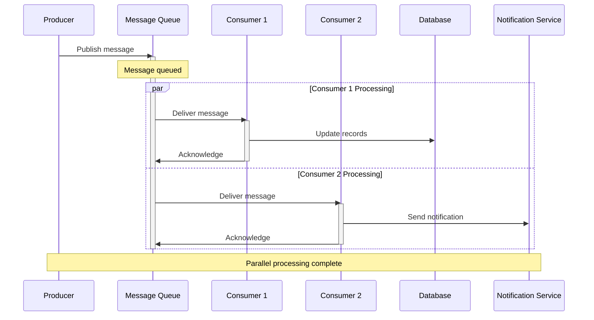
```mermaid
sequenceDiagram
    participant P as Producer
    participant Q as Message Queue
    participant C1 as Consumer 1
    participant C2 as Consumer 2
    participant DB as Database
    participant N as Notification Service

    P->>Q: Publish message
    activate Q
    Note over Q: Message queued

    par Consumer 1 Processing
        Q->>C1: Deliver message
        activate C1
        C1->>DB: Update records
        C1->>Q: Acknowledge
        deactivate C1
    and Consumer 2 Processing
        Q->>C2: Deliver message
        activate C2
        C2->>N: Send notification
        C2->>Q: Acknowledge
        deactivate C2
    end

    deactivate Q
    Note over P,N: Parallel processing complete
```

## Entity Relationship Diagrams

### Database Schema

**When to use**: Show database table relationships.

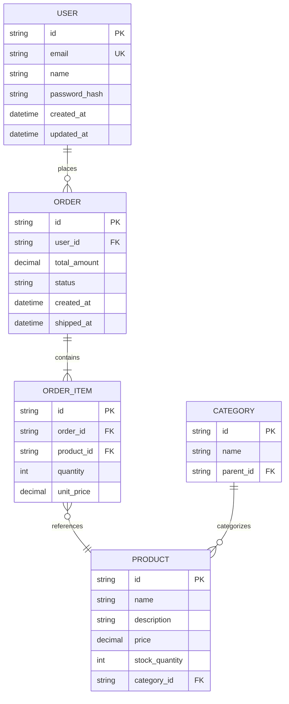
```mermaid
erDiagram
    USER ||--o{ ORDER : places
    USER {
        string id PK
        string email UK
        string name
        string password_hash
        datetime created_at
        datetime updated_at
    }

    ORDER ||--|{ ORDER_ITEM : contains
    ORDER {
        string id PK
        string user_id FK
        decimal total_amount
        string status
        datetime created_at
        datetime shipped_at
    }

    ORDER_ITEM }o--|| PRODUCT : references
    ORDER_ITEM {
        string id PK
        string order_id FK
        string product_id FK
        int quantity
        decimal unit_price
    }

    PRODUCT {
        string id PK
        string name
        string description
        decimal price
        int stock_quantity
        string category_id FK
    }

    CATEGORY ||--o{ PRODUCT : categorizes
    CATEGORY {
        string id PK
        string name
        string parent_id FK
    }
```

### Domain Model

**When to use**: Show business entity relationships.

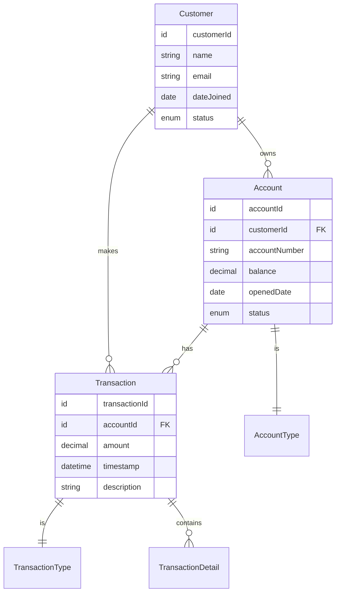
```mermaid
erDiagram
    Customer ||--o{ Account : owns
    Customer ||--o{ Transaction : makes

    Account ||--o{ Transaction : has
    Account ||--|| AccountType : is

    Transaction ||--|| TransactionType : is
    Transaction ||--o{ TransactionDetail : contains

    Customer {
        id customerId
        string name
        string email
        date dateJoined
        enum status
    }

    Account {
        id accountId
        id customerId FK
        string accountNumber
        decimal balance
        date openedDate
        enum status
    }

    Transaction {
        id transactionId
        id accountId FK
        decimal amount
        datetime timestamp
        string description
    }
```

## Deployment Diagrams

### Cloud Infrastructure

**When to use**: Show deployment architecture and infrastructure.

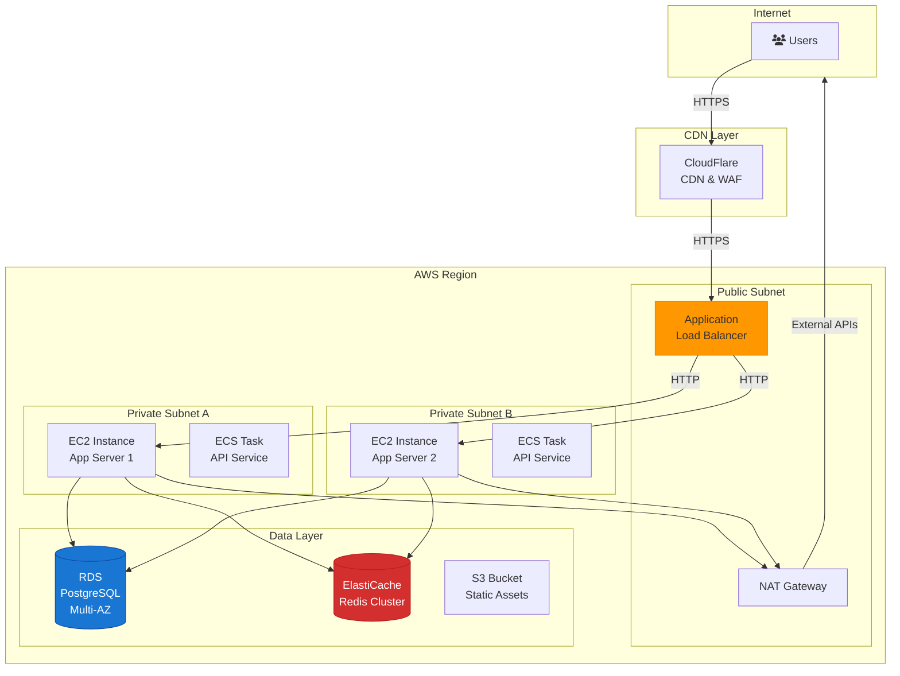
```mermaid
graph TB
    subgraph "Internet"
        Users[fa:fa-users Users]
    end

    subgraph "CDN Layer"
        CF[CloudFlare<br/>CDN & WAF]
    end

    subgraph "AWS Region"
        subgraph "Public Subnet"
            ALB[Application<br/>Load Balancer]
            NAT[NAT Gateway]
        end

        subgraph "Private Subnet A"
            EC2A[EC2 Instance<br/>App Server 1]
            ECS1[ECS Task<br/>API Service]
        end

        subgraph "Private Subnet B"
            EC2B[EC2 Instance<br/>App Server 2]
            ECS2[ECS Task<br/>API Service]
        end

        subgraph "Data Layer"
            RDS[(RDS<br/>PostgreSQL<br/>Multi-AZ)]
            REDIS[(ElastiCache<br/>Redis Cluster)]
            S3[S3 Bucket<br/>Static Assets]
        end
    end

    Users -->|HTTPS| CF
    CF -->|HTTPS| ALB
    ALB -->|HTTP| EC2A
    ALB -->|HTTP| EC2B
    EC2A --> RDS
    EC2A --> REDIS
    EC2B --> RDS
    EC2B --> REDIS
    EC2A --> NAT
    EC2B --> NAT
    NAT -->|External APIs| Internet

    style ALB fill:#ff9800,stroke:#f57c00
    style RDS fill:#1976d2,stroke:#0d47a1,color:#ffffff
    style REDIS fill:#d32f2f,stroke:#b71c1c,color:#ffffff
```

### Kubernetes Deployment

**When to use**: Show container orchestration setup.

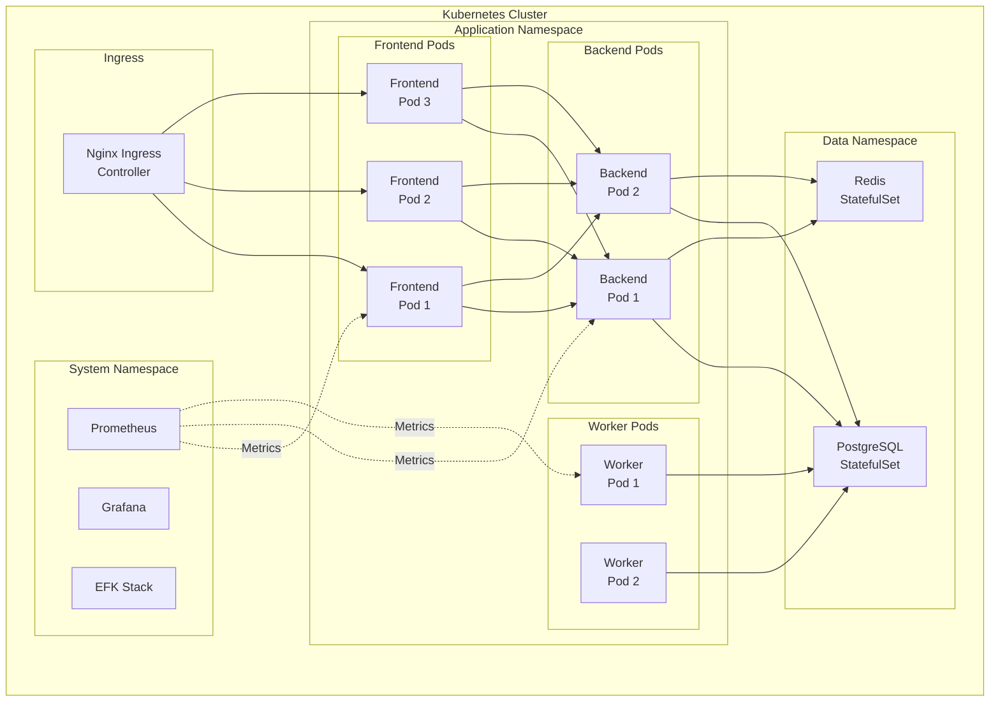
```mermaid
graph TB
    subgraph "Kubernetes Cluster"
        subgraph "Ingress"
            ING[Nginx Ingress<br/>Controller]
        end

        subgraph "Application Namespace"
            subgraph "Frontend Pods"
                FE1[Frontend<br/>Pod 1]
                FE2[Frontend<br/>Pod 2]
                FE3[Frontend<br/>Pod 3]
            end

            subgraph "Backend Pods"
                BE1[Backend<br/>Pod 1]
                BE2[Backend<br/>Pod 2]
            end

            subgraph "Worker Pods"
                W1[Worker<br/>Pod 1]
                W2[Worker<br/>Pod 2]
            end
        end

        subgraph "System Namespace"
            PROM[Prometheus]
            GRAF[Grafana]
            EFK[EFK Stack]
        end

        subgraph "Data Namespace"
            PG[PostgreSQL<br/>StatefulSet]
            REDIS[Redis<br/>StatefulSet]
        end
    end

    ING --> FE1
    ING --> FE2
    ING --> FE3

    FE1 --> BE1
    FE1 --> BE2
    FE2 --> BE1
    FE2 --> BE2
    FE3 --> BE1
    FE3 --> BE2

    BE1 --> PG
    BE1 --> REDIS
    BE2 --> PG
    BE2 --> REDIS

    W1 --> PG
    W2 --> PG

    PROM -.->|Metrics| FE1
    PROM -.->|Metrics| BE1
    PROM -.->|Metrics| W1
```

## Component Interaction Diagrams

### Microservices Communication

**When to use**: Show service mesh and API gateway patterns.

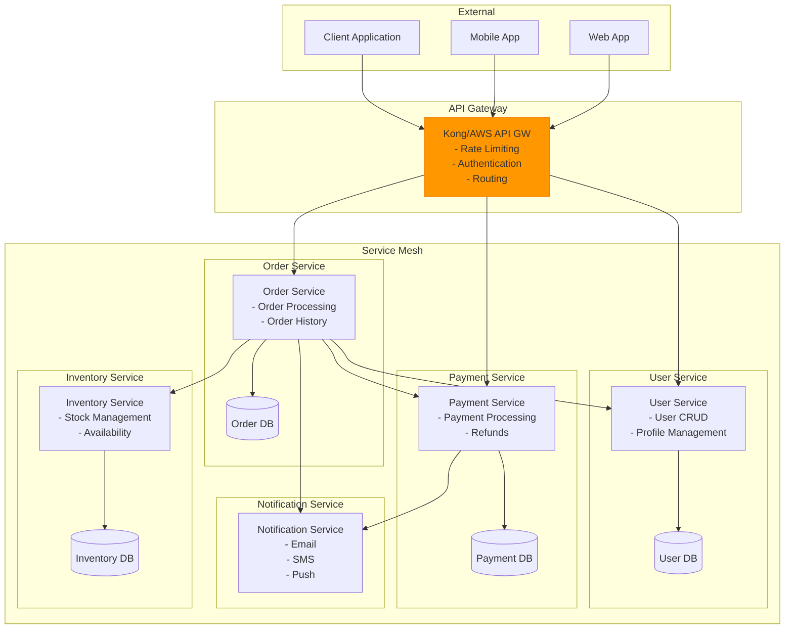
```mermaid
graph TB
    subgraph "External"
        Client[Client Application]
        Mobile[Mobile App]
        Web[Web App]
    end

    subgraph "API Gateway"
        Gateway[Kong/AWS API GW<br/>- Rate Limiting<br/>- Authentication<br/>- Routing]
    end

    subgraph "Service Mesh"
        subgraph "User Service"
            US[User Service<br/>- User CRUD<br/>- Profile Management]
            USD[(User DB)]
        end

        subgraph "Order Service"
            OS[Order Service<br/>- Order Processing<br/>- Order History]
            OSD[(Order DB)]
        end

        subgraph "Payment Service"
            PS[Payment Service<br/>- Payment Processing<br/>- Refunds]
            PSD[(Payment DB)]
        end

        subgraph "Notification Service"
            NS[Notification Service<br/>- Email<br/>- SMS<br/>- Push]
        end

        subgraph "Inventory Service"
            IS[Inventory Service<br/>- Stock Management<br/>- Availability]
            ISD[(Inventory DB)]
        end
    end

    Client --> Gateway
    Mobile --> Gateway
    Web --> Gateway

    Gateway --> US
    Gateway --> OS
    Gateway --> PS

    OS --> US
    OS --> PS
    OS --> IS
    OS --> NS

    PS --> NS

    US --> USD
    OS --> OSD
    PS --> PSD
    IS --> ISD

    style Gateway fill:#ff9800,stroke:#f57c00
```

### Event-Driven Architecture

**When to use**: Show event flow and event sourcing patterns.

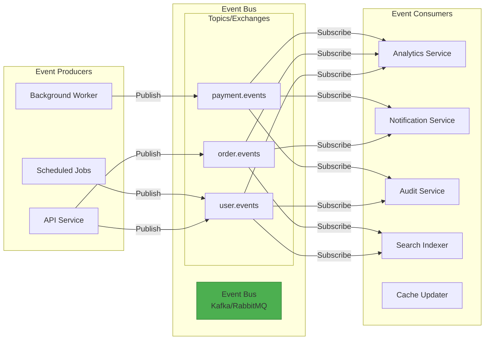
```mermaid
graph LR
    subgraph "Event Producers"
        API[API Service]
        Worker[Background Worker]
        Scheduler[Scheduled Jobs]
    end

    subgraph "Event Bus"
        EB[Event Bus<br/>Kafka/RabbitMQ]

        subgraph "Topics/Exchanges"
            UserEvents[user.events]
            OrderEvents[order.events]
            PaymentEvents[payment.events]
        end
    end

    subgraph "Event Consumers"
        Analytics[Analytics Service]
        Notification[Notification Service]
        Audit[Audit Service]
        Search[Search Indexer]
        Cache[Cache Updater]
    end

    API -->|Publish| UserEvents
    API -->|Publish| OrderEvents
    Worker -->|Publish| PaymentEvents
    Scheduler -->|Publish| UserEvents

    UserEvents -->|Subscribe| Analytics
    UserEvents -->|Subscribe| Audit
    UserEvents -->|Subscribe| Search

    OrderEvents -->|Subscribe| Notification
    OrderEvents -->|Subscribe| Analytics
    OrderEvents -->|Subscribe| Search

    PaymentEvents -->|Subscribe| Notification
    PaymentEvents -->|Subscribe| Audit
    PaymentEvents -->|Subscribe| Analytics

    style EB fill:#4caf50,stroke:#2e7d32
```

## Decision Trees

### Business Logic Flow

**When to use**: Show complex decision logic visually.

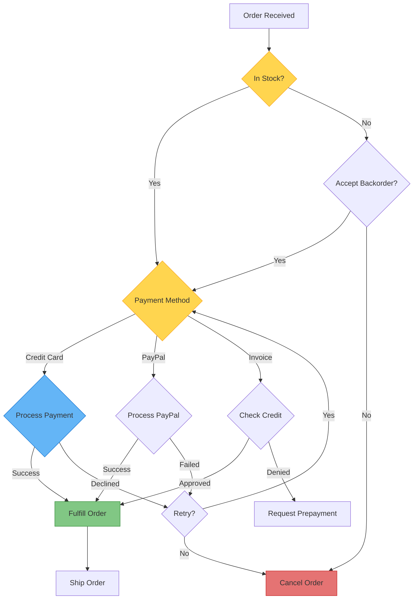
```mermaid
graph TD
    Start[Order Received] --> CheckStock{In Stock?}

    CheckStock -->|Yes| CheckPayment{Payment Method}
    CheckStock -->|No| BackOrder{Accept Backorder?}

    BackOrder -->|Yes| CheckPayment
    BackOrder -->|No| CancelOrder[Cancel Order]

    CheckPayment -->|Credit Card| ProcessCC{Process Payment}
    CheckPayment -->|PayPal| ProcessPP{Process PayPal}
    CheckPayment -->|Invoice| CheckCredit{Check Credit}

    ProcessCC -->|Success| FulfillOrder[Fulfill Order]
    ProcessCC -->|Declined| RetryPayment{Retry?}

    ProcessPP -->|Success| FulfillOrder
    ProcessPP -->|Failed| RetryPayment

    CheckCredit -->|Approved| FulfillOrder
    CheckCredit -->|Denied| RequestPayment[Request Prepayment]

    RetryPayment -->|Yes| CheckPayment
    RetryPayment -->|No| CancelOrder

    FulfillOrder --> ShipOrder[Ship Order]

    style CheckStock fill:#ffd54f,stroke:#f9a825
    style CheckPayment fill:#ffd54f,stroke:#f9a825
    style ProcessCC fill:#64b5f6,stroke:#1976d2
    style FulfillOrder fill:#81c784,stroke:#388e3c
    style CancelOrder fill:#e57373,stroke:#c62828
```

### Feature Flag Decision Tree

**When to use**: Show feature rollout logic.

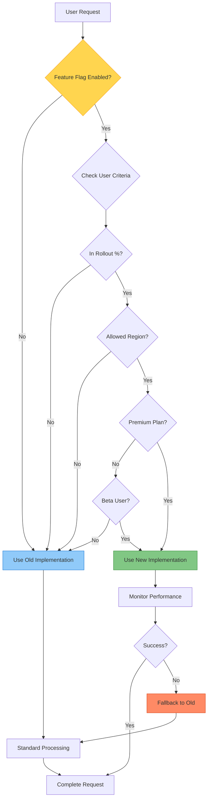
```mermaid
graph TD
    Request[User Request] --> CheckFlag{Feature Flag Enabled?}

    CheckFlag -->|No| OldPath[Use Old Implementation]
    CheckFlag -->|Yes| CheckUser{Check User Criteria}

    CheckUser --> CheckPercentage{In Rollout %?}
    CheckPercentage -->|No| OldPath
    CheckPercentage -->|Yes| CheckRegion{Allowed Region?}

    CheckRegion -->|No| OldPath
    CheckRegion -->|Yes| CheckPlan{Premium Plan?}

    CheckPlan -->|No| CheckBeta{Beta User?}
    CheckPlan -->|Yes| NewPath[Use New Implementation]

    CheckBeta -->|No| OldPath
    CheckBeta -->|Yes| NewPath

    NewPath --> Monitor[Monitor Performance]
    OldPath --> StandardPath[Standard Processing]

    Monitor --> Success{Success?}
    Success -->|Yes| Complete[Complete Request]
    Success -->|No| Fallback[Fallback to Old]
    Fallback --> StandardPath
    StandardPath --> Complete

    style CheckFlag fill:#ffd54f,stroke:#f9a825
    style NewPath fill:#81c784,stroke:#388e3c
    style OldPath fill:#90caf9,stroke:#1976d2
    style Fallback fill:#ff8a65,stroke:#d84315
```

## Tools and Automation

### Diagram Generation Tools

#### 1. **PlantUML to Mermaid Converters**

```bash
# Using npm package
npm install -g plantuml2mermaid
plantuml2mermaid input.puml > output.mmd
```

#### 2. **Code to Diagram Tools**

**TypeScript/JavaScript:**

```bash
# Generate class diagrams from TypeScript
npm install -g tplant
tplant --input src/**/*.ts --output docs/class-diagram.mmd
```

**Database Schema:**

```bash
# Generate ER diagrams from SQL
npm install -g sql-to-mermaid
sql-to-mermaid schema.sql > er-diagram.mmd
```

#### 3. **API Documentation Integration**

```javascript
// Generate sequence diagrams from OpenAPI
const OpenAPIToMermaid = require("openapi-to-mermaid");

const sequenceDiagram = OpenAPIToMermaid.generateSequence(openapiSpec, {
  endpoint: "/api/users/{id}",
  method: "GET",
});
```

### Maintaining Diagram Consistency

#### 1. **Diagram Linting**

Create `.mermaidrc.json`:

```json
{
  "theme": "default",
  "themeVariables": {
    "primaryColor": "#1168bd",
    "primaryBorderColor": "#0b4884",
    "primaryTextColor": "#ffffff",
    "lineColor": "#333333",
    "fontSize": "16px"
  },
  "flowchart": {
    "curve": "basis",
    "useMaxWidth": true
  }
}
```

#### 2. **Version Control Best Practices**

```bash
# Store diagrams as separate .mmd files
/docs/diagrams/
  ├── architecture/
  │   ├── system-context.mmd
  │   ├── container-diagram.mmd
  │   └── component-diagram.mmd
  ├── flows/
  │   ├── user-registration.mmd
  │   └── order-processing.mmd
  └── README.md
```

#### 3. **CI/CD Integration**

```yaml
# .github/workflows/diagrams.yml
name: Update Diagrams
on:
  push:
    paths:
      - "docs/diagrams/**/*.mmd"

jobs:
  render:
    runs-on: ubuntu-latest
    steps:
      - uses: actions/checkout@v3

      - name: Render Mermaid Diagrams
        uses: neenjaw/mermaid-compile-action@v1
        with:
          files: "docs/diagrams/**/*.mmd"
          output: "docs/images"

      - name: Commit Rendered Diagrams
        run: |
          git config user.name "GitHub Actions"
          git config user.email "actions@github.com"
          git add docs/images
          git commit -m "chore: update rendered diagrams" || true
          git push
```

### Export Options

#### 1. **SVG Export (Preferred for Documentation)**

```javascript
// Using mermaid CLI
const mermaid = require("@mermaid-js/mermaid-cli");

await mermaid.run("input.mmd", "output.svg", {
  puppeteerConfig: { headless: true },
  svgId: "diagram-id",
  outputFormat: "svg",
});
```

#### 2. **PNG Export (For Presentations)**

```bash
# Using mmdc (mermaid CLI)
mmdc -i diagram.mmd -o diagram.png -t dark -b transparent
```

#### 3. **PDF Integration**

```bash
# Convert to PDF with diagrams
pandoc README.md \
  --filter mermaid-filter \
  --pdf-engine=xelatex \
  -o documentation.pdf
```

## Best Practices

### 1. **Clarity and Simplicity**

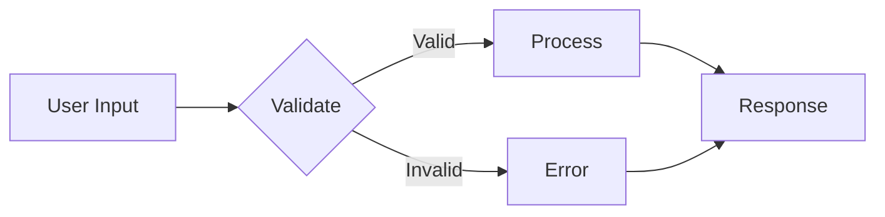
```mermaid
%% Good: Clear and focused
graph LR
    A[User Input] --> B{Validate}
    B -->|Valid| C[Process]
    B -->|Invalid| D[Error]
    C --> E[Response]
    D --> E

%% Avoid: Too complex in one diagram
%% Break into multiple focused diagrams instead
```

### 2. **Consistent Styling**

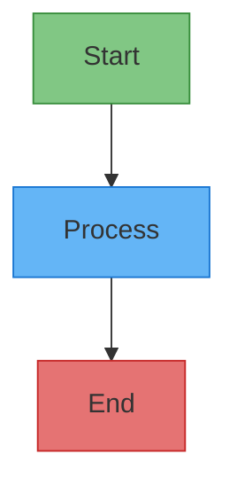
```mermaid
%%{init: {
  'theme': 'base',
  'themeVariables': {
    'primaryColor': '#f4f4f4',
    'primaryBorderColor': '#8b8b8b',
    'primaryTextColor': '#333',
    'lineColor': '#333',
    'secondaryColor': '#006100',
    'tertiaryColor': '#fff'
  }
}}%%
graph TD
    A[Start] --> B[Process]
    B --> C[End]

    style A fill:#81c784,stroke:#388e3c
    style B fill:#64b5f6,stroke:#1976d2
    style C fill:#e57373,stroke:#c62828
```

### 3. **Progressive Disclosure**

Start with high-level overview diagrams and link to detailed diagrams:

```markdown
## System Overview

[High-level architecture diagram]

- See [Container Diagram](./container-diagram.md) for details
- See [Component Diagrams](./components/) for internals
```

### 4. **Accessibility**

```mermaid
graph LR
    A[Start<br/>aria-label='Process start']
    B[Process Data<br/>aria-label='Main processing step']
    C[Complete<br/>aria-label='Process complete']

    A -->|Step 1| B
    B -->|Step 2| C
```

### 5. **Documentation Integration**

````markdown
## User Registration Flow

The following diagram shows the user registration process:

```mermaid
sequenceDiagram
    participant U as User
    participant F as Frontend
    participant A as API
    participant D as Database

    U->>F: Fill registration form
    F->>A: POST /api/register
    A->>D: Check email exists
    D-->>A: Email available
    A->>D: Create user
    D-->>A: User created
    A-->>F: 201 Created
    F-->>U: Registration successful
```
````

### Key Points:

1. User provides registration details
2. Frontend validates input
3. API checks for duplicate emails
4. New user record is created
5. Confirmation sent to user

````
### 6. **Version Control Considerations**

1. **Store source files**: Always commit `.mmd` files, not just rendered images
2. **Use meaningful names**: `user-auth-flow.mmd` not `diagram1.mmd`
3. **Document changes**: Include diagram updates in commit messages
4. **Review changes**: Use diff tools that support Mermaid syntax
5. **Tag versions**: Tag major diagram updates for reference

### 7. **Performance Optimization**

For large diagrams:
```mermaid
graph TD
    subgraph "Use Subgraphs"
        A1 --> A2
        A2 --> A3
    end

    subgraph "Group Related Items"
        B1 --> B2
        B2 --> B3
    end

    A3 --> B1
````

### 8. **Error Handling in Diagrams**

Always show error paths:

```mermaid
graph TD
    Start --> Process
    Process --> Success
    Process --> Error
    Error --> Retry
    Retry --> Process
    Retry --> Fail
    Success --> End
    Fail --> End

    style Error fill:#ffcdd2,stroke:#d32f2f
    style Fail fill:#ef5350,stroke:#c62828,color:#fff
    style Success fill:#c8e6c9,stroke:#388e3c
```

## Common Patterns Library

### Authentication Flow

```mermaid
sequenceDiagram
    participant User
    participant App
    participant Auth
    participant DB

    User->>App: Login request
    App->>Auth: Validate credentials
    Auth->>DB: Check user
    DB-->>Auth: User data
    Auth-->>App: Generate token
    App-->>User: Return token

    User->>App: API request + token
    App->>Auth: Validate token
    Auth-->>App: Token valid
    App-->>User: API response
```

### CI/CD Pipeline

```mermaid
graph LR
    Dev[Developer] --> Git[Git Push]
    Git --> CI{CI Pipeline}

    CI --> Test[Run Tests]
    CI --> Lint[Lint Code]
    CI --> Build[Build App]

    Test --> Quality{Quality Gate}
    Lint --> Quality
    Build --> Quality

    Quality -->|Pass| Deploy[Deploy to Staging]
    Quality -->|Fail| Notify[Notify Developer]

    Deploy --> E2E[E2E Tests]
    E2E -->|Pass| Prod[Deploy to Production]
    E2E -->|Fail| Rollback[Rollback]

    style Quality fill:#ffd54f,stroke:#f9a825
    style Prod fill:#81c784,stroke:#388e3c
    style Rollback fill:#e57373,stroke:#c62828
```

## Summary

This guide provides comprehensive patterns for using Mermaid diagrams in
technical documentation. Key takeaways:

1. **Choose the right diagram type** for your use case
2. **Keep diagrams focused** and avoid overwhelming complexity
3. **Maintain consistency** in styling and naming
4. **Version control** your diagram sources
5. **Automate** diagram generation where possible
6. **Document** both the happy path and error cases
7. **Make diagrams accessible** with proper labels
8. **Integrate** diagrams into your documentation workflow

Remember: A good diagram is worth a thousand words, but a bad diagram can
confuse more than clarify. Always prioritize clarity and purpose over
complexity.
