# Complete Mermaid Reference Guide

## Quick Reference

| Diagram Type                                         | Syntax            | Best For                      |
| ---------------------------------------------------- | ----------------- | ----------------------------- |
| [Flowchart](#flowchart)                              | `graph TD`        | Process flows, decision trees |
| [Sequence](#sequence-diagrams)                       | `sequenceDiagram` | API interactions, protocols   |
| [Class](#class-diagrams)                             | `classDiagram`    | Object-oriented design        |
| [State](#state-diagrams)                             | `stateDiagram-v2` | State machines, workflows     |
| [Entity Relationship](#entity-relationship-diagrams) | `erDiagram`       | Database schemas              |
| [Gantt](#gantt-charts)                               | `gantt`           | Project timelines             |
| [Pie](#pie-charts)                                   | `pie`             | Data distribution             |
| [Git Graph](#git-graph)                              | `gitGraph`        | Version control flow          |
| [User Journey](#user-journey)                        | `journey`         | User experience flows         |

## Flowchart

### Basic Syntax

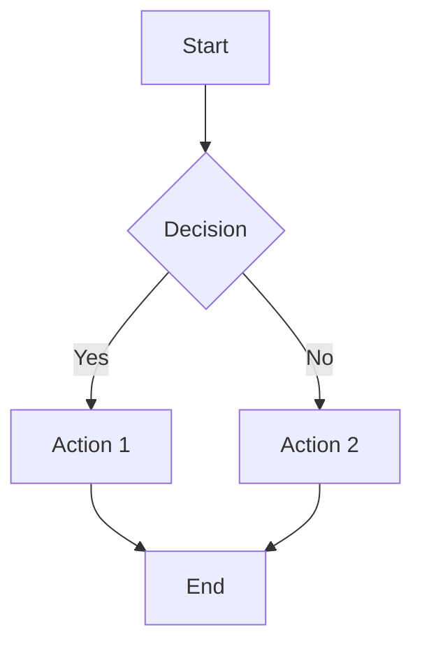

### Node Shapes

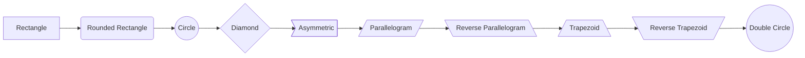

### Directional Flows

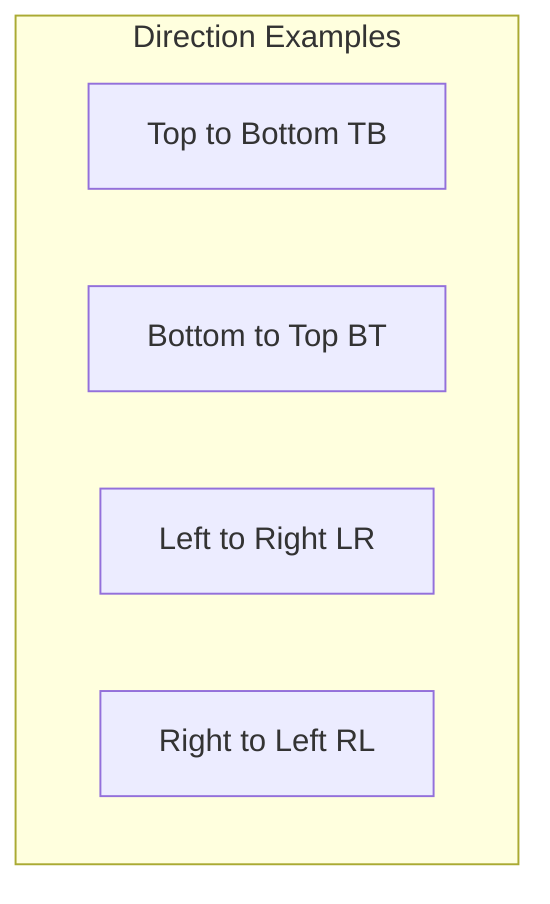

### Styling

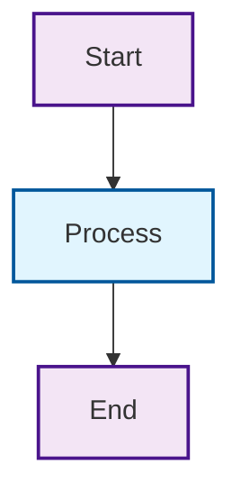

### Subgraphs

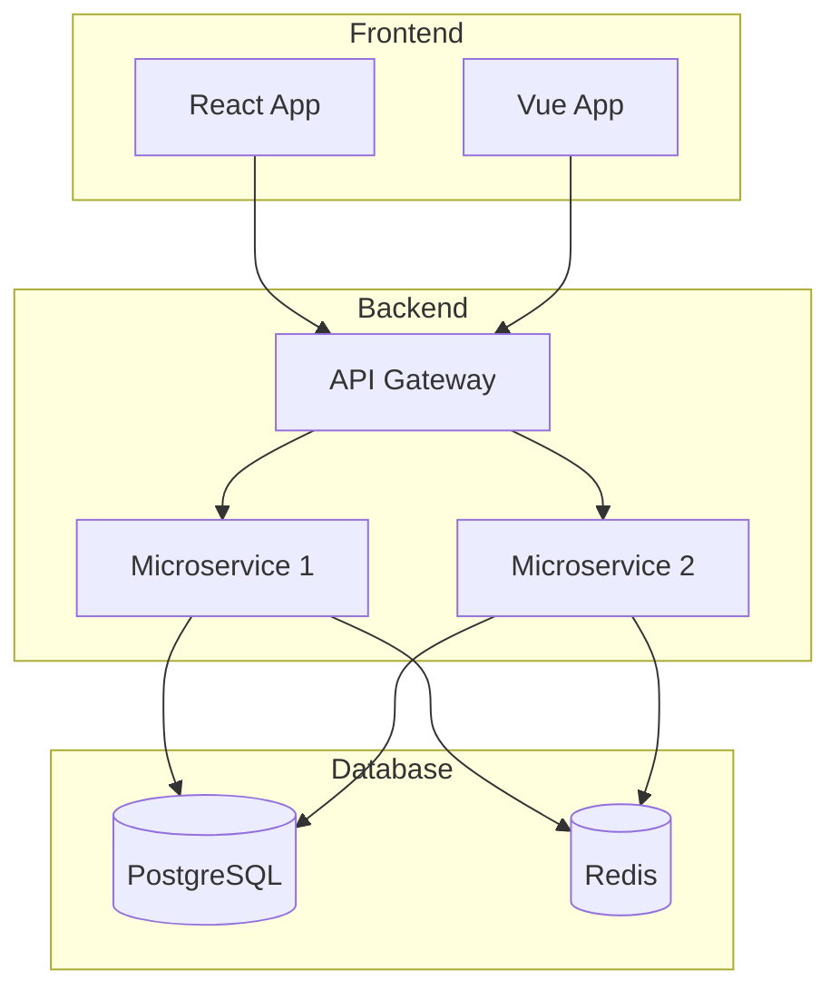

## Sequence Diagrams

### Basic Sequence

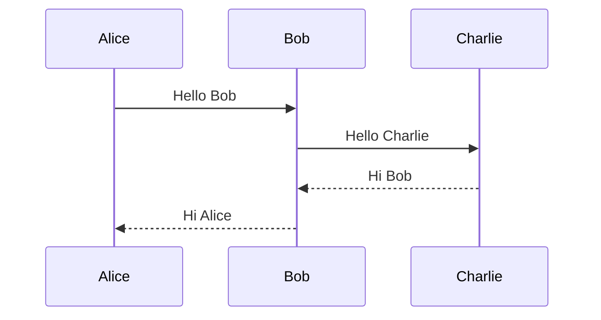

### Message Types

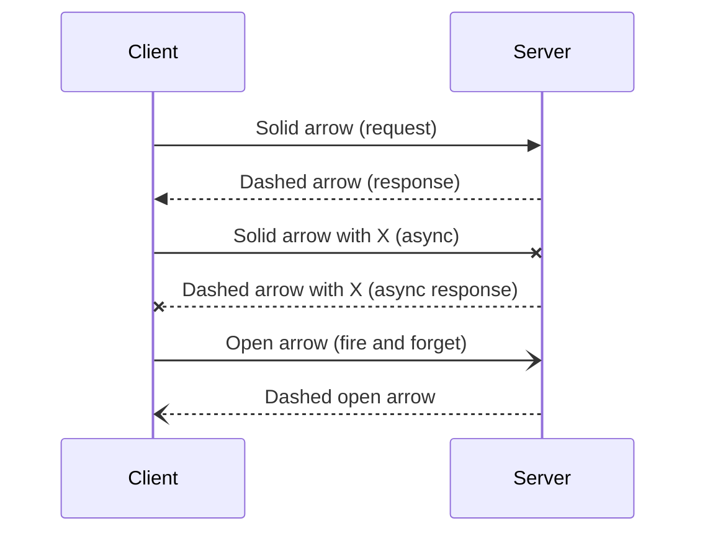

### Activation Boxes

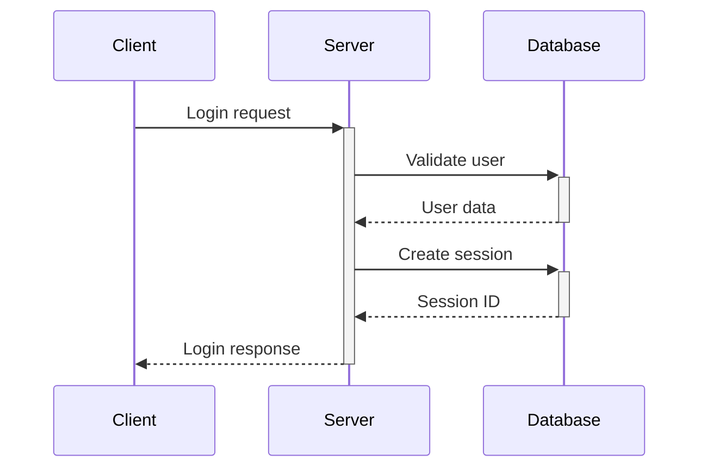

### Loops and Conditionals

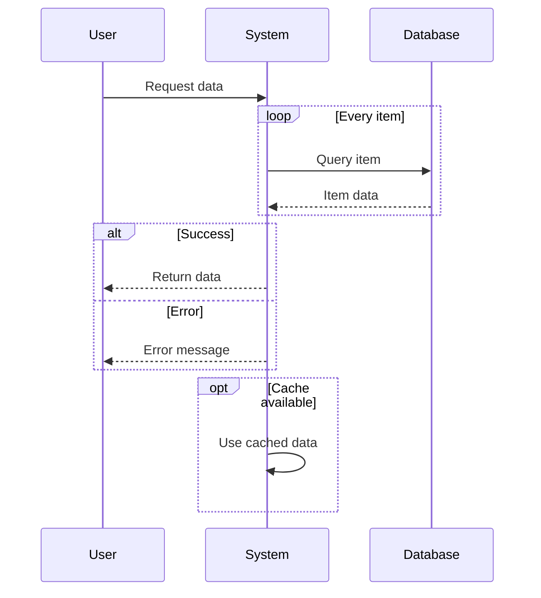

### Notes and Comments

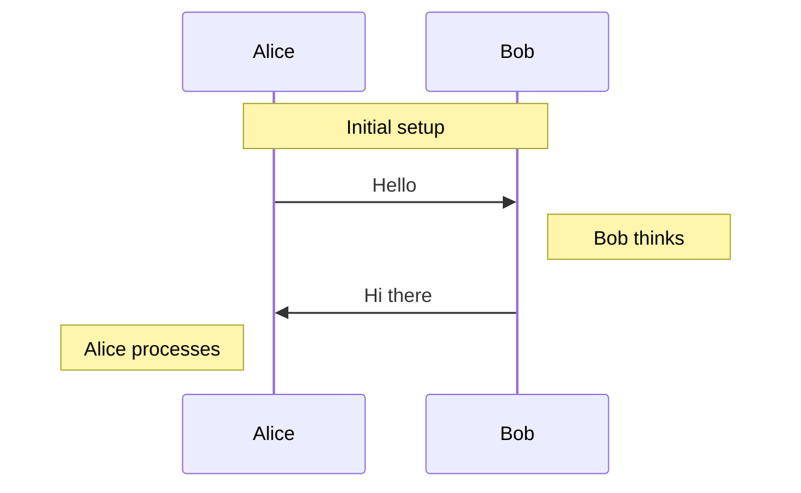

## Class Diagrams

### Basic Class

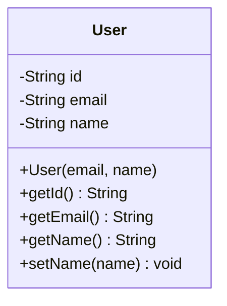

### Visibility Modifiers

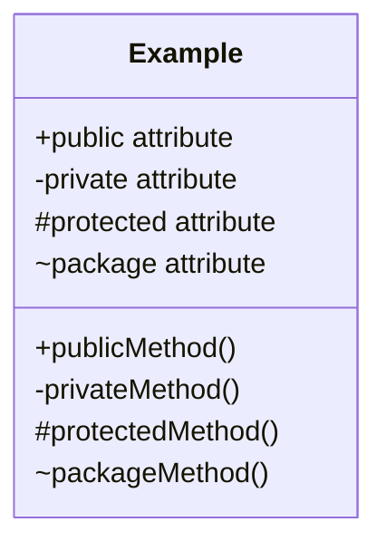

### Relationships

```mermaid
classDiagram
    class User {
        +name: String
        +email: String
    }

    class Order {
        +id: String
        +total: Decimal
    }

    class Product {
        +name: String
        +price: Decimal
    }

    class Category {
        +name: String
    }

    User ||--o{ Order : places
    Order ||--o{ Product : contains
    Category ||--o{ Product : categorizes

    Order : +calculateTotal()
    Product : +applyDiscount()
```

### Inheritance and Interfaces

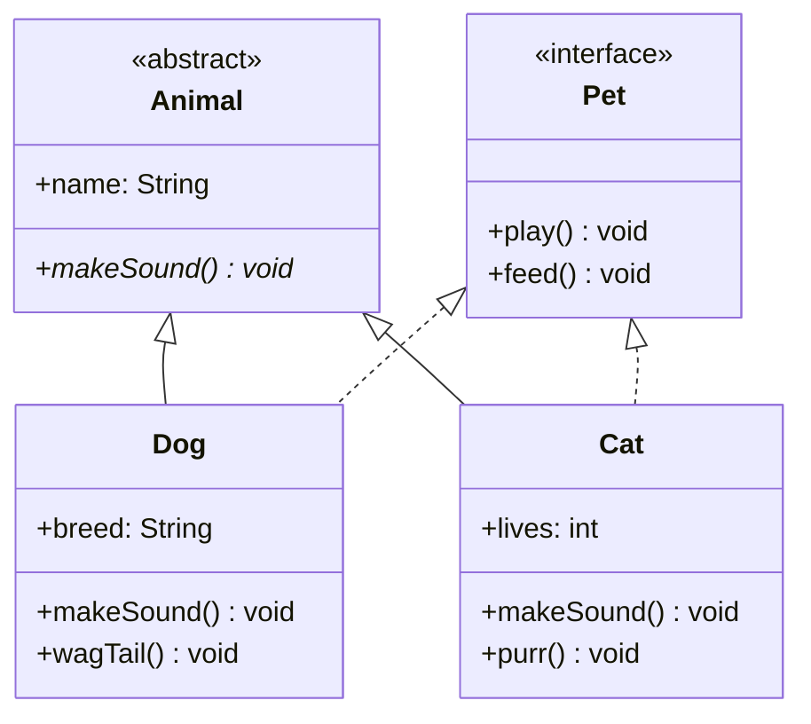

### Annotations

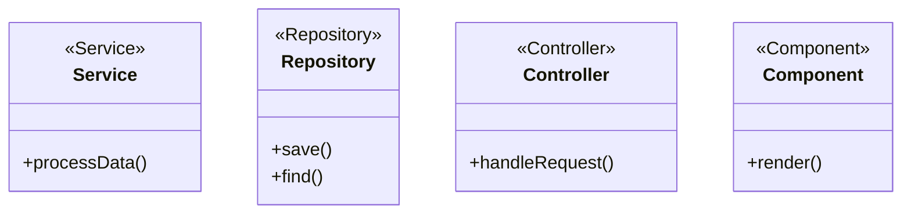

## State Diagrams

### Basic State Machine

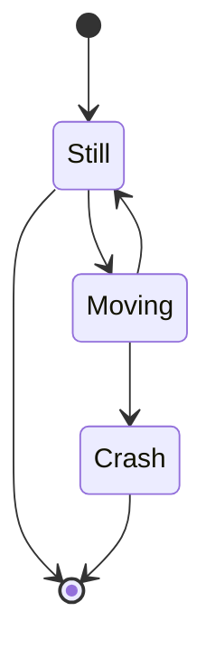

### Composite States

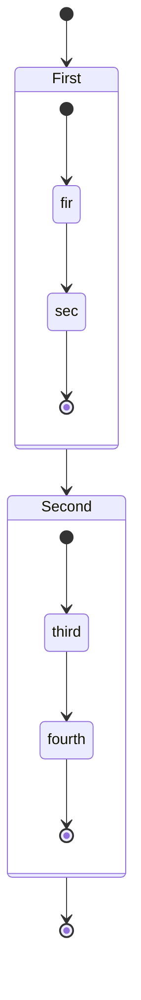

### Parallel States

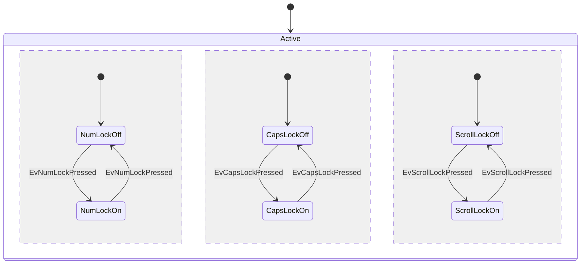

### State Actions

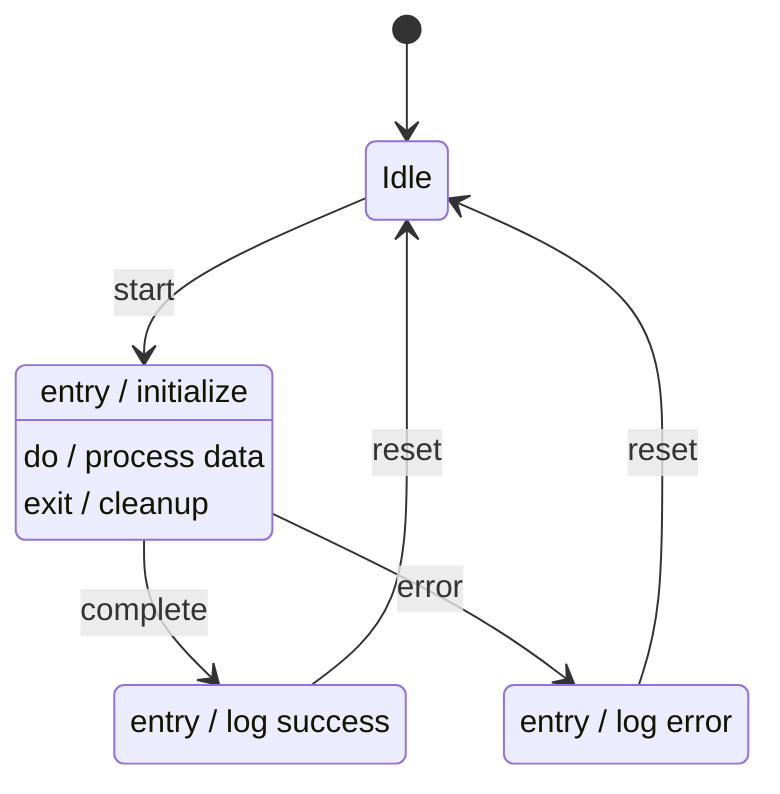

## Entity Relationship Diagrams

### Basic ER Diagram

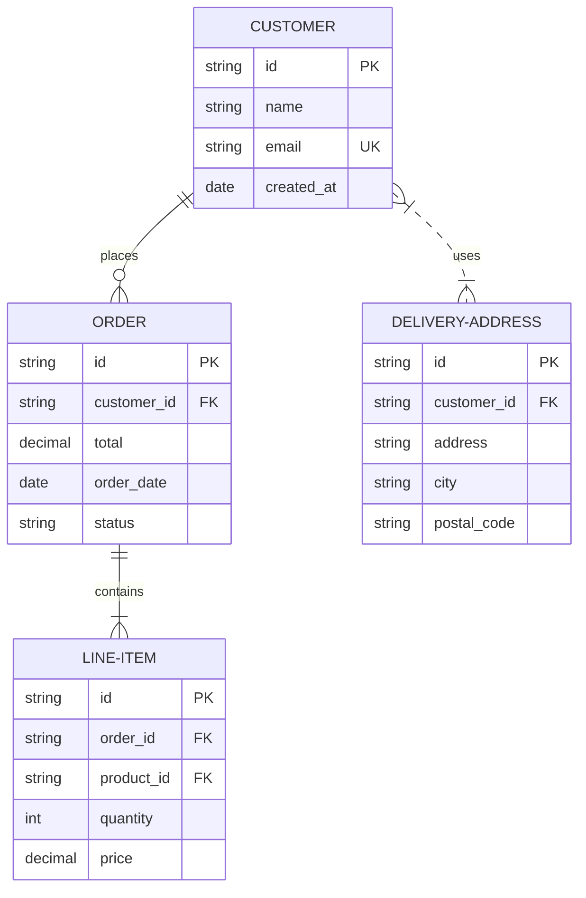

### Relationship Types

```mermaid
erDiagram
    A ||--|| B : "One to One"
    C ||--o{ D : "One to Many"
    E }|--|| F : "Many to One"
    G }|--|{ H : "Many to Many"
    I ||..|| J : "One to One (Optional)"
    K }|..|{ L : "Many to Many (Optional)"
```

### Attributes and Keys

```mermaid
erDiagram
    USER {
        bigint id PK "Primary Key"
        varchar email UK "Unique Key"
        varchar name
        varchar phone
        timestamp created_at
        timestamp updated_at
    }

    PROFILE {
        bigint id PK
        bigint user_id FK "Foreign Key"
        text bio
        varchar avatar_url
        json preferences
    }

    POST {
        bigint id PK
        bigint user_id FK
        varchar title
        text content
        enum status "draft, published, archived"
        timestamp published_at
    }

    USER ||--|| PROFILE : has
    USER ||--o{ POST : writes
```

## Gantt Charts

### Basic Gantt

```mermaid
gantt
    title Project Timeline
    dateFormat YYYY-MM-DD

    section Phase 1
    Task 1           :done,    des1, 2024-01-06, 2024-01-08
    Task 2           :active,  des2, 2024-01-09, 3d
    Task 3           :         des3, after des2, 5d

    section Phase 2
    Task 4           :         des4, 2024-01-12, 6d
    Task 5           :         des5, after des4, 5d

    section Phase 3
    Task 6           :         des6, after des5, 3d
    Task 7           :         des7, after des6, 2d
```

### Milestone and Dependencies

```mermaid
gantt
    title Software Development Project
    dateFormat YYYY-MM-DD

    section Planning
    Requirements     :done,    req, 2024-01-01, 2024-01-05
    Design           :done,    des, 2024-01-06, 2024-01-10

    section Development
    Backend API      :active,  api, 2024-01-11, 2024-01-25
    Frontend         :         fe,  2024-01-16, 2024-01-30
    Database         :done,    db,  2024-01-11, 2024-01-20

    section Testing
    Unit Tests       :         ut,  after api, 5d
    Integration      :         it,  after ut, 3d
    User Testing     :         uat, after fe, 5d

    section Deployment
    Production Setup :milestone, prod, 2024-02-01, 0d
    Go Live         :milestone, live, 2024-02-05, 0d
```

## Pie Charts

### Basic Pie Chart

```mermaid
pie title Browser Usage
    "Chrome" : 58.5
    "Firefox" : 18.2
    "Safari" : 12.1
    "Edge" : 6.8
    "Other" : 4.4
```

### Styled Pie Chart

```mermaid
pie title Programming Languages Usage
    "JavaScript" : 35.2
    "Python" : 24.8
    "Java" : 15.7
    "TypeScript" : 12.3
    "C#" : 8.1
    "Other" : 3.9
```

## Git Graph

### Basic Git Flow

```mermaid
gitGraph
    commit id: "Initial"
    branch develop
    checkout develop
    commit id: "Feature A"
    commit id: "Feature B"
    checkout main
    merge develop
    commit id: "Release"
```

### Complex Branching

```mermaid
gitGraph
    commit id: "Main"
    branch develop
    checkout develop
    commit id: "Dev1"

    branch feature/login
    checkout feature/login
    commit id: "Login UI"
    commit id: "Auth logic"

    checkout develop
    branch feature/dashboard
    checkout feature/dashboard
    commit id: "Dashboard"

    checkout develop
    merge feature/login
    commit id: "Merge login"

    checkout main
    branch hotfix
    checkout hotfix
    commit id: "Security fix"

    checkout main
    merge hotfix

    checkout develop
    merge main
    merge feature/dashboard

    checkout main
    merge develop
    commit id: "Release v1.0"
```

## User Journey

### Customer Journey

```mermaid
journey
    title Customer Purchase Journey
    section Discovery
      Visit website     : 3: Customer
      Browse products   : 4: Customer
      Read reviews      : 5: Customer
    section Consideration
      Compare prices    : 2: Customer
      Contact support   : 4: Customer, Support
      Get quote         : 3: Customer, Sales
    section Purchase
      Add to cart       : 5: Customer
      Checkout          : 3: Customer
      Payment           : 2: Customer
    section Post-Purchase
      Receive product   : 5: Customer
      Leave review      : 4: Customer
      Get support       : 3: Customer, Support
```

### User Experience Flow

```mermaid
journey
    title User Registration Process
    section Landing
      Visit homepage    : 5: User
      Click signup      : 4: User
    section Registration
      Fill form         : 2: User
      Verify email      : 3: User
      Setup profile     : 4: User
    section Onboarding
      Complete tutorial : 3: User
      Invite friends    : 5: User
      Make first action : 4: User
```

## Advanced Features

### Themes and Styling

```mermaid
%%{init: {'theme':'base', 'themeVariables': { 'primaryColor': '#ff0000'}}}%%
graph TD
    A[Start] --> B{Is it?}
    B -->|Yes| C[OK]
    C --> D[Rethink]
    D --> B
    B ---->|No| E[End]
```

### Configuration

```mermaid
%%{init: {
  'theme': 'forest',
  'themeVariables': {
    'primaryColor': '#bb2528',
    'primaryTextColor': '#fff',
    'primaryBorderColor': '#7c0000',
    'lineColor': '#f8b229',
    'secondaryColor': '#006100',
    'tertiaryColor': '#fff'
  }
}}%%
graph TD
    A[Christmas] -->|Get money| B(Go shopping)
    B --> C{Let me think}
    C -->|One| D[Laptop]
    C -->|Two| E[iPhone]
    C -->|Three| F[fa:fa-car Car]
```

### Interactivity

```mermaid
graph TD
    A[Start] --> B{Decision}
    B -->|Yes| C[Action 1]
    B -->|No| D[Action 2]

    click A "https://example.com" "Go to homepage"
    click B "https://example.com/decision" "Learn about decisions"
    click C callback "Action 1 callback"
    click D callback "Action 2 callback"
```

## Best Practices

### 1. Naming Conventions

```mermaid
graph TD
    %% Good: Descriptive names
    UserRegistration[User Registration] --> ValidateInput{Validate Input}
    ValidateInput -->|Valid| CreateUser[Create User Account]
    ValidateInput -->|Invalid| ShowError[Show Error Message]

    %% Avoid: Generic names like A, B, C
```

### 2. Layout and Spacing

```mermaid
graph TB
    %% Use subgraphs for logical grouping
    subgraph "User Interface"
        UI1[Login Form]
        UI2[Dashboard]
    end

    subgraph "Business Logic"
        BL1[Authentication]
        BL2[User Management]
    end

    subgraph "Data Layer"
        DL1[(User Database)]
        DL2[(Session Store)]
    end

    UI1 --> BL1
    UI2 --> BL2
    BL1 --> DL1
    BL1 --> DL2
    BL2 --> DL1
```

### 3. Color Coding

```mermaid
graph TD
    A[Input] --> B{Process}
    B -->|Success| C[Output]
    B -->|Error| D[Handle Error]

    %% Color coding for different types
    classDef input fill:#e3f2fd
    classDef process fill:#f3e5f5
    classDef output fill:#e8f5e8
    classDef error fill:#ffebee

    class A input
    class B process
    class C output
    class D error
```

### 4. Accessibility

```mermaid
graph TD
    A["🔵 Start Process<br/>aria-label='Begin workflow'"]
    B["⚙️ Processing<br/>aria-label='System processing data'"]
    C["✅ Complete<br/>aria-label='Process completed successfully'"]

    A --> B
    B --> C
```

### 5. Documentation Integration

Always accompany complex diagrams with explanations:

````markdown
## System Architecture

The following diagram shows our microservices architecture:

```mermaid
graph TB
    subgraph "API Gateway"
        GW[Kong Gateway]
    end

    subgraph "Services"
        US[User Service]
        OS[Order Service]
        PS[Payment Service]
    end

    GW --> US
    GW --> OS
    GW --> PS
```
````

**Key Components:**

- **Kong Gateway**: Handles routing, authentication, and rate limiting
- **User Service**: Manages user accounts and profiles
- **Order Service**: Processes orders and inventory
- **Payment Service**: Handles payment processing and billing

````
## Troubleshooting Common Issues

### 1. Syntax Errors

```mermaid
%% Common mistake: Missing direction
graph
    A --> B  %% Error: Missing TD, LR, etc.

%% Correct:
graph TD
    A --> B
````

### 2. Unbalanced Brackets

```mermaid
%% Wrong: Unbalanced brackets
graph TD
    A[Start --> B[Process]  %% Missing closing bracket

%% Correct:
graph TD
    A[Start] --> B[Process]
```

### 3. Reserved Words

```mermaid
%% Avoid using reserved words as node names
graph TD
    %% Don't use: class, end, if, else, etc.
    start[Start] --> process[Process]  %% Good
    class --> end  %% Bad - these are reserved
```

### 4. Complex Diagrams

Break complex diagrams into smaller, focused ones:

```mermaid
%% Instead of one massive diagram, create focused views
graph TD
    A[See User Flow Diagram] --> B[See Data Flow Diagram]
    B --> C[See System Architecture]
```

This reference guide covers all major Mermaid diagram types with practical
examples. Use it as a quick reference when creating technical documentation
diagrams.
