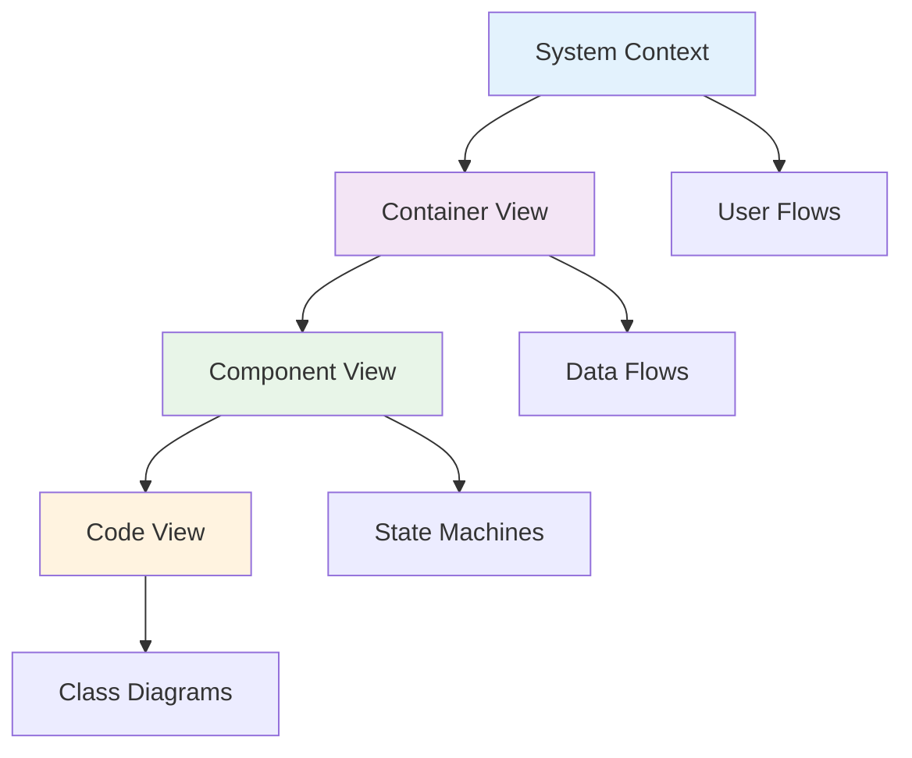
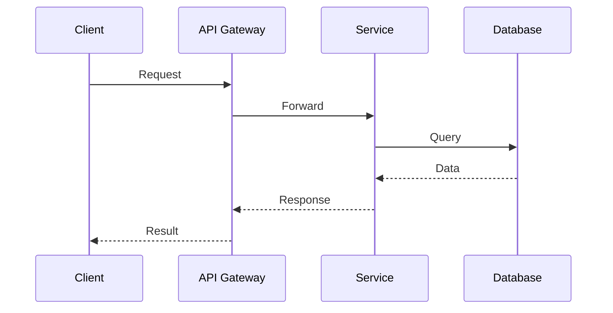

# Technical Documentation with Mermaid Diagrams - Complete Guide

## Overview

This comprehensive guide provides everything needed to create effective
technical documentation using Mermaid diagrams. The collection includes
patterns, automation tools, and best practices for maintaining visual
documentation that scales with your codebase.

## Document Structure

### 1. [Mermaid Diagram Patterns](./MERMAID-DIAGRAM-PATTERNS.md)

**Purpose**: Comprehensive patterns for technical reference documentation

**Key Sections**:

- **System Architecture Diagrams (C4 Model)**: Context, Container, Component,
  and Code level diagrams
- **Data Flow Diagrams**: Simple and complex data processing pipelines
- **State Machines**: Simple and complex state transitions with guards and
  actions
- **Sequence Diagrams**: HTTP flows, async message processing, and protocol
  interactions
- **Entity Relationship Diagrams**: Database schemas and domain models
- **Deployment Diagrams**: Cloud infrastructure and Kubernetes deployments
- **Component Interaction Diagrams**: Microservices and event-driven
  architectures
- **Decision Trees**: Business logic and feature flag decision flows

**When to Use**: Reference when designing new documentation or improving
existing diagrams

### 2. [Advanced Patterns](./diagrams/advanced-patterns.mmd)

**Purpose**: Complex real-world patterns and scenarios

**Key Sections**:

- **Complex State Machines**: Multi-level states with guards and actions
- **Microservices Saga Pattern**: Distributed transaction choreography
- **Event Sourcing Architecture**: CQRS and event-driven systems
- **Multi-Region Database Replication**: Global deployment patterns
- **Service Mesh with Observability**: Istio/Envoy with monitoring
- **Data Pipelines**: Error handling and recovery patterns
- **Authorization Flows**: Complex permission systems
- **Kubernetes Network Policies**: Security and networking visualization

**When to Use**: Complex system design and architecture documentation

### 3. [Diagram Automation Guide](./DIAGRAM-AUTOMATION-GUIDE.md)

**Purpose**: Tools and techniques for automated diagram generation

**Key Sections**:

- **Code to Diagram Generation**: TypeScript, Python, Go, and more
- **Database Schema Visualization**: SQL, Prisma, and ORM schema generation
- **API Documentation Integration**: OpenAPI and GraphQL to diagrams
- **Architecture Documentation as Code**: C4 model generation from YAML
- **CI/CD Integration**: GitHub Actions and GitLab CI automation
- **Diagram Testing and Validation**: Syntax checking and consistency validation
- **Version Control Strategies**: Git hooks and change tracking
- **Export and Publishing**: Multi-format output and documentation site
  integration

**When to Use**: Setting up automated documentation workflows

### 4. [Complete Reference Guide](./MERMAID-REFERENCE-GUIDE.md)

**Purpose**: Quick reference for all Mermaid diagram types

**Key Sections**:

- **Flowchart**: Process flows with all node shapes and styling options
- **Sequence Diagrams**: Message types, activation boxes, loops, and
  conditionals
- **Class Diagrams**: Visibility, relationships, inheritance, and annotations
- **State Diagrams**: Composite states, parallel states, and actions
- **Entity Relationship Diagrams**: Relationship types and attribute
  specifications
- **Gantt Charts**: Timeline visualization with dependencies and milestones
- **Specialized Diagrams**: Pie charts, Git graphs, and user journeys
- **Advanced Features**: Themes, configuration, and interactivity
- **Best Practices**: Naming, layout, accessibility, and troubleshooting

**When to Use**: Quick syntax reference while creating diagrams

## Implementation Strategy

### Phase 1: Foundation (Week 1-2)

1. **Setup Basic Infrastructure**
   - Install Mermaid CLI and validation tools
   - Configure git hooks for diagram validation
   - Set up directory structure for diagrams

2. **Create Core Documentation**
   - Document existing system architecture using C4 model
   - Create sequence diagrams for key API flows
   - Generate ER diagrams from database schemas

### Phase 2: Automation (Week 3-4)

1. **Implement Automated Generation**
   - Set up code-to-diagram generation for class diagrams
   - Configure database schema visualization
   - Create CI/CD pipeline for diagram updates

2. **Establish Quality Controls**
   - Implement diagram syntax validation
   - Set up consistency checking
   - Create export pipeline for multiple formats

### Phase 3: Integration (Week 5-6)

1. **Documentation Site Integration**
   - Embed diagrams in documentation site
   - Set up automated diagram publishing
   - Configure multi-format exports

2. **Team Training and Adoption**
   - Train team on diagram patterns
   - Establish documentation standards
   - Create contribution guidelines

## Quick Start Checklist

### Initial Setup

- [ ] Install Mermaid CLI: `npm install -g @mermaid-js/mermaid-cli`
- [ ] Create diagram directory structure
- [ ] Configure git hooks for validation
- [ ] Set up basic CI/CD pipeline

### First Diagrams

- [ ] Create system context diagram (C4 Level 1)
- [ ] Document main user flows with sequence diagrams
- [ ] Generate database ER diagram
- [ ] Create deployment architecture diagram

### Automation

- [ ] Set up class diagram generation from code
- [ ] Configure diagram validation in CI/CD
- [ ] Implement multi-format export
- [ ] Create diagram index and documentation

## Best Practices Summary

### 1. Diagram Design Principles

- **Clarity First**: Simple, focused diagrams are better than complex ones
- **Consistent Styling**: Use standardized colors and shapes
- **Progressive Disclosure**: Start with high-level, link to detailed views
- **Accessibility**: Include alt text and clear labeling

### 2. Maintenance Strategies

- **Version Control**: Always store source (.mmd) files
- **Automated Updates**: Generate diagrams from code when possible
- **Regular Reviews**: Update diagrams during code reviews
- **Validation**: Check syntax and consistency in CI/CD

### 3. Documentation Integration

- **Context**: Always explain what the diagram shows
- **Relationships**: Link related diagrams together
- **Currency**: Keep diagrams up-to-date with code changes
- **Discovery**: Make diagrams easy to find and navigate

## Common Use Cases

### Software Architecture Documentation



### API Documentation



### Database Design

```mermaid
erDiagram
    USER ||--o{ ORDER : places
    ORDER ||--|{ LINE_ITEM : contains
    PRODUCT ||--o{ LINE_ITEM : included_in
    
    USER {
        id PK
        email UK
        name
    }
    
    ORDER {
        id PK
        user_id FK
        total
        status
    }
```

## Tools and Resources

### Essential Tools

- **Mermaid CLI**: `@mermaid-js/mermaid-cli`
- **VS Code Extension**: Mermaid Preview
- **GitHub Integration**: Native Mermaid support
- **Documentation Sites**: GitBook, Notion, VitePress support

### Validation Tools

- **Syntax Checker**: Built into Mermaid CLI
- **Consistency Checker**: Custom scripts for naming conventions
- **Export Validator**: Multi-format output verification

### Automation Tools

- **Code Generators**: tplant (TypeScript), py2mermaid (Python)
- **Schema Generators**: SQL-to-mermaid, Prisma-to-mermaid
- **CI/CD Integration**: GitHub Actions, GitLab CI templates

## Troubleshooting Guide

### Common Issues

1. **Syntax Errors**: Use validation tools and check bracket balance
2. **Rendering Problems**: Verify theme compatibility and node naming
3. **Performance Issues**: Break large diagrams into smaller focused ones
4. **Export Problems**: Check output format support and dependencies

### Solutions

- Keep diagrams under 50 nodes for optimal performance
- Use descriptive names instead of generic identifiers
- Validate syntax before committing
- Test exports in CI/CD pipeline

## Conclusion

This comprehensive guide provides everything needed to implement effective
technical documentation using Mermaid diagrams. The combination of patterns,
automation, and best practices ensures that your documentation remains accurate,
accessible, and maintainable.

### Key Benefits

- **Improved Communication**: Visual diagrams clarify complex concepts
- **Better Onboarding**: New team members understand systems faster
- **Reduced Maintenance**: Automated generation keeps diagrams current
- **Enhanced Collaboration**: Standardized patterns improve team consistency

### Next Steps

1. Start with the [Quick Start Checklist](#quick-start-checklist)
2. Choose patterns from the
   [Diagram Patterns Guide](./MERMAID-DIAGRAM-PATTERNS.md)
3. Implement automation using the
   [Automation Guide](./DIAGRAM-AUTOMATION-GUIDE.md)
4. Reference the [Complete Guide](./MERMAID-REFERENCE-GUIDE.md) for syntax

Remember: Great documentation is not just about having diagrams—it's about
having the right diagrams that tell the story of your system clearly and
accurately.
