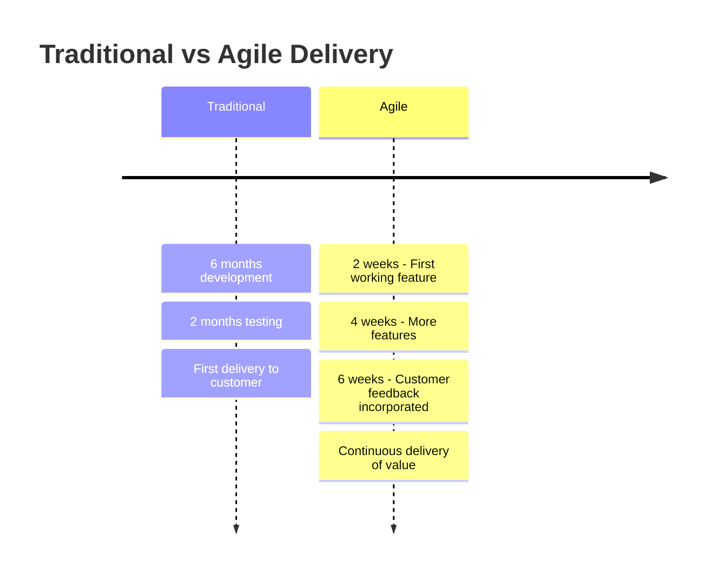

# Agile Manifesto

## Overview

The Agile Manifesto, created in February 2001 by seventeen software developers at a ski resort in Utah, revolutionized
software development by establishing a new set of values and principles. It emerged from frustration with heavyweight,
documentation-driven development processes and aimed to uncover better ways of developing software.

## The Four Core Values

### 1. Individuals and Interactions Over Processes and Tools

While processes and tools are important, the focus should be on empowering people and fostering communication.

```
Traditional Approach:          Agile Approach:
┌──────────────────┐          ┌──────────────────┐
│ Rigid Processes  │          │ Empowered Teams  │
│ Heavy Tools      │    →     │ Direct Communication │
│ Documentation    │          │ Collaboration    │
└──────────────────┘          └──────────────────┘
```

**In Practice:**

- Face-to-face conversations over lengthy email chains
- Self-organizing teams over command-and-control management
- Pair programming over isolated development
- Team decisions over management directives

### 2. Working Software Over Comprehensive Documentation

Documentation should serve the software, not become an end in itself.

```python
# Traditional: Extensive documentation before coding
"""
Software Requirements Specification v2.3
Last Updated: 2024-01-15
Pages: 347

Table of Contents:
1. Introduction (45 pages)
2. System Architecture (89 pages)
3. Detailed Requirements (156 pages)
4. Appendices (57 pages)
"""

# Agile: Just enough documentation
class UserService:
    """Handles user authentication and profile management."""
    
    def authenticate(self, username: str, password: str) -> User:
        """
        Authenticate user with credentials.
        Returns User object if successful, raises AuthError otherwise.
        """
        # Working code that demonstrates the behavior
```

### 3. Customer Collaboration Over Contract Negotiation

Ongoing collaboration leads to better outcomes than rigid adherence to initial requirements.

**Traditional Contract Approach:**

```yaml
project:
  requirements: "Fixed at contract signing"
  changes: "Require formal change requests"
  customer_interaction: "At milestones only"
  success_criteria: "Meeting initial specifications"
```

**Agile Collaboration Approach:**

```yaml
project:
  requirements: "Evolve through collaboration"
  changes: "Welcome as understanding improves"
  customer_interaction: "Continuous involvement"
  success_criteria: "Delivering value to customer"
```

### 4. Responding to Change Over Following a Plan

The ability to adapt is more valuable than following an outdated plan.

```javascript
// Traditional: Rigid adherence to plan
const projectPlan = {
  phase1: "Complete by March (no changes allowed)",
  phase2: "Complete by June (locked requirements)",
  phase3: "Complete by September (fixed scope)",
};

// Agile: Adaptive planning
const agilePlan = {
  currentSprint: "Deliver highest value features",
  nextSprint: "Adjust based on feedback",
  future: "Continuously re-prioritize based on learning",
};
```

## The Twelve Principles

### 1. Customer Satisfaction Through Early and Continuous Delivery



### 2. Welcome Changing Requirements

```python
# Traditional approach fears change
def traditional_development():
    requirements = freeze_requirements()  # Locked early
    if change_requested():
        raise ChangeControlException("Submit formal request")
    
# Agile approach embraces change
def agile_development():
    while project.active:
        current_requirements = get_highest_priority_needs()
        deliver_increment(current_requirements)
        feedback = gather_customer_feedback()
        adjust_priorities(feedback)
```

### 3. Deliver Working Software Frequently

**Delivery Cycles:**

- Traditional: 6-18 months
- Agile: 1-4 weeks

```javascript
// Agile delivery cycle
class SprintCycle {
  constructor(duration = 2) {
    this.weeks = duration;
  }

  execute() {
    this.plan(); // Day 1
    this.develop(); // Days 2-9
    this.review(); // Day 10 morning
    this.retrospective(); // Day 10 afternoon
    this.deliver(); // End of sprint
  }
}
```

### 4. Business People and Developers Work Together Daily

```yaml
traditional_interaction:
  requirements_phase: "Business people involved"
  development_phase: "Developers work in isolation"
  testing_phase: "Limited interaction"
  delivery: "Business sees result"

agile_interaction:
  daily_standup: "Product owner present"
  sprint_planning: "Business priorities discussed"
  development: "Continuous clarification"
  review: "Immediate feedback"
```

### 5. Build Projects Around Motivated Individuals

```typescript
// Creating the right environment
interface AgileEnvironment {
  trust: "High - team makes decisions";
  support: "Resources and tools provided";
  autonomy: "Self-organizing teams";
  purpose: "Clear vision and goals";
  mastery: "Continuous learning encouraged";
}

// Traditional vs Agile team structure
class TraditionalTeam {
  manager: "Assigns all tasks";
  developers: "Follow instructions";
  communication: "Top-down";
}

class AgileTeam {
  facilitator: "Removes impediments";
  members: "Self-assign tasks";
  communication: "All directions";
}
```

### 6. Face-to-Face Conversation

**Communication Effectiveness:**

```
Most Effective ←────────────────→ Least Effective

Face-to-face → Video call → Phone → Chat → Email → Documentation
at whiteboard
```

### 7. Working Software as Primary Measure

```python
# Traditional metrics
traditional_progress = {
    "lines_of_code": 50000,
    "documents_completed": 23,
    "hours_worked": 1200,
    "percent_complete": "60%"  # Based on tasks, not value
}

# Agile metrics
agile_progress = {
    "features_delivered": 15,
    "user_stories_completed": 45,
    "business_value_delivered": "High priority items done",
    "customer_satisfaction": "Increasing"
}
```

### 8. Sustainable Development Pace

```javascript
// Unsustainable pace leads to burnout
const crunchMode = {
  week1: { hours: 50, productivity: "100%" },
  week2: { hours: 60, productivity: "90%" },
  week3: { hours: 70, productivity: "70%" },
  week4: { hours: 80, productivity: "40%", bugs: "increasing" },
};

// Sustainable pace maintains quality
const sustainablePace = {
  everyWeek: {
    hours: 40,
    productivity: "95%",
    quality: "consistent",
    teamMorale: "high",
  },
};
```

### 9. Technical Excellence and Good Design

```ruby
# Technical debt slows agility
class TechnicalDebt
  def initialize
    @shortcuts_taken = 0
    @refactoring_needed = []
  end
  
  def take_shortcut
    @shortcuts_taken += 1
    # Each shortcut makes future changes harder
    @change_difficulty *= 1.2
  end
end

# Continuous attention to quality
class TechnicalExcellence
  def develop_feature
    write_tests_first
    implement_simply
    refactor_continuously
    review_with_peer
  end
end
```

### 10. Simplicity - Maximizing Work Not Done

```python
# YAGNI in practice
# Bad: Building for imagined future needs
class OverEngineeredSolution:
    def __init__(self):
        self.configure_multi_tenancy()      # Not needed yet
        self.setup_microservices()          # Single service would work
        self.implement_caching_layers()     # No performance issues
        self.add_ai_recommendation()        # Customer didn't ask
        
# Good: Build what's needed now
class SimpleSolution:
    def __init__(self):
        self.solve_current_problem()        # Focus on actual need
```

### 11. Self-Organizing Teams

```yaml
traditional_team:
  architect: "Designs entire system"
  team_lead: "Assigns all tasks"
  developers: "Implement assigned work"
  tester: "Tests after development"

self_organizing_team:
  team: "Collectively owns architecture"
  members: "Pull tasks based on skills/interest"
  everyone: "Shares responsibility for quality"
  decisions: "Made by those doing the work"
```

### 12. Regular Reflection and Adaptation

```javascript
class SprintRetrospective {
  reflect() {
    const insights = {
      whatWentWell: [
        "Pair programming improved code quality",
        "Daily standups kept us aligned",
      ],
      whatCouldImprove: [
        "Too many meetings",
        "Unclear requirements from PO",
      ],
      actionItems: [
        "Limit meetings to 2 per day",
        "PO to provide acceptance criteria",
      ],
    };
    return insights;
  }

  adapt() {
    // Implement changes in next sprint
    this.implementActionItems();
    this.measureImpact();
  }
}
```

## Common Agile Practices

### Scrum Framework

```python
class ScrumFramework:
    def __init__(self):
        self.roles = ["Product Owner", "Scrum Master", "Development Team"]
        self.events = ["Sprint Planning", "Daily Scrum", "Sprint Review", "Retrospective"]
        self.artifacts = ["Product Backlog", "Sprint Backlog", "Increment"]
    
    def run_sprint(self, duration_weeks=2):
        self.sprint_planning()
        for day in range(duration_weeks * 5):  # Working days
            self.daily_scrum()
            self.development_work()
        self.sprint_review()
        self.sprint_retrospective()
```

### Kanban Method

```javascript
class KanbanBoard {
  constructor() {
    this.columns = ["To Do", "In Progress", "Review", "Done"];
    this.wipLimits = { "In Progress": 3, "Review": 2 };
  }

  moveCard(card, toColumn) {
    if (
      this.wipLimits[toColumn] &&
      this.getCardCount(toColumn) >= this.wipLimits[toColumn]
    ) {
      throw new Error(`WIP limit exceeded for ${toColumn}`);
    }
    // Move card and update metrics
  }
}
```

### Extreme Programming (XP)

```ruby
module ExtremeProgramming
  PRACTICES = {
    planning_game: "Determine scope of releases and iterations",
    small_releases: "Release early and often",
    pair_programming: "Two developers, one computer",
    continuous_integration: "Integrate and test frequently",
    refactoring: "Improve code structure continuously",
    collective_ownership: "Everyone owns all the code",
    simple_design: "Simplest thing that works",
    test_driven: "Write test first, then code"
  }
  
  def develop_feature
    write_failing_test
    write_simplest_code_to_pass
    refactor_if_needed
    integrate_continuously
  end
end
```

## Agile at Scale

### Scaling Challenges

```yaml
small_team_agile:
  communication: "Easy - everyone in same room"
  coordination: "Simple - daily standups"
  alignment: "Natural - shared understanding"

large_organization_agile:
  communication: "Complex - multiple teams/locations"
  coordination: "Challenging - dependencies"
  alignment: "Difficult - competing priorities"

scaling_solutions:
  - framework: "SAFe (Scaled Agile Framework)"
    focus: "Enterprise-wide agility"
  - framework: "LeSS (Large Scale Scrum)"
    focus: "Simplicity at scale"
  - framework: "Spotify Model"
    focus: "Autonomous squads with alignment"
```

## Common Misconceptions

### "Agile Means No Documentation"

```python
# Wrong interpretation
def no_documentation_approach():
    # Just code, no docs at all
    pass

# Correct interpretation
def appropriate_documentation():
    """
    Document:
    - Why decisions were made
    - How to use the system
    - Architecture overview
    
    Don't document:
    - Obvious code behavior
    - Detailed specs that change frequently
    - Things better shown in code
    """
```

### "Agile Means No Planning"

```javascript
// Misconception: Agile is chaos
const chaosMode = {
  planning: "none",
  direction: "random",
  results: "unpredictable",
};

// Reality: Agile plans differently
const agilePlanning = {
  vision: "Clear long-term direction",
  roadmap: "Flexible medium-term goals",
  sprint: "Detailed short-term plans",
  daily: "Continuous micro-adjustments",
};
```

## Measuring Agile Success

### Traditional vs Agile Metrics

```typescript
interface TraditionalMetrics {
  linesOfCode: number;
  percentComplete: number;
  hoursWorked: number;
  documentsProduced: number;
}

interface AgileMetrics {
  customerSatisfaction: number;
  businessValueDelivered: string[];
  cycleTime: number; // Idea to production
  teamHappiness: number;
  defectRate: number;
  deploymentFrequency: number;
}
```

### Value Delivery

```python
class ValueStream:
    def measure_flow(self):
        return {
            "lead_time": self.time_from_request_to_delivery(),
            "cycle_time": self.time_from_start_to_delivery(),
            "throughput": self.features_delivered_per_sprint(),
            "quality": self.defect_escape_rate(),
            "value": self.business_outcomes_achieved()
        }
```

## Cultural Transformation

### From Command-and-Control to Servant Leadership

```yaml
traditional_manager:
  role: "Direct and control"
  decisions: "Made by manager"
  information: "Flows up and down"
  focus: "Individual performance"
  motivation: "Extrinsic rewards"

agile_leader:
  role: "Serve and enable"
  decisions: "Made by team"
  information: "Flows all directions"
  focus: "Team success"
  motivation: "Intrinsic purpose"
```

## Conclusion

The Agile Manifesto isn't a methodology—it's a mindset. It's not about following specific practices, but about embracing
values that lead to better software and happier teams. The key is understanding that:

1. **People** create software, not processes
2. **Working software** is the goal, not documentation
3. **Collaboration** yields better results than negotiation
4. **Adaptability** beats rigid planning

Remember: "Being Agile" is not the goal—delivering value to customers and creating sustainable, enjoyable work
environments is the goal. Agile values and principles are simply tools to help achieve these outcomes.
