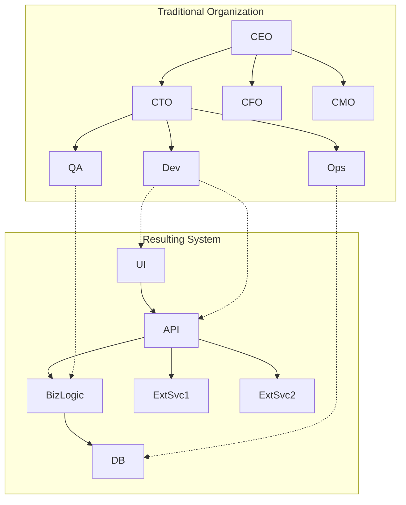

# Conway's Law

## Overview

"Organizations which design systems are constrained to produce designs which are copies of the communication structures
of these organizations." - Melvin Conway, 1967

Conway's Law is a profound observation about the relationship between organizational structure and system architecture.
It reveals that the software we build inevitably mirrors the communication patterns of the teams that build it.

## Core Concept

The law suggests that:

1. **System design mirrors organizational design**
2. **Communication paths become system interfaces**
3. **Team boundaries become architectural boundaries**
4. **Organizational silos create technical silos**

## Visual Representation



## Real-World Examples

### Example 1: Microservices and Team Structure

```yaml
# Organization: Amazon (Two-Pizza Teams)
teams:
  product_catalog_team:
    size: 6-8 people
    ownership: "Product catalog service"
    autonomy: "Full stack ownership"

  shopping_cart_team:
    size: 6-8 people
    ownership: "Shopping cart service"
    autonomy: "Deploy independently"

  payment_team:
    size: 6-8 people
    ownership: "Payment service"
    autonomy: "Own database, API"

# Resulting Architecture
architecture:
  services:
    - product_catalog_service:
        api: "/products"
        database: "products_db"
        team: "product_catalog_team"

    - shopping_cart_service:
        api: "/cart"
        database: "cart_db"
        team: "shopping_cart_team"

    - payment_service:
        api: "/payments"
        database: "payments_db"
        team: "payment_team"
```

### Example 2: Monolithic Systems from Hierarchical Organizations

```python
# Traditional Organization Structure
class TraditionalOrg:
    def __init__(self):
        self.layers = {
            "executives": ["CEO", "CTO", "CFO"],
            "managers": ["Dev Manager", "QA Manager", "DBA"],
            "developers": ["Frontend Team", "Backend Team"],
            "testers": ["QA Team"],
            "operations": ["DBA Team", "Sysadmin Team"]
        }
    
    def communication_flow(self):
        # Vertical communication through hierarchy
        return "Top-down through management layers"

# Resulting Monolithic Architecture
class MonolithicSystem:
    def __init__(self):
        self.layers = {
            "presentation": "Tightly coupled to business logic",
            "business_logic": "Mixed with data access",
            "data_access": "Direct database calls everywhere",
            "database": "Single shared database"
        }
        
    def deployment(self):
        return "Everything deployed together"
```

### Example 3: Frontend/Backend Split

```javascript
// Organization: Separate Frontend and Backend Teams
const organization = {
  frontendTeam: {
    members: ["UI Developer", "UX Designer", "Frontend Lead"],
    responsibilities: ["React Components", "CSS", "User Experience"],
    communication: "Weekly sync with backend team",
  },

  backendTeam: {
    members: ["API Developer", "Database Expert", "Backend Lead"],
    responsibilities: ["REST APIs", "Business Logic", "Database"],
    communication: "API contracts with frontend",
  },
};

// Resulting Architecture
const architecture = {
  frontend: {
    technology: "React SPA",
    deployment: "CDN/S3",
    integration: "REST API calls",
  },

  backend: {
    technology: "Node.js API",
    deployment: "Kubernetes",
    integration: "JSON over HTTPS",
  },

  coupling: "Loose coupling through API contracts",
};
```

## The Inverse Conway Maneuver

Using Conway's Law strategically by designing teams to create desired architecture:

```typescript
// Step 1: Define Target Architecture
interface TargetArchitecture {
  services: ServiceDefinition[];
  interactions: InteractionPattern[];
}

// Step 2: Design Team Topology to Match
class TeamDesign {
  createTeamsForArchitecture(target: TargetArchitecture): Team[] {
    return target.services.map((service) => ({
      name: `${service.name}-team`,
      responsibilities: service.capabilities,
      ownership: {
        code: service.codebase,
        infrastructure: service.infrastructure,
        data: service.database,
        deployment: service.deployment,
      },
      size: this.calculateTeamSize(service.complexity),
    }));
  }
}

// Step 3: Establish Communication Patterns
class CommunicationDesign {
  defineInteractions(teams: Team[]): CommunicationPattern[] {
    return [
      {
        type: "API Contract",
        between: ["Orders Team", "Inventory Team"],
        frequency: "Async via events",
      },
      {
        type: "Collaboration",
        between: ["Platform Team", "Product Teams"],
        frequency: "Self-service with support",
      },
    ];
  }
}
```

## Team Topologies and Architecture

### Stream-Aligned Teams

```ruby
class StreamAlignedTeam
  attr_reader :name, :value_stream, :architecture
  
  def initialize(value_stream)
    @value_stream = value_stream
    @name = "#{value_stream} Team"
    @architecture = {
      ownership: "End-to-end feature delivery",
      boundaries: "Vertical slice through all layers",
      interfaces: "Minimal dependencies on other teams"
    }
  end
  
  def resulting_system
    {
      frontend: "Owned UI components",
      backend: "Owned API endpoints",
      database: "Owned tables/schemas",
      deployment: "Independent deployment pipeline"
    }
  end
end

# Example: E-commerce teams
checkout_team = StreamAlignedTeam.new("Checkout")
search_team = StreamAlignedTeam.new("Search")
recommendation_team = StreamAlignedTeam.new("Recommendations")
```

### Platform Teams

```python
class PlatformTeam:
    def __init__(self, platform_name):
        self.name = f"{platform_name} Platform Team"
        self.customers = "Internal development teams"
        
    def architecture_impact(self):
        return {
            "provides": [
                "Self-service infrastructure",
                "Shared libraries and tools",
                "Common services (auth, logging)",
                "Developer experience tools"
            ],
            "interfaces": {
                "type": "X-as-a-Service",
                "examples": [
                    "Deployment pipelines as a service",
                    "Monitoring as a service",
                    "Authentication as a service"
                ]
            },
            "result": "Consistent infrastructure layer across all services"
        }

# Usage
platform = PlatformTeam("Developer")
platform_architecture = platform.architecture_impact()
```

## Communication Patterns and System Interfaces

### Tight Coupling from Close Collaboration

```javascript
// High-bandwidth communication between teams
const tightlyCoupledTeams = {
  teamA: {
    name: "User Service Team",
    communication: {
      withTeamB: "Daily standups together",
      sharedCode: true,
      sharedDatabase: true,
    },
  },
  teamB: {
    name: "Profile Service Team",
    communication: {
      withTeamA: "Constant coordination",
      sharedCode: true,
      sharedDatabase: true,
    },
  },
};

// Results in tightly coupled services
const tightlyCoupledServices = {
  deployment: "Must deploy together",
  database: "Shared tables with foreign keys",
  code: "Shared libraries and models",
  issues: [
    "Can't scale independently",
    "Changes require coordination",
    "Testing requires both services",
  ],
};
```

### Loose Coupling from Defined Interfaces

```yaml
# Well-defined team boundaries
order_team:
  communication:
    with_inventory: "Via published events only"
    with_payment: "Via async API calls"
    frequency: "Only through defined contracts"

# Results in loosely coupled services
order_service:
  interfaces:
    publishes:
      - event: "OrderPlaced"
        schema: "Versioned JSON schema"
    consumes:
      - api: "GET /inventory/check"
        contract: "OpenAPI specification"
  deployment: "Independent"
  database: "Isolated"
  scaling: "Autonomous"
```

## Anti-Patterns and Solutions

### The Distributed Monolith

```typescript
// Anti-pattern: Microservices with monolithic organization
class DistributedMonolithAntiPattern {
  problem = {
    organization: "Single team owns all services",
    result: "Services tightly coupled despite distribution",
    symptoms: [
      "Synchronized deployments",
      "Shared database",
      "Cascading failures",
      "Complex integration testing",
    ],
  };

  solution = {
    reorganize: "Create autonomous teams per service",
    boundaries: "Clear ownership and interfaces",
    communication: "Async through well-defined APIs",
  };
}
```

### The Silo Problem

```python
# Anti-pattern: Organizational silos
class SiloProblem:
    def __init__(self):
        self.silos = {
            "database_team": {
                "owns": "All databases",
                "communication": "Ticket system only",
                "result": "Database becomes bottleneck"
            },
            "frontend_team": {
                "owns": "All UI",
                "communication": "Monthly meetings",
                "result": "UI disconnected from backend"
            },
            "backend_team": {
                "owns": "All APIs",
                "communication": "Email only",
                "result": "APIs don't match UI needs"
            }
        }
    
    def architectural_result(self):
        return {
            "integration": "Complex middleware layers",
            "performance": "Multiple hops for simple operations",
            "changes": "Require coordination across all teams",
            "innovation": "Slow due to dependencies"
        }
    
    def solution(self):
        return {
            "approach": "Cross-functional teams",
            "ownership": "Full stack per team",
            "result": "Simpler, more cohesive architecture"
        }
```

## Practical Applications

### 1. System Design Considerations

```javascript
class SystemDesigner {
  designWithConwaysLaw(requirements) {
    // First, understand current organization
    const orgStructure = this.analyzeOrganization();

    // Consider communication patterns
    const communicationPaths = this.mapCommunication(orgStructure);

    // Design system boundaries to match
    const systemBoundaries = this.alignBoundaries(
      requirements,
      communicationPaths,
    );

    // Or reorganize teams if needed
    if (this.mismatchDetected(requirements, systemBoundaries)) {
      return this.proposeReorganization(requirements);
    }

    return systemBoundaries;
  }
}
```

### 2. Architectural Evolution

```ruby
# Evolution of architecture with organization
class ArchitecturalEvolution
  def stage_1_startup
    {
      org: "Small co-located team",
      architecture: "Monolithic application",
      communication: "Face-to-face daily"
    }
  end
  
  def stage_2_growth
    {
      org: "Multiple feature teams",
      architecture: "Modular monolith",
      communication: "Regular meetings"
    }
  end
  
  def stage_3_scale
    {
      org: "Distributed autonomous teams",
      architecture: "Microservices",
      communication: "Async via APIs and events"
    }
  end
end
```

### 3. Measuring Conway's Law Impact

```python
class ConwayMetrics:
    def measure_alignment(self):
        metrics = {
            "team_autonomy": self.measure_deployment_independence(),
            "interface_stability": self.measure_api_changes(),
            "cross_team_dependencies": self.count_blocking_dependencies(),
            "communication_overhead": self.measure_meeting_time(),
            "delivery_speed": self.measure_feature_cycle_time()
        }
        
        return {
            "alignment_score": self.calculate_alignment(metrics),
            "recommendations": self.suggest_improvements(metrics)
        }
    
    def measure_deployment_independence(self):
        """Can teams deploy without coordinating?"""
        independent_deployments = 45
        coordinated_deployments = 5
        return independent_deployments / (independent_deployments + coordinated_deployments)
```

## Using Conway's Law Strategically

### Planning for Success

```yaml
strategic_planning:
  step_1_vision:
    - Define target architecture
    - Identify required capabilities
    - Map service boundaries

  step_2_organization:
    - Design team topology
    - Assign clear ownership
    - Establish interaction modes

  step_3_evolution:
    - Start with MVP teams
    - Evolve as system grows
    - Maintain alignment

  step_4_governance:
    - Regular architecture reviews
    - Team health metrics
    - Adjust as needed
```

### Common Patterns for Success

```typescript
interface SuccessfulPatterns {
  amazonModel: {
    principle: "Two-pizza teams";
    architecture: "Service-oriented";
    result: "Highly scalable systems";
  };

  spotifyModel: {
    principle: "Tribes, Squads, Chapters, Guilds";
    architecture: "Microservices with shared platform";
    result: "Innovation with consistency";
  };

  netflixModel: {
    principle: "Full-cycle developers";
    architecture: "Loosely coupled services";
    result: "High autonomy and reliability";
  };
}
```

## Conclusion

Conway's Law is not a problem to be solved but a force to be understood and leveraged. Key takeaways:

1. **Architecture mirrors organization** - Design teams thoughtfully
2. **Communication patterns matter** - They become system interfaces
3. **Use it strategically** - The Inverse Conway Maneuver
4. **Evolution is natural** - Systems and organizations co-evolve
5. **Alignment is key** - Misalignment causes friction

Remember: "If the architecture of the system and the architecture of the organization are at odds, the architecture of
the organization wins." - Ruth Malan

Design your organization to design your systems.
