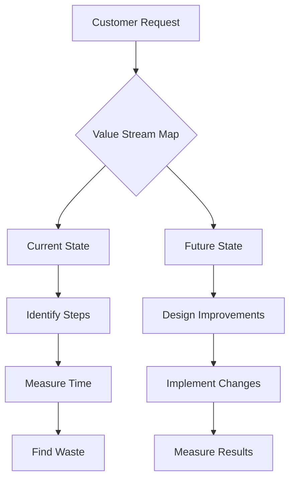

# Lean Principles

## Overview

Lean principles originated from the Toyota Production System (TPS) in post-war Japan and have since revolutionized
manufacturing, software development, and knowledge work worldwide. At its core, Lean is about creating more value for
customers with fewer resources by systematically eliminating waste.

## Core Concept

Lean thinking focuses on three key enemies of efficiency:

- **Muda** (Waste): Activities that consume resources but create no value
- **Mura** (Unevenness): Variability and inconsistency in processes
- **Muri** (Overburden): Overwhelming people or equipment

## The Five Lean Principles

### 1. Identify Value

**Define value from the customer's perspective**

```python
# Traditional approach: Feature-driven
class TraditionalDevelopment:
    def plan_features(self):
        return [
            "Advanced search with 20 filters",      # Developers think it's cool
            "Real-time collaboration",              # Competitor has it
            "AI-powered recommendations",           # Trending technology
            "Customizable dashboard",               # Seems useful
        ]

# Lean approach: Value-driven
class LeanDevelopment:
    def identify_value(self):
        customer_problems = self.research_customer_needs()
        return [
            "Simple search that works",             # 90% just need basic search
            "Faster page load times",               # #1 customer complaint
            "Mobile responsiveness",                # 60% use mobile
            "Clear error messages",                 # Top support issue
        ]
```

**Value Identification Questions:**

- What problem are we solving?
- Would customers pay for this?
- Does this directly benefit the user?
- What happens if we don't build this?

### 2. Map the Value Stream

**Identify all steps and eliminate those that don't create value**

```mermaid
graph LR
    A[Requirements] -->|2 days| B[Design]
    B -->|3 days| C[Approval]
    C -->|5 days waiting| D[Development]
    D -->|10 days| E[Code Review]
    E -->|2 days waiting| F[Testing]
    F -->|3 days| G[Deployment Approval]
    G -->|3 days waiting| H[Deployment]
    H -->|1 day| I[Customer Value]
    
    style C fill:#ff9999
    style E fill:#ff9999
    style G fill:#ff9999
```



**Value Stream Analysis:**

```javascript
class ValueStreamMapper {
  analyzeProcess() {
    const steps = [
      { name: "Requirements", duration: 2, valueAdding: true },
      { name: "Design", duration: 3, valueAdding: true },
      { name: "Approval Wait", duration: 5, valueAdding: false },
      { name: "Development", duration: 10, valueAdding: true },
      { name: "Review Wait", duration: 2, valueAdding: false },
      { name: "Testing", duration: 3, valueAdding: true },
      { name: "Deploy Approval", duration: 3, valueAdding: false },
      { name: "Deployment", duration: 1, valueAdding: true },
    ];

    const totalTime = steps.reduce((sum, step) => sum + step.duration, 0);
    const valueTime = steps
      .filter((step) => step.valueAdding)
      .reduce((sum, step) => sum + step.duration, 0);

    return {
      efficiency: (valueTime / totalTime * 100).toFixed(1) + "%",
      totalDays: totalTime,
      valueDays: valueTime,
      wasteDays: totalTime - valueTime,
    };
  }
}
// Result: 65.5% efficiency, 10 days of waste
```

### 3. Create Flow

**Make value-creating steps flow smoothly without interruptions**

```typescript
// Traditional: Batch Processing
class BatchDevelopment {
  private requirements: Requirement[] = [];
  private batchSize = 50;

  collectRequirements() {
    // Wait until we have 50 requirements
    while (this.requirements.length < this.batchSize) {
      this.requirements.push(this.getNextRequirement());
    }
    // Then process all at once
    this.processAllRequirements();
  }
}

// Lean: Continuous Flow
class FlowDevelopment {
  async processRequirement(requirement: Requirement) {
    // Process immediately, one at a time
    const feature = await this.develop(requirement);
    await this.test(feature);
    await this.deploy(feature);
    // Value delivered continuously
  }
}
```

**Techniques for Creating Flow:**

```yaml
reduce_batch_sizes:
  from: "Monthly releases with 50 features"
  to: "Daily releases with 1-2 features"
  benefit: "Faster feedback, less risk"

eliminate_handoffs:
  from: "Dev → QA → Ops → Support"
  to: "Cross-functional team owns entire flow"
  benefit: "No waiting, shared ownership"

automate_everything:
  - continuous_integration: "No manual build steps"
  - automated_testing: "No manual regression testing"
  - continuous_deployment: "No manual deployment"
  benefit: "Consistent, fast, reliable flow"
```

### 4. Establish Pull

**Let demand pull value through the system**

```ruby
# Push System: Build based on predictions
class PushSystem
  def plan_quarter
    # Guess what customers might want
    predicted_features = estimate_demand()
    
    # Build everything upfront
    predicted_features.each do |feature|
      develop_feature(feature)
      stockpile_in_backlog(feature)
    end
  end
end

# Pull System: Build based on actual demand
class PullSystem
  def initialize
    @wip_limit = 3  # Limit work in progress
    @ready_queue = Queue.new
  end
  
  def process_demand
    while customer_request = get_next_request
      if current_wip < @wip_limit
        pull_into_development(customer_request)
      else
        @ready_queue.push(customer_request)
      end
    end
  end
end
```

**Kanban Board - Visual Pull System:**

```
┌─────────────┬──────────────┬──────────────┬──────────────┐
│   Backlog   │  In Progress │    Review    │     Done     │
│             │   (WIP: 3)   │   (WIP: 2)   │              │
├─────────────┼──────────────┼──────────────┼──────────────┤
│ Feature A   │  Feature D   │  Feature F   │  Feature H   │
│ Feature B   │  Feature E   │              │  Feature I   │
│ Feature C   │              │              │  Feature J   │
│     ...     │   [BLOCKED]  │              │              │
└─────────────┴──────────────┴──────────────┴──────────────┘
```

### 5. Seek Perfection

**Continuously improve through elimination of waste**

```python
class ContinuousImprovement:
    def __init__(self):
        self.metrics = MetricsCollector()
        self.improvements = []
    
    def kaizen_cycle(self):
        """Daily improvement cycle"""
        # Plan
        problem = self.identify_biggest_waste()
        hypothesis = self.form_improvement_hypothesis(problem)
        
        # Do
        experiment = self.run_small_experiment(hypothesis)
        
        # Check
        results = self.measure_impact(experiment)
        
        # Act
        if results.positive:
            self.standardize_improvement(experiment)
            self.share_learning_with_organization()
        else:
            self.learn_from_failure(results)
        
        # Continue forever
        self.kaizen_cycle()
```

## The Eight Wastes (DOWNTIME)

### 1. Defects

```javascript
// Waste: Bugs reaching production
const defectWaste = {
  bugFixTime: 8, // hours to fix
  customerImpact: 100, // users affected
  supportCalls: 25, // additional load
  reputationDamage: "unmeasurable",
};

// Lean solution: Shift left
const preventDefects = {
  practices: [
    "Test-driven development",
    "Pair programming",
    "Automated testing",
    "Code reviews",
    "Static analysis",
  ],
  result: "90% reduction in production defects",
};
```

### 2. Overproduction

```ruby
# Waste: Building features nobody uses
class FeatureUsageAnalysis
  def analyze_usage
    features = {
      "Advanced Search": { usage: 2, development_weeks: 8 },
      "Social Sharing": { usage: 85, development_weeks: 2 },
      "AI Assistant": { usage: 0.5, development_weeks: 12 },
      "Quick Actions": { usage: 95, development_weeks: 1 }
    }
    
    features.each do |name, data|
      roi = data[:usage] / data[:development_weeks]
      puts "#{name}: ROI = #{roi}"
    end
  end
end

# Lean approach: Build only what's needed
def minimum_viable_feature
  customer_feedback = gather_feedback()
  build_smallest_useful_version()
  measure_actual_usage()
  iterate_based_on_data()
end
```

### 3. Waiting

```yaml
waiting_examples:
  code_review:
    average_wait: "2 days"
    solution: "Pair programming or mob programming"

  environment_setup:
    average_wait: "4 hours"
    solution: "Infrastructure as code, self-service"

  decision_making:
    average_wait: "1 week"
    solution: "Delegate decisions to teams"

  deployment_approval:
    average_wait: "3 days"
    solution: "Automated deployment with quality gates"
```

### 4. Non-Utilized Talent

```python
class TalentUtilization:
    def identify_waste(self):
        return {
            "senior_dev_doing_manual_testing": {
                "waste": "Not using automation skills",
                "solution": "Automate tests, mentor others"
            },
            "designer_excluded_from_planning": {
                "waste": "Missing design perspective",
                "solution": "Include in all planning sessions"
            },
            "junior_dev_only_bug_fixes": {
                "waste": "Not learning new skills",
                "solution": "Pair on feature development"
            }
        }
```

### 5. Transportation

```javascript
// Waste: Moving work between teams
const handoffWaste = {
  frontend_to_backend: {
    communicationOverhead: "2 hours/feature",
    misunderstandings: "30% of features",
    delays: "1-2 days average",
  },
  dev_to_qa: {
    contextSwitching: "1 hour/handoff",
    waitingTime: "8 hours average",
    backAndForth: "2-3 cycles",
  },
};

// Lean solution: Cross-functional teams
const crossFunctionalTeam = {
  members: ["frontend", "backend", "qa", "design"],
  benefits: {
    communication: "Immediate",
    understanding: "Shared context",
    delivery: "50% faster",
  },
};
```

### 6. Inventory

```typescript
interface InventoryWaste {
  undeployedFeatures: Feature[]; // Built but not released
  documentationBacklog: Document[]; // Written but outdated
  uncomittedCode: CodeChange[]; // Written but not integrated
  unfinishedStories: UserStory[]; // Started but not completed
}

class InventoryReduction {
  reduceWorkInProgress(limit: number) {
    // Limit active work
    this.wipLimit = limit;

    // Finish before starting new
    this.enforceOneFeatureFlow();

    // Deploy immediately when ready
    this.continuousDeployment = true;
  }
}
```

### 7. Motion

```ruby
# Waste: Unnecessary actions
motion_waste = {
  context_switching: {
    frequency: "15 times/day",
    recovery_time: "23 minutes each",
    daily_waste: "5.75 hours"
  },
  
  tool_navigation: {
    clicking_through_menus: "45 minutes/day",
    searching_for_files: "30 minutes/day",
    switching_applications: "20 minutes/day"
  }
}

# Solutions
motion_solutions = {
  reduce_wip: "Work on one thing at a time",
  keyboard_shortcuts: "Save 30 minutes/day",
  better_tooling: "Integrated development environment",
  organized_workspace: "Everything within reach"
}
```

### 8. Extra Processing

```python
# Waste: Doing more than necessary
class OverProcessing:
    def examples(self):
        return [
            {
                "activity": "Gold plating",
                "example": "Adding animations nobody asked for",
                "time_wasted": "2 days",
                "solution": "Build exactly what's needed"
            },
            {
                "activity": "Redundant approvals",
                "example": "5 people approve simple changes",
                "time_wasted": "3 days",
                "solution": "Trust teams, automate checks"
            },
            {
                "activity": "Over-documentation",
                "example": "100-page specs nobody reads",
                "time_wasted": "1 week",
                "solution": "Just enough documentation"
            }
        ]
```

## Lean Tools and Techniques

### Value Stream Mapping



### The Five Whys

```javascript
class FiveWhysAnalysis {
  analyzeDefect(problem) {
    const analysis = {
      problem: "Website is down",

      why1: "Server crashed",
      why2: "Out of memory",
      why3: "Memory leak in application",
      why4: "No code review caught it",
      why5: "No automated memory testing",

      rootCause: "Lack of automated performance testing",

      solution: "Add memory leak detection to CI/CD pipeline",
    };

    return this.addressRootCause(analysis);
  }
}
```

### Kaizen Events

```typescript
interface KaizenEvent {
  duration: "1-5 days";
  team: "Cross-functional";
  focus: "Specific improvement";

  steps: [
    "Define problem and goals",
    "Measure current state",
    "Analyze root causes",
    "Develop solutions",
    "Test improvements",
    "Standardize success",
    "Document learning",
  ];

  outcomes: {
    immediate: "Quick wins implemented";
    shortTerm: "Process improvements";
    longTerm: "Cultural change";
  };
}
```

## Lean Metrics

```python
class LeanMetrics:
    def __init__(self):
        self.metrics = {
            "cycle_time": self.measure_cycle_time,
            "lead_time": self.measure_lead_time,
            "throughput": self.measure_throughput,
            "wip": self.measure_work_in_progress,
            "efficiency": self.calculate_efficiency
        }
    
    def measure_cycle_time(self):
        """Time from starting work to completion"""
        return {
            "current": "10 days",
            "target": "2 days",
            "improvement": "Smaller batches, automation"
        }
    
    def calculate_efficiency(self):
        """Value-adding time / Total time"""
        value_time = 16  # hours
        total_time = 80  # hours
        return {
            "efficiency": f"{(value_time/total_time)*100:.1f}%",
            "waste": f"{total_time - value_time} hours"
        }
```

## Cultural Transformation

### Respect for People

```yaml
lean_culture:
  psychological_safety:
    - "OK to identify problems"
    - "OK to stop the line"
    - "OK to experiment"
    - "OK to fail and learn"

  continuous_learning:
    - "Regular training"
    - "Cross-functional skills"
    - "Knowledge sharing"
    - "External learning"

  empowerment:
    - "Teams own processes"
    - "Authority to improve"
    - "Direct customer contact"
    - "Decision-making power"
```

### Long-term Thinking

```javascript
// Short-term thinking (waste)
const shortTerm = {
  focus: "This quarter's numbers",
  decisions: "Quick fixes",
  people: "Expendable resources",
  quality: "Good enough to ship",
};

// Lean long-term thinking
const longTerm = {
  focus: "Sustainable growth",
  decisions: "Root cause solutions",
  people: "Invest in development",
  quality: "Built-in from start",
};
```

## Implementing Lean

### Getting Started

```python
class LeanImplementation:
    def week_1(self):
        """Start with awareness"""
        self.train_team_on_waste()
        self.identify_biggest_pain_point()
        self.measure_current_state()
    
    def week_2_4(self):
        """Run first experiment"""
        self.map_value_stream()
        self.identify_quick_wins()
        self.implement_one_improvement()
        self.measure_impact()
    
    def month_2_3(self):
        """Expand and iterate"""
        self.standardize_successful_changes()
        self.tackle_next_waste()
        self.involve_more_teams()
        
    def ongoing(self):
        """Make it cultural"""
        self.daily_improvement_habits()
        self.regular_kaizen_events()
        self.share_success_stories()
        self.measure_long_term_impact()
```

## Conclusion

Lean is not just a set of tools—it's a mindset of continuous improvement and respect for people. The key principles:

1. **Value**: Always define from customer perspective
2. **Flow**: Eliminate interruptions and delays
3. **Pull**: Build based on actual demand
4. **Perfection**: Never stop improving
5. **Respect**: Develop people and partners

Remember: "The most dangerous kind of waste is the waste we do not recognize." Start by making waste visible, then
systematically eliminate it while building a culture of continuous improvement.
