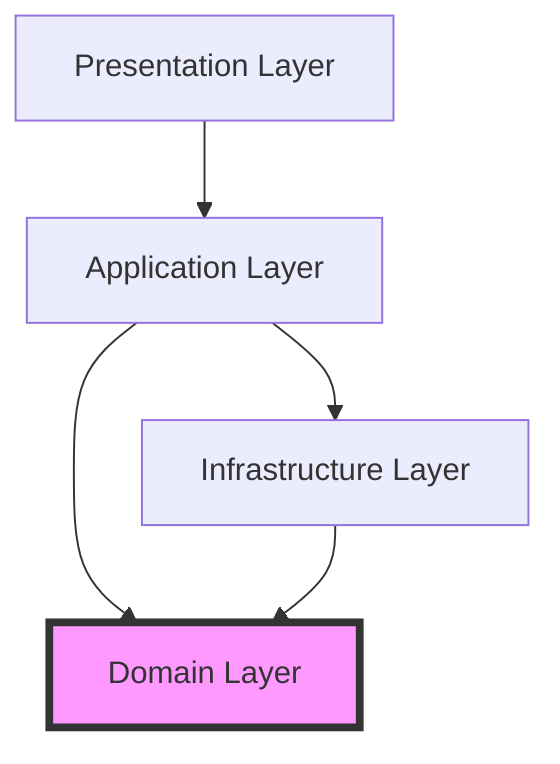

# Separation of Concerns

## Overview

Separation of Concerns (SoC) is a design principle for separating a computer program into distinct sections, where each
section addresses a separate concern. Introduced by Edsger W. Dijkstra in 1974, this principle is fundamental to
creating maintainable, scalable software systems.

## Core Concept

A "concern" is a set of information that affects the code of a computer program. SoC advocates organizing code so that
distinct features or behaviors are located in distinct areas. Each section should address a specific concern with
minimal overlap with other sections.

## Key Principles

1. **Modular Organization**: Each module handles one specific concern
2. **Clear Boundaries**: Well-defined interfaces between concerns
3. **High Cohesion**: Related functionality stays together
4. **Low Coupling**: Minimize dependencies between concerns
5. **Single Focus**: Each component has one clear purpose

## Implementation at Different Levels

### Architectural Level

#### Layered Architecture

```python
# Presentation Layer - UI concerns only
class UserController:
    def __init__(self, user_service):
        self.user_service = user_service
    
    def get_user(self, request):
        user_id = request.params.get('id')
        user = self.user_service.get_user(user_id)
        return render_template('user.html', user=user)

# Business Layer - Business logic only
class UserService:
    def __init__(self, user_repository):
        self.user_repository = user_repository
    
    def get_user(self, user_id):
        user = self.user_repository.find_by_id(user_id)
        if not user:
            raise UserNotFoundException()
        return user
    
    def calculate_user_score(self, user):
        # Business logic for score calculation
        return user.posts_count * 10 + user.comments_count * 5

# Data Layer - Data access only
class UserRepository:
    def __init__(self, database):
        self.db = database
    
    def find_by_id(self, user_id):
        return self.db.query("SELECT * FROM users WHERE id = ?", user_id)
    
    def save(self, user):
        self.db.execute("INSERT INTO users ...", user.to_dict())
```

#### Microservices Architecture

```yaml
# Each service handles a specific business domain
services:
  user-service:
    concerns:
      - User authentication
      - User profiles
      - User preferences

  order-service:
    concerns:
      - Order creation
      - Order processing
      - Order history

  payment-service:
    concerns:
      - Payment processing
      - Payment validation
      - Payment history

  notification-service:
    concerns:
      - Email notifications
      - SMS notifications
      - Push notifications
```

### Design Level

#### Model-View-Controller (MVC)

```javascript
// Model - Data and business logic concern
class TodoModel {
  constructor() {
    this.todos = [];
  }

  addTodo(text) {
    const todo = {
      id: Date.now(),
      text,
      completed: false,
    };
    this.todos.push(todo);
    return todo;
  }

  toggleTodo(id) {
    const todo = this.todos.find((t) => t.id === id);
    if (todo) {
      todo.completed = !todo.completed;
    }
    return todo;
  }
}

// View - Presentation concern
class TodoView {
  constructor() {
    this.app = document.getElementById("app");
  }

  render(todos) {
    this.app.innerHTML = `
            <ul>
                ${
      todos.map((todo) => `
                    <li class="${todo.completed ? "completed" : ""}">
                        ${todo.text}
                    </li>
                `).join("")
    }
            </ul>
        `;
  }

  bindAddTodo(handler) {
    document.getElementById("add-button").addEventListener("click", handler);
  }
}

// Controller - Coordination concern
class TodoController {
  constructor(model, view) {
    this.model = model;
    this.view = view;

    this.view.bindAddTodo(this.handleAddTodo.bind(this));
  }

  handleAddTodo() {
    const text = document.getElementById("todo-input").value;
    this.model.addTodo(text);
    this.view.render(this.model.todos);
  }
}
```

#### Hexagonal Architecture (Ports and Adapters)

```typescript
// Domain layer - Core business logic
interface UserRepository {
  findById(id: string): Promise<User>;
  save(user: User): Promise<void>;
}

class UserService {
  constructor(private repository: UserRepository) {}

  async getUser(id: string): Promise<User> {
    return await this.repository.findById(id);
  }

  async updateUserEmail(id: string, email: string): Promise<void> {
    const user = await this.repository.findById(id);
    user.updateEmail(email); // Business rule in domain model
    await this.repository.save(user);
  }
}

// Infrastructure layer - External concerns
class PostgresUserRepository implements UserRepository {
  async findById(id: string): Promise<User> {
    const data = await postgres.query("SELECT * FROM users WHERE id = $1", [id]);
    return User.fromData(data);
  }

  async save(user: User): Promise<void> {
    await postgres.query("UPDATE users SET ...", user.toData());
  }
}

// Application layer - Use case orchestration
class UpdateUserEmailUseCase {
  constructor(
    private userService: UserService,
    private emailService: EmailService,
  ) {}

  async execute(userId: string, newEmail: string): Promise<void> {
    await this.userService.updateUserEmail(userId, newEmail);
    await this.emailService.sendConfirmation(newEmail);
  }
}
```

### Code Level

#### Function Separation

```ruby
# BAD: Multiple concerns in one function
def process_order(order_data)
  # Validation concern
  unless order_data[:items].any?
    return { error: "Order must have items" }
  end
  
  # Calculation concern
  total = 0
  order_data[:items].each do |item|
    total += item[:price] * item[:quantity]
  end
  
  # Database concern
  order = Order.create(
    items: order_data[:items],
    total: total
  )
  
  # Notification concern
  EmailService.send_order_confirmation(order)
  
  # Logging concern
  Logger.info("Order #{order.id} created")
  
  order
end

# GOOD: Separated concerns
class OrderValidator
  def self.validate(order_data)
    return false unless order_data[:items].any?
    # More validation logic
    true
  end
end

class PriceCalculator
  def self.calculate_total(items)
    items.sum { |item| item[:price] * item[:quantity] }
  end
end

class OrderService
  def create_order(order_data)
    raise InvalidOrderError unless OrderValidator.validate(order_data)
    
    total = PriceCalculator.calculate_total(order_data[:items])
    
    Order.create(
      items: order_data[:items],
      total: total
    )
  end
end

class OrderController
  def create
    order = OrderService.new.create_order(params[:order])
    NotificationService.notify_order_created(order)
    AuditLogger.log_order_creation(order)
    
    render json: order
  rescue InvalidOrderError => e
    render json: { error: e.message }, status: 422
  end
end
```

## Handling Cross-Cutting Concerns

Cross-cutting concerns affect multiple modules and can be challenging to separate. Common solutions include:

### Aspect-Oriented Programming (AOP)

```java
// Logging aspect
@Aspect
@Component
public class LoggingAspect {
    @Before("@annotation(Loggable)")
    public void logMethodCall(JoinPoint joinPoint) {
        String method = joinPoint.getSignature().getName();
        logger.info("Calling method: " + method);
    }
}

// Business logic with annotation
@Service
public class UserService {
    @Loggable
    public User findUser(Long id) {
        // Business logic without logging concern
        return userRepository.findById(id);
    }
}
```

### Middleware Pattern

```javascript
// Express.js middleware for cross-cutting concerns
const express = require("express");
const app = express();

// Authentication middleware
const authenticate = (req, res, next) => {
  if (!req.headers.authorization) {
    return res.status(401).json({ error: "Unauthorized" });
  }
  // Verify token
  next();
};

// Logging middleware
const logRequest = (req, res, next) => {
  console.log(`${req.method} ${req.path}`);
  next();
};

// Error handling middleware
const errorHandler = (err, req, res, next) => {
  console.error(err.stack);
  res.status(500).json({ error: "Internal server error" });
};

// Apply middleware
app.use(logRequest);
app.use(authenticate);

// Business logic endpoints
app.get("/users/:id", (req, res) => {
  // Only business logic here
  const user = userService.getUser(req.params.id);
  res.json(user);
});

app.use(errorHandler);
```

### Decorator Pattern

```python
# Decorators for cross-cutting concerns
def log_execution(func):
    def wrapper(*args, **kwargs):
        print(f"Executing {func.__name__}")
        result = func(*args, **kwargs)
        print(f"Completed {func.__name__}")
        return result
    return wrapper

def cache_result(func):
    cache = {}
    def wrapper(*args):
        if args in cache:
            return cache[args]
        result = func(*args)
        cache[args] = result
        return result
    return wrapper

def validate_input(validator):
    def decorator(func):
        def wrapper(*args, **kwargs):
            if not validator(*args, **kwargs):
                raise ValueError("Invalid input")
            return func(*args, **kwargs)
        return wrapper
    return decorator

# Business logic with decorators
class UserService:
    @log_execution
    @cache_result
    def get_user(self, user_id):
        # Pure business logic
        return self.repository.find_by_id(user_id)
    
    @validate_input(lambda self, email: '@' in email)
    @log_execution
    def update_email(self, user_id, email):
        # Pure business logic
        user = self.get_user(user_id)
        user.email = email
        self.repository.save(user)
```

## Common Anti-Patterns and Solutions

### 1. Business Logic in UI

```jsx
// BAD: Business logic mixed with presentation
function ProductCard({ product }) {
  // Business logic in component
  const discountedPrice = product.price * 0.9;
  const isEligibleForFreeShipping = product.price > 50;
  const taxAmount = product.price * 0.08;
  const finalPrice = discountedPrice + taxAmount;

  return (
    <div>
      <h3>{product.name}</h3>
      <p>Price: ${finalPrice.toFixed(2)}</p>
      {isEligibleForFreeShipping && <p>Free Shipping!</p>}
    </div>
  );
}

// GOOD: Separated concerns
// Business logic in service
class PricingService {
  calculateDiscount(price) {
    return price * 0.9;
  }

  calculateTax(price) {
    return price * 0.08;
  }

  calculateFinalPrice(product) {
    const discounted = this.calculateDiscount(product.price);
    return discounted + this.calculateTax(discounted);
  }

  isEligibleForFreeShipping(product) {
    return product.price > 50;
  }
}

// Pure presentation component
function ProductCard({ product, pricing }) {
  return (
    <div>
      <h3>{product.name}</h3>
      <p>Price: ${pricing.finalPrice.toFixed(2)}</p>
      {pricing.freeShipping && <p>Free Shipping!</p>}
    </div>
  );
}
```

### 2. Data Access in Controllers

```go
// BAD: Direct database access in handler
func GetUserHandler(w http.ResponseWriter, r *http.Request) {
    id := r.URL.Query().Get("id")
    
    // Database concern in handler
    db, err := sql.Open("postgres", "connection-string")
    if err != nil {
        http.Error(w, err.Error(), 500)
        return
    }
    
    var user User
    err = db.QueryRow("SELECT * FROM users WHERE id = $1", id).Scan(&user)
    if err != nil {
        http.Error(w, "User not found", 404)
        return
    }
    
    json.NewEncoder(w).Encode(user)
}

// GOOD: Separated concerns
// Repository handles data access
type UserRepository struct {
    db *sql.DB
}

func (r *UserRepository) FindByID(id string) (*User, error) {
    var user User
    err := r.db.QueryRow("SELECT * FROM users WHERE id = $1", id).Scan(&user)
    if err != nil {
        return nil, err
    }
    return &user, nil
}

// Service handles business logic
type UserService struct {
    repo *UserRepository
}

func (s *UserService) GetUser(id string) (*User, error) {
    return s.repo.FindByID(id)
}

// Handler handles HTTP concerns only
func GetUserHandler(service *UserService) http.HandlerFunc {
    return func(w http.ResponseWriter, r *http.Request) {
        id := r.URL.Query().Get("id")
        
        user, err := service.GetUser(id)
        if err != nil {
            http.Error(w, "User not found", 404)
            return
        }
        
        json.NewEncoder(w).Encode(user)
    }
}
```

## Best Practices

### 1. Clear Module Boundaries

```typescript
// Define clear interfaces between modules
interface PaymentGateway {
  charge(amount: number, token: string): Promise<PaymentResult>;
  refund(transactionId: string): Promise<RefundResult>;
}

interface NotificationService {
  sendEmail(to: string, subject: string, body: string): Promise<void>;
  sendSMS(to: string, message: string): Promise<void>;
}

interface OrderRepository {
  save(order: Order): Promise<void>;
  findById(id: string): Promise<Order>;
}
```

### 2. Directory Structure

```
project/
├── src/
│   ├── domain/          # Business logic
│   │   ├── entities/
│   │   ├── services/
│   │   └── valueObjects/
│   ├── application/     # Use cases
│   │   ├── commands/
│   │   ├── queries/
│   │   └── handlers/
│   ├── infrastructure/  # External concerns
│   │   ├── persistence/
│   │   ├── messaging/
│   │   └── http/
│   └── presentation/    # UI concerns
│       ├── controllers/
│       ├── views/
│       └── middleware/
```

### 3. Dependency Flow



## Conclusion

Separation of Concerns is a fundamental principle that appears at every level of software design. From high-level
architecture to individual functions, properly separating concerns leads to:

- **Maintainable** code that's easier to understand and modify
- **Testable** components that can be verified in isolation
- **Reusable** modules that can be composed in different ways
- **Scalable** systems that can grow without becoming tangled

The key is finding the right level of separation for your context. Over-separation can lead to unnecessary complexity,
while under-separation creates maintenance nightmares. Strike a balance based on your team's needs, project complexity,
and expected evolution of the system.
