# Project Status: Slash Commands Migration

## Overview

Migrating from JSON-based slash commands in settings.json to the new markdown
format in ~/.claude/commands/

## Status

🍃 **COMPLETED**

```mermaid
graph LR
    A[🌱 Planning] --> B[🌿 Migration]
    B --> C[🌳 Testing]
    C --> D[🍃 Complete]
    style D fill:#90EE90
```

## Progress Timeline

### 2025-01-14 - Planning Phase

- Created Shape Up pitch documenting the migration plan
- Analyzed current 10 slash commands in settings.json
- Discovered Claude's new built-in commands (potential overlaps)
- Designed new directory structure with categories
- Created example migrations showing new features

### 2025-01-14 21:49 - Migration Completed ✅

- **Created directory structure** in `~/.claude/commands/`
- **Migrated all 10 commands** to new markdown format with enhanced features
- **Added tool permissions** to each command's YAML frontmatter
- **Enhanced with new features**: $ARGUMENTS, !bash execution, @file references
- **Cleaned up settings.json** (removed 58 lines of old command definitions)
- **Created backups** for rollback safety
- **Added namespacing** to avoid conflicts with Claude's built-in commands

## Migration Results

✅ All 10 commands successfully migrated\
✅ Directory structure organized by category\
✅ Enhanced with new markdown features\
✅ Settings.json cleaned up\
✅ Backups created for safety\
✅ Documentation completed

## Future Work

Created design document for adding slash command management to Aichaku:

- CLI commands for install/update/list/create
- Command registry system
- Integration with methodologies
- Team sharing capabilities

## Key Decisions

- Organize commands by category (aichaku/, security/, dev/, utils/)
- Use namespacing to avoid conflicts (e.g., /aichaku:checkpoint)
- Leverage new features: $ARGUMENTS, !bash execution, @file references
- Keep command names consistent for user familiarity

## Risks & Mitigations

| Risk                           | Mitigation                               |
| ------------------------------ | ---------------------------------------- |
| Breaking existing workflows    | Keep same command names, test thoroughly |
| Overlap with built-in commands | Use namespacing, document differences    |
| Loss of functionality          | Manually verify each migration           |
| User confusion                 | Clear migration guide and examples       |
