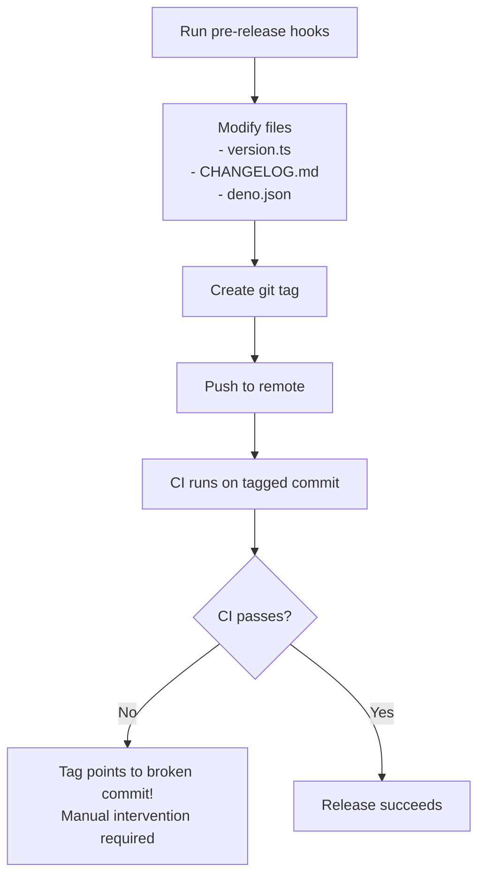
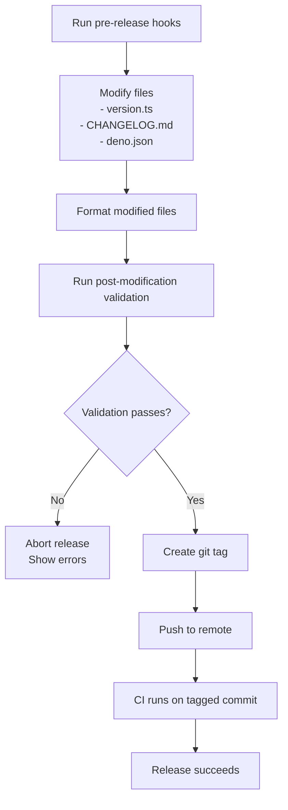

# Nagare Enhancement Proposal: Fix Release Process Timing Issues

## Problem Statement

Currently, nagare's release process has a critical timing issue that causes releases to fail in CI almost every time. The root cause is that nagare modifies files during the release process but creates and pushes tags before validating that these modifications pass formatting and type checking.

## Current Flow vs Proposed Flow

### Current Flow (Problematic)


### Proposed Flow (Fixed)


## Code Changes Required in Nagare

### 1. Add Post-Modification Formatting

In `src/release-manager.ts` (or equivalent), after file modifications:

```typescript
// After all file updates are complete
await this.updateVersionFiles();
await this.updateChangelog();

// NEW: Format all modified files
if (this.config.release?.autoFix?.enabled) {
  await this.formatModifiedFiles();
}

// NEW: Validate formatted files
await this.validateModifiedFiles();
```

### 2. Implement `formatModifiedFiles` Method

```typescript
private async formatModifiedFiles(): Promise<void> {
  console.log("🎨 Formatting modified files...");
  
  const modifiedFiles = await this.getModifiedFiles();
  
  for (const file of modifiedFiles) {
    if (file.endsWith('.ts') || file.endsWith('.js') || 
        file.endsWith('.json') || file.endsWith('.md')) {
      const fmtCmd = new Deno.Command("deno", {
        args: ["fmt", file],
      });
      const { success } = await fmtCmd.output();
      
      if (!success) {
        throw new Error(`Failed to format ${file}`);
      }
    }
  }
}
```

### 3. Implement `validateModifiedFiles` Method

```typescript
private async validateModifiedFiles(): Promise<void> {
  console.log("🔍 Validating modified files...");
  
  // Run format check
  const fmtCheck = new Deno.Command("deno", {
    args: ["fmt", "--check"],
  });
  const fmtResult = await fmtCheck.output();
  
  if (!fmtResult.success) {
    throw new Error("Formatting validation failed. Run 'deno fmt' to fix.");
  }
  
  // Run lint check on TypeScript files
  const tsFiles = await this.getModifiedFiles()
    .then(files => files.filter(f => f.endsWith('.ts')));
  
  if (tsFiles.length > 0) {
    const lintCmd = new Deno.Command("deno", {
      args: ["lint", ...tsFiles],
    });
    const lintResult = await lintCmd.output();
    
    if (!lintResult.success) {
      throw new Error("Linting failed on modified files.");
    }
  }
  
  // Run type check
  const typeCmd = new Deno.Command("deno", {
    args: ["check", "**/*.ts"],
  });
  const typeResult = await typeCmd.output();
  
  if (!typeResult.success) {
    throw new Error("Type checking failed.");
  }
}
```

### 4. Add Rollback Support

```typescript
export async function rollbackRelease(version: string): Promise<void> {
  console.log(`🔄 Rolling back release v${version}...`);
  
  try {
    // Delete local tag
    await run(["git", "tag", "-d", `v${version}`]);
    console.log("✅ Deleted local tag");
    
    // Try to delete remote tag
    try {
      await run(["git", "push", "origin", `:refs/tags/v${version}`]);
      console.log("✅ Deleted remote tag");
    } catch {
      console.log("ℹ️  Remote tag not found or already deleted");
    }
    
    // Reset to previous commit
    await run(["git", "reset", "--hard", "HEAD~1"]);
    console.log("✅ Reset to previous commit");
    
  } catch (error) {
    console.error("❌ Rollback failed:", error);
    throw error;
  }
}
```

### 5. Add New Configuration Options

In `nagare.config.ts` schema:

```typescript
export interface NagareConfig {
  release?: {
    autoFix?: {
      enabled?: boolean;
      beforeTag?: boolean; // NEW: Run fixes before creating tag
      formatOnly?: boolean; // NEW: Only run formatting, skip other fixes
    };
    validation?: {
      strict?: boolean; // NEW: Fail fast on any validation error
      beforeTag?: boolean; // NEW: Validate before creating tag (default: true)
    };
  };
}
```

## Benefits

1. **No more broken tags**: Tags will only be created after validation passes
2. **Faster feedback**: Errors caught locally before pushing
3. **Automatic formatting**: Files modified by nagare are automatically formatted
4. **Easy rollback**: If something goes wrong, rollback is automated
5. **CI always passes**: Since validation happens before tagging

## Migration Guide

For existing nagare users, the change would be transparent but they could opt-in to stricter validation:

```typescript
// nagare.config.ts
export default defineConfig({
  release: {
    autoFix: {
      enabled: true,
      beforeTag: true, // NEW: Ensure fixes happen before tagging
    },
    validation: {
      strict: true, // NEW: Fail fast on any error
      beforeTag: true, // NEW: Always validate before tagging
    },
  },
});
```

## Testing Plan

1. Create a test project with intentional formatting issues
2. Run nagare release and verify it fails BEFORE creating tags
3. Fix formatting issues and verify release succeeds
4. Test rollback functionality if tag was accidentally created

## Alternative Solutions Considered

1. **Run formatting in git pre-commit hooks**: This doesn't help with files modified by nagare itself
2. **Add formatting to CI only**: This discovers issues too late, after tags are created
3. **Manual pre-release checklist**: Error-prone and defeats the purpose of automation

## Conclusion

This enhancement would make nagare's release process much more reliable by ensuring that only properly formatted and validated code gets tagged and released. The current "tag first, validate later" approach causes unnecessary friction and manual intervention in what should be an automated process.