# Project Status: Aichaku Hooks Integration

## Overview
Enhancing Aichaku with Claude Code's hooks feature to provide automated methodology enforcement and improved developer experience.

## Current Status: 🌱 Planning

```mermaid
graph LR
    A[🌱 Planning] --> B[🌿 Active]
    B --> C[🌳 Review]
    C --> D[🍃 Complete]
    style A fill:#90EE90
```

## Progress Timeline
[Shaping] → [**Pitching**] → [Betting] → [Building] → [Cool-down]
            ▲
Day 1/14 █░░░░░░░░░░░░░░░░░░░ 7% 🌱

## Key Decisions
- [ ] Decide on hook template categories (basic, advanced, security)
- [ ] Determine role-based prompting approach
- [ ] Resolve SECURITY_WORKFLOWS.md placement
- [ ] Design modular guidance section architecture

## Next Steps
1. Complete Shape Up pitch document
2. Gather feedback on hook design
3. Create prototype hook templates
4. Design CLI command structure

## Blockers
None currently

## Last Updated
2025-01-09