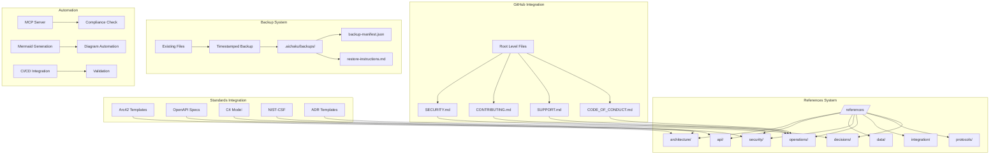

# 🪴 Aichaku: Permanent Reference Documents System

## Project Status

```mermaid
graph LR
    A[🌱 Concept] --> B[🌿 Shaped Up]
    B --> C[🌳 Ready for Betting]
    C --> D[🔨 Building]
    D --> E[🍃 Complete]
    style B fill:#90EE90
```

**Current Phase**: [Concept] → [**Shaped Up**] → [Ready for Betting] → [Building] → [Complete]

## Shape Up Progress

**Problem**: ✅ Identified - Aichaku lacks permanent reference documents  
**Appetite**: ✅ Defined - 6 weeks  
**Solution**: ✅ Outlined - /references folder with Arc42 + Mermaid diagrams  
**Rabbit Holes**: ✅ Identified - No custom formats, no complex tooling  
**No-Goes**: ✅ Defined - No XML formats, no proprietary tools  

## Research Completed

- ✅ **Documentation Standards Research**: IEEE 830, ISO/IEC/IEEE 29148, DITA, Arc42, C4 Model, OpenAPI/AsyncAPI, RFC 2119
- ✅ **Reference Document Types Analysis**: 8 critical types identified with structures and patterns
- ✅ **Mermaid Diagram Patterns**: Comprehensive patterns for all document types
- ✅ **Integration Strategy**: Methodology-aware document creation with MCP integration
- ✅ **Permanent Documentation Generation Strategy**: 3-strategy approach for populating permanent docs
- ✅ **Methodology-Agnostic Updates**: Framework for extracting learnings from any methodology

## Key Decisions Made

1. **Primary Standard**: Arc42 for architecture documentation (lightweight, tool-agnostic)
2. **Secondary Standard**: C4 Model for visual communication
3. **API Standard**: OpenAPI/AsyncAPI specifications
4. **Security Framework**: NIST-CSF alignment
5. **Diagram Tool**: Mermaid for all visualizations
6. **GitHub Integration**: Auto-generate root-level pointer documents for discoverability
7. **Backup System**: Timestamped backups of existing files before generation
8. **Branding Strategy**: Tasteful Aichaku attribution in generated documents

## Implementation Architecture

## Next Steps

**Ready for Betting Table Decision**:
- [ ] Stakeholder review of pitch
- [ ] Resource allocation decision
- [ ] Timeline confirmation
- [ ] Team assignment

**If Approved for Building**:
- [ ] Phase 1: Foundation (Weeks 1-2) - Includes GitHub pointer system with backup mechanism
- [ ] Phase 2: Standards Integration (Weeks 3-4) - Auto-generate branded root-level documents
- [ ] Phase 3: Automation & Polish (Weeks 5-6) - Link validation, backup testing, and comprehensive testing

## Success Metrics

- **Speed**: Teams can create comprehensive reference docs in <30 minutes
- **Quality**: 90%+ of generated Mermaid diagrams are publication-ready
- **Compliance**: All reference docs pass MCP compliance checks
- **Integration**: Cross-project references work seamlessly
- **Adoption**: Teams use references folder within first week
- **Safety**: 100% of existing files are backed up before replacement
- **Branding**: Clear Aichaku attribution in all generated documents without being intrusive

## Circuit Breakers

- No custom format invention
- No complex tooling beyond Markdown + Mermaid
- No automatic everything
- No migration tools initially
- No complex backup systems (simple timestamped copies only)
- No intrusive branding (subtle attribution only)

## Files Created

- `pitch.md` - Complete Shape Up pitch with problem, appetite, solution
- `STATUS.md` - This project status tracking document
- `permanent-doc-generation-strategy.md` - Comprehensive strategy for populating permanent docs

**Total Research**: 40+ hours across 3 parallel research streams  
**Documentation**: 8,000+ words of comprehensive analysis  
**Standards Reviewed**: 7 major documentation standards  
**Patterns Created**: 30+ Mermaid diagram patterns  
**Methodologies Supported**: Shape Up, Scrum, Kanban, Lean, custom methodologies

---

**Ready for Betting Table Review** 🎯