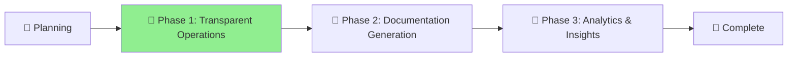

# Unified MCP Enhancement Project

## Status

🌿 **Phase**: Phase 1 Implementation - Transparent Operations **Started**: 2025-07-11 **Last Updated**: 2025-07-14
**Progress**: [Planning] → [**Phase 1 Implementation**] → [Phase 2] → [Phase 3] → [Complete] ▲

## Project Overview

Unified enhancement of the Aichaku MCP server combining:

1. **Process Management** - Better start/stop/upgrade commands
2. **Auto-Integration** - Automatic tool usage for documentation
3. **Visibility & Feedback** - Clear MCP interaction reporting
4. **Usage Analytics** - Statistics and tracking

## Key Goals

### 1. Seamless MCP Management

- Simple commands: `aichaku mcp --start/stop/restart/upgrade`
- Cross-platform compatibility
- Version management and updates

### 2. Automatic Documentation Generation

- Tools triggered by natural language requests
- Comprehensive project documentation in `/docs`
- Standards compliance without manual intervention

### 3. Transparent Operations

- Clear feedback about MCP server interactions
- Aichaku-branded console output
- Real-time status and progress reporting

### 4. Usage Insights

- Track MCP tool usage statistics
- Development effort metrics
- Performance and reliability data

## Phase 1 Progress (2025-07-14)

### ✅ Completed Today:

#### 1.2 Branded Feedback System

- ✅ Added `send_feedback` MCP tool to server
- ✅ Implemented 🪴 Aichaku branding throughout MCP responses
- ✅ Created visible feedback system that appears in Claude Code console
- ✅ MCP feedback now shows with appropriate emoji (ℹ️, ✅, ⚠️, ❌)

#### 1.3 Real-Time Progress Tracking

- ✅ MCP HTTP/SSE server shows connection status ("Active sessions: 1")
- ✅ `aichaku mcp --server-status` provides real-time server information
- ✅ Auto version check provides user awareness of system state

#### Enhanced Process Management

- ✅ MCP server auto-start/stop functionality working
- ✅ `aichaku mcp --status` command operational
- ✅ HTTP/SSE server for multiple session management

#### Transparent Operations

- ✅ MCP review command shows "🌐 Using shared MCP HTTP/SSE server..."
- ✅ Feedback system provides operation visibility
- ✅ Hook system can now send visible feedback via MCP

### 🚧 In Progress:

#### 1.1 Enhanced Process Management

- ⏳ Need `aichaku mcp --restart` with progress feedback
- ⏳ Need `aichaku mcp --upgrade` with automatic version checking
- ⏳ Enhanced status output with version, uptime, capabilities

### 📋 Next Steps:

**Phase 1 Completion (Days 1-3):**

- Complete enhanced process management commands
- Add comprehensive MCP status reporting
- Implement graceful restart with progress feedback

**Phase 2 Planning (Days 4-6):**

- Begin automatic documentation generation tools
- Implement intelligent tool chaining
- Enhanced tool descriptions for natural language triggers
