# Unified MCP Enhancement Project

## Status

🌱 **Phase**: Planning & Design
**Started**: 2025-07-11
**Progress**: [**Planning**] → [Implementation] → [Testing] → [Documentation] → [Complete]
                   ▲

```mermaid
graph LR
    A[🌱 Planning & Design] --> B[🌿 Implementation]
    B --> C[🌳 Testing & Integration]
    C --> D[🌳 Documentation Update]
    D --> E[🍃 Complete]
    style A fill:#90EE90
```

## Project Overview

Unified enhancement of the Aichaku MCP server combining:
1. **Process Management** - Better start/stop/upgrade commands
2. **Auto-Integration** - Automatic tool usage for documentation
3. **Visibility & Feedback** - Clear MCP interaction reporting
4. **Usage Analytics** - Statistics and tracking

## Key Goals

### 1. Seamless MCP Management
- Simple commands: `aichaku mcp --start/stop/restart/upgrade`
- Cross-platform compatibility
- Version management and updates

### 2. Automatic Documentation Generation
- Tools triggered by natural language requests
- Comprehensive project documentation in `/docs`
- Standards compliance without manual intervention

### 3. Transparent Operations
- Clear feedback about MCP server interactions
- Aichaku-branded console output
- Real-time status and progress reporting

### 4. Usage Insights
- Track MCP tool usage statistics
- Development effort metrics
- Performance and reliability data

## Current Phase Focus

Merging the two separate improvement plans into a cohesive, sequenced implementation strategy.