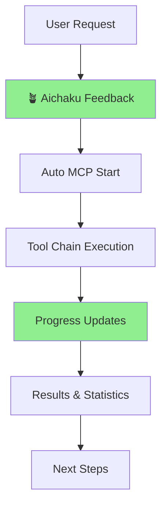

# Unified MCP Enhancement: Complete Aichaku Integration

## Problem

The current MCP server experience has several disconnected issues:

1. **Manual Process Management** - Complex commands requiring system admin
   knowledge
2. **Invisible Operations** - Claude Code gives no feedback about MCP
   interactions
3. **Passive Documentation** - Tools only review, don't generate comprehensive
   docs
4. **Black Box Experience** - Users don't know what's happening or why
5. **No Usage Insights** - Can't track how MCP tools are being used

This creates a fragmented, opaque experience that doesn't match Aichaku's
philosophy of thoughtful, visible development.

## Appetite

**1-2 weeks** - This is a foundational improvement that will dramatically
enhance the entire Aichaku experience.

## Solution

### Unified Enhancement Strategy

Instead of separate improvements, create one cohesive system that addresses all
pain points:



### Phase 1: Transparent MCP Operations (Days 1-3)

#### 1.1 Enhanced Process Management

```bash
# Simple, reliable commands
aichaku mcp --status     # Rich status with version, uptime, capabilities
aichaku mcp --restart    # Graceful restart with progress feedback
aichaku mcp --upgrade    # Automatic version checking and updating
```

#### 1.2 Branded Feedback System

```
🪴 Aichaku MCP Server
━━━━━━━━━━━━━━━━━━━━━━━━━━━━━━━━━━━━━━━━
✨ Starting server (v0.21.2)...
🔍 Loading security standards (OWASP, NIST-CSF)
📚 Loading methodology guides (Shape Up, Scrum)
✅ Ready to assist with code review and documentation

🪴 Reviewing auth.ts for security issues...
🔍 Scanning 247 lines across 3 modules
⚙️ Checking OWASP Top 10 compliance
✨ Found 2 suggestions, 0 critical issues (1.2s)
```

#### 1.3 Real-Time Progress Tracking

- Show when MCP tools are invoked
- Display progress for longer operations
- Report standards being checked
- Provide completion summaries

### Phase 2: Automatic Documentation Generation (Days 4-6)

#### 2.1 New Documentation Tools

Add tools that match user requests:

```typescript
// Tools that trigger on "generate comprehensive documentation"
- analyze_project: "Understand project structure and architecture"
- generate_documentation: "Create docs following selected standards"
- create_doc_template: "Generate standard-compliant templates"
```

#### 2.2 Intelligent Tool Chaining

```
User: "Generate comprehensive project documentation"

🪴 Auto-executing documentation workflow:
🔍 Getting project standards... (DIATAXIS-GOOGLE, OWASP)
⚙️ Analyzing project structure... (TypeScript, Node.js, REST API)
📚 Creating documentation outline... (4 sections planned)
✨ Generating /docs/architecture.md...
✨ Generating /docs/api-reference.md...
✨ Generating /docs/security-guide.md...
🔍 Reviewing generated docs for compliance...
✅ Documentation complete! 3 files created, all standards-compliant
```

#### 2.3 Enhanced Tool Descriptions

Update tool descriptions to trigger automatically:

```
Before: "Review a file for security compliance"
After: "Automatically scan code for security vulnerabilities (OWASP),
       quality issues, and standards compliance. Triggers on: review,
       audit, security, check, scan, analyze"
```

### Phase 3: Usage Analytics & Insights (Days 7-8)

#### 3.1 Statistics Collection

Track MCP usage with privacy protection:

```typescript
interface UsageStats {
  sessionsToday: number;
  toolsUsed: Record<string, number>;
  averageResponseTime: number;
  standardsChecked: string[];
  filesAnalyzed: number; // anonymized
}
```

#### 3.2 Development Insights

```
🪴 Development Session Summary
━━━━━━━━━━━━━━━━━━━━━━━━━━━━━━━━━━━━━━━━
🔍 MCP Tools Used: 23 operations
📊 Most Used: review*file (15), get*standards (5), review_methodology (3)
⚡ Average Response: 800ms
📚 Standards Applied: OWASP, SOLID, TDD
✨ Quality Score: 94% (up 12% from last session)
```

#### 3.3 Q&A Interface

Enable natural language queries:

```
User: "How often did I use security scanning this week?"
🪴 This week you used security tools 47 times across 12 files,
    finding an average of 1.3 issues per file with 0 critical vulnerabilities.
```

### Phase 4: Documentation & Polish (Days 9-10)

#### 4.1 Comprehensive Documentation Update

Update `/docs` to reflect all new capabilities:

- Complete MCP management guide
- Documentation generation workflows
- Feedback system explanation
- Statistics and analytics guide
- Troubleshooting and FAQ

#### 4.2 User Onboarding

Create smooth onboarding experience:

```
🪴 Welcome to Aichaku MCP!
━━━━━━━━━━━━━━━━━━━━━━━━━━━━━━━━━━━━━━━━
✨ First time setup detected
🔧 Configuring Claude Code integration...
📚 Loading your project standards...
🎯 Ready! Try: "Generate project documentation" or "Review this file"
```

## Key Features

### 1. Seamless Integration

- MCP server auto-starts when needed
- No manual configuration required
- Cross-platform compatibility

### 2. Transparent Operations

- Clear feedback about every action
- Aichaku-branded console output
- Progress indicators for long operations

### 3. Intelligent Automation

- Natural language triggers tool usage
- Automatic tool chaining for complex tasks
- Standards-compliant output without manual intervention

### 4. Valuable Insights

- Track development patterns
- Monitor code quality trends
- Understand tool usage effectiveness

## Implementation Sequence

### Week 1: Core Infrastructure

- Days 1-2: Process management and feedback system
- Days 3-4: Auto-invocation and tool chaining
- Day 5: Integration testing

### Week 2: Features & Polish

- Days 6-7: Documentation generation tools
- Days 8-9: Statistics and analytics
- Day 10: Documentation and final testing

## Success Metrics

1. **Zero-Touch MCP**: Server management requires no manual commands
2. **Transparent Operations**: Users always know what MCP is doing
3. **Automatic Documentation**: One request generates complete, compliant docs
4. **Usage Insights**: Clear metrics on development productivity
5. **Seamless Experience**: Aichaku branding throughout all interactions

## No-Goes

1. **Complex Configuration** - Keep everything auto-configured
2. **Overwhelming Output** - Smart timing prevents information overload
3. **Privacy Violations** - All analytics are anonymized and local
4. **Breaking Changes** - Maintain backward compatibility throughout

This unified approach creates a cohesive, professional MCP experience that
embodies Aichaku's philosophy of thoughtful, visible, and productive
development.
