# 🪴 Aichaku: Simplify Security Workflow

## Status Overview

[Planning] → [**Executing**] → [Complete]
              ▲

```mermaid
graph LR
    A[🌱 Started] --> B[🌿 Active]
    B --> C[🌳 Review]
    C --> D[🍃 Complete]
    style A fill:#90EE90
```

## Project Goal
Remove redundant custom security checks from GitHub workflow and rely on proven tools (DevSkim and CodeQL) for security scanning.

## Problem Statement
Our custom security checks in `.github/workflows/security.yml` are:
1. Duplicating what DevSkim and CodeQL already do better
2. Causing false positives that block releases
3. Difficult to maintain with complex exclusion patterns
4. Not adding security value beyond existing tools

## Proposed Solution
1. Remove custom path traversal checks
2. Remove custom dangerous pattern checks  
3. Keep only checks not covered by DevSkim/CodeQL
4. Simplify the security workflow
5. Document which tool covers which security concerns

## Tasks

### Phase 1: Analysis
- [ ] Analyze what DevSkim covers
- [ ] Analyze what CodeQL covers
- [ ] Identify any gaps in coverage
- [ ] Document overlap with custom checks

### Phase 2: Implementation
- [ ] Remove redundant custom checks
- [ ] Keep only unique/valuable checks
- [ ] Update workflow documentation
- [ ] Test simplified workflow

### Phase 3: Documentation
- [ ] Document security tool coverage
- [ ] Update contributing guidelines
- [ ] Create security scanning guide

## Benefits
- Fewer false positives blocking releases
- Easier maintenance
- Better security coverage (tools are more sophisticated)
- Faster CI/CD pipeline
- Clearer security stance

## Notes
- DevSkim and CodeQL are actively maintained by Microsoft and GitHub
- They have better pattern matching and fewer false positives
- Custom checks were attempting to recreate their functionality
- "Don't reinvent the wheel" principle applies here

## Next Steps
1. Complete hooks release first
2. Return to this project for implementation
3. Test thoroughly before deploying