# 🪴 Aichaku: Security Architecture Modernization

## Status Overview

[**Planning**] → [Shaping] → [Betting] → [Building] → [Cool-down]
     ▲

```mermaid
graph LR
    A[🌱 Started] --> B[🌿 Shaping]
    B --> C[🌿 Betting]
    C --> D[🌿 Building]
    D --> E[🍃 Complete]
    style A fill:#90EE90
```

## Project Goal
Design and implement a modern, comprehensive security architecture that eliminates tool overlap, fills coverage gaps, and provides layered security without false positives blocking releases.

## Problem Statement
Our current security approach has evolved organically with multiple tools that:
1. **Overlap significantly** - Custom checks duplicate what CodeQL/DevSkim do better
2. **Have major gaps** - Runtime vulnerabilities, Deno-specific concerns, contextual issues
3. **Create maintenance burden** - Complex exclusion lists and brittle regex patterns
4. **Block releases unnecessarily** - False positives on legitimate code patterns

## Shape Up Appetite
**6 weeks** - This is a comprehensive security strategy overhaul requiring:
- Complete tool capability assessment
- Gap analysis and risk prioritization  
- New security architecture design
- Implementation and validation
- Documentation and team training

## Solution Outline
1. **Security Tool Audit**: Map what CodeQL, DevSkim, Dependabot, and Aichaku hooks actually cover
2. **Gap Analysis**: Identify what's missing vs. what's duplicated 
3. **Layered Strategy Design**: Define clear responsibilities for each security layer
4. **Focused Implementation**: Replace scattered custom checks with targeted gap-filling
5. **Validation**: Test with known vulnerabilities to ensure comprehensive coverage

## Rabbit Holes
- Don't try to build our own static analysis engine
- Don't attempt to replace professional security tools  
- Don't aim for 100% custom coverage - leverage existing tools
- Don't over-engineer - focus on practical security improvements

## No-gos
- We're NOT disabling CodeQL or DevSkim
- We're NOT reducing overall security coverage
- We're NOT creating more complex custom checks
- We're NOT ignoring runtime security concerns

## Circuit Breakers
- If custom checks become too complex, use professional tools instead
- If gaps can't be filled cost-effectively, document and accept risk
- If implementation takes longer than 6 weeks, ship what's working

## Key Files
- [Security Tools Analysis](security-tools-analysis.md) - Comprehensive tool capability assessment
- [Architecture Design](security-architecture-design.md) - New security strategy (TBD)
- [Implementation Plan](implementation-plan.md) - Execution roadmap (TBD)

## Success Criteria
- Zero false positives blocking releases
- Clear documentation of what each tool covers
- Measurable reduction in security check maintenance overhead
- Maintained or improved security coverage
- Team confidence in security posture