# Project Status: YAML Integration Redesign

🪴 Aichaku: Shape Up Progress

[Shaping] → [Betting] → [Building] → [**Cool-down**] ▲

Phase: Implementation complete, documenting results 🍃

## Project Summary

Successfully designed a compact YAML-based integration system to replace the
verbose Markdown injection approach. The solution reduces CLAUDE.md size from
50KB+ to ~2KB while maintaining all behavioral directives.

## Key Achievements ✅

1. **Comprehensive Design Document** - Created full Shape Up pitch with problem
   analysis and solution
2. **YAML Structure Definition** - Designed compact structure including all
   behavioral rules
3. **MCP Hooks Integration** - Defined system for dynamic content loading via
   integration URLs
4. **Size Reduction** - Achieved 96% file size reduction (50KB → 2KB)
5. **Behavioral Directives** - Captured all critical rules in structured YAML
   format
6. **Configuration as Code** - Enabled dynamic behavior based on YAML metadata

## Completed Deliverables

### Core Design Documents

- ✅ [Shape Up Pitch](pitch.md) - Complete problem/solution analysis
- ✅ [YAML Structure](improved-yaml-structure.md) - Full schema with directives
- ✅ [MCP Hooks Design](mcp-hooks-design.md) - Dynamic content loading system

### Technical Specifications

- **YAML Schema**: Triggers, directives, visual identity, and behavioral rules
- **Integration URLs**: `aichaku://methodology/shape-up/guide` format
- **Dynamic Loading**: MCP hooks read YAML and fetch referenced content
- **Behavioral Rules**: Discussion-first, creation without asking, visual
  indicators

## Implementation Impact

### Before (Current System)

- CLAUDE.md: 50KB+ with full Markdown injection
- Maintenance: Manual updates to multiple locations
- Duplication: Same content in multiple files
- Static: Fixed content regardless of context

### After (New Design)

- CLAUDE.md: ~2KB with YAML references
- Maintenance: Update YAML, behavior follows
- Single Source: Content referenced, not duplicated
- Dynamic: Context-aware content loading

## Next Steps (Post-Cool-down)

While this project focused on design, the implementation path is clear:

1. **YAML Integration in CLI** - Update `aichaku integrate` command
2. **MCP Hooks Development** - Implement content resolution system
3. **Migration Tools** - Convert existing CLAUDE.md files
4. **Documentation Updates** - User guides for new system

## Pivotal Learning

**Critical Insight**: During implementation discussions, we identified a
security vulnerability in the MCP reviewer that could process sensitive
`~/.claude/commands/` files. This led to implementing a comprehensive blocklist
system to protect Claude command files from review tools.

## Related Work

This project laid the groundwork for future improvements but was paused to
address the critical security issue discovered. The MCP Reviewer Blocklist
implementation (completed separately) ensures that the new YAML system will
operate in a secure environment.

## Progress Diagram

```mermaid
graph LR
    A[🌱 Shaping] --> B[Betting]
    B --> C[Building]
    C --> D[🍃 Cool-down]
    style A fill:#90EE90
```

