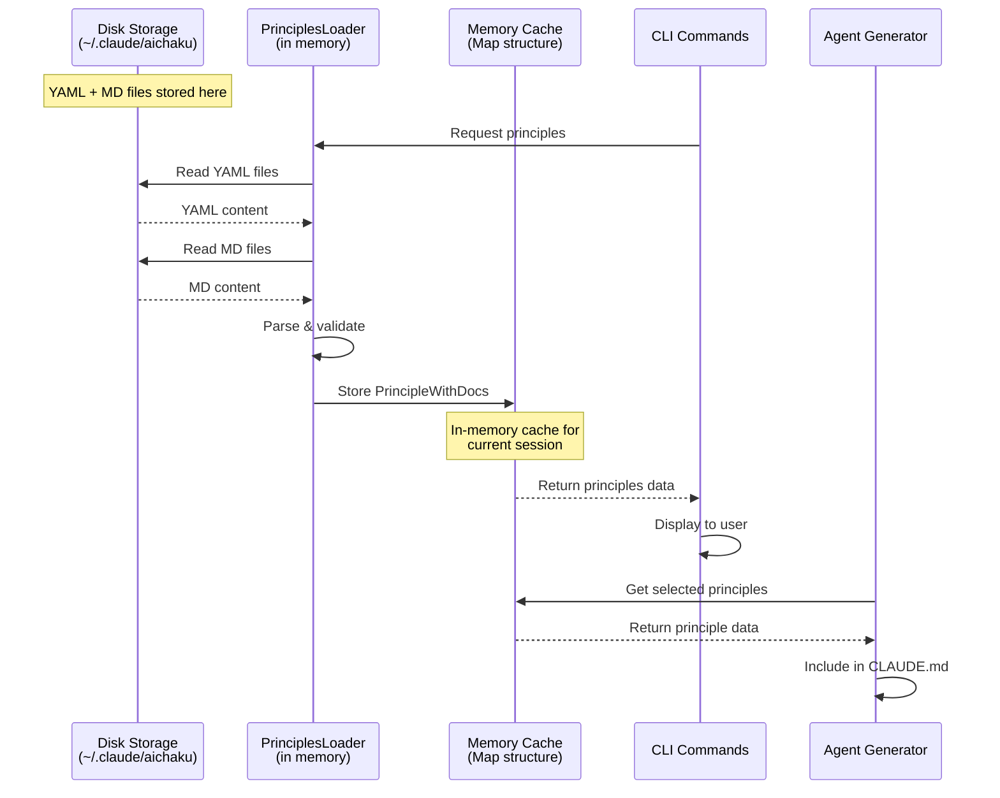
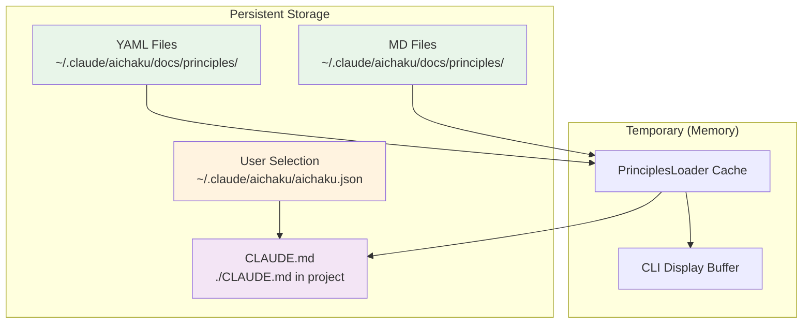

# Principles System Data Flow

## Where Files Are Loaded

### 1. Source Location (Persistent Storage)

Files are stored on disk at:

```
~/.claude/aichaku/docs/principles/
├── software-development/
│   ├── unix-philosophy.yaml    # Structured data
│   └── unix-philosophy.md      # Human-readable docs
└── ...
```

### 2. Loading Process



### 3. Memory Structure

When loaded, each principle is stored in memory as:

```typescript
interface PrincipleWithDocs {
  data: Principle;        // Parsed from YAML
  documentation: string;  // Content from MD file
  path: string;          // Original file path
}

// Stored in a Map for fast lookup
Map<string, PrincipleWithDocs> {
  "unix-philosophy" => {
    data: { name: "Unix Philosophy", category: "software-development", ... },
    documentation: "# Unix Philosophy\n\n> Write programs...",
    path: "/Users/rcogley/.claude/aichaku/docs/principles/software-development/unix-philosophy.yaml"
  },
  "dry" => { ... },
  "yagni" => { ... }
}
```

### 4. Usage by Different Commands

#### `aichaku principles --list`

- Loads all principles into memory
- Displays names and descriptions from the YAML data
- Doesn't need the MD documentation

#### `aichaku principles --show unix-philosophy`

- Retrieves from cache (or loads if not cached)
- Shows basic info from YAML
- With `--verbose`, includes content from MD file

#### `aichaku principles --select dry,kiss`

- Validates selections against loaded principles
- Saves selections to `~/.claude/aichaku/aichaku.json`
- Doesn't store the principle content itself

#### `aichaku integrate`

- Reads selected principle names from config
- Loads those specific principles
- Includes principle metadata in CLAUDE.md YAML

### 5. What Gets Persisted Where



## Summary

- **Source files** (YAML + MD) live in `~/.claude/aichaku/docs/principles/`
- **Loader** reads these files into **memory** when needed
- **Cache** holds them during the CLI session for performance
- **User selections** are saved to `aichaku.json` (just the names)
- **CLAUDE.md** gets updated with principle metadata when running `integrate`

The actual principle content is never duplicated - it's always read from the source files in the global aichaku
installation.
