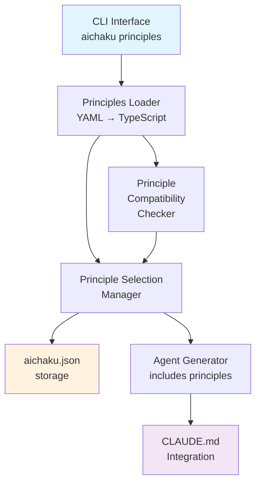
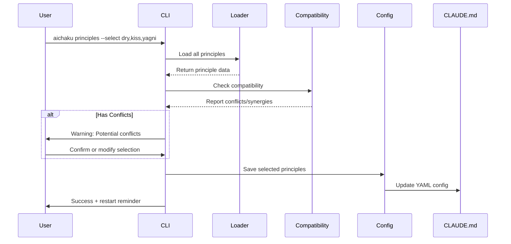
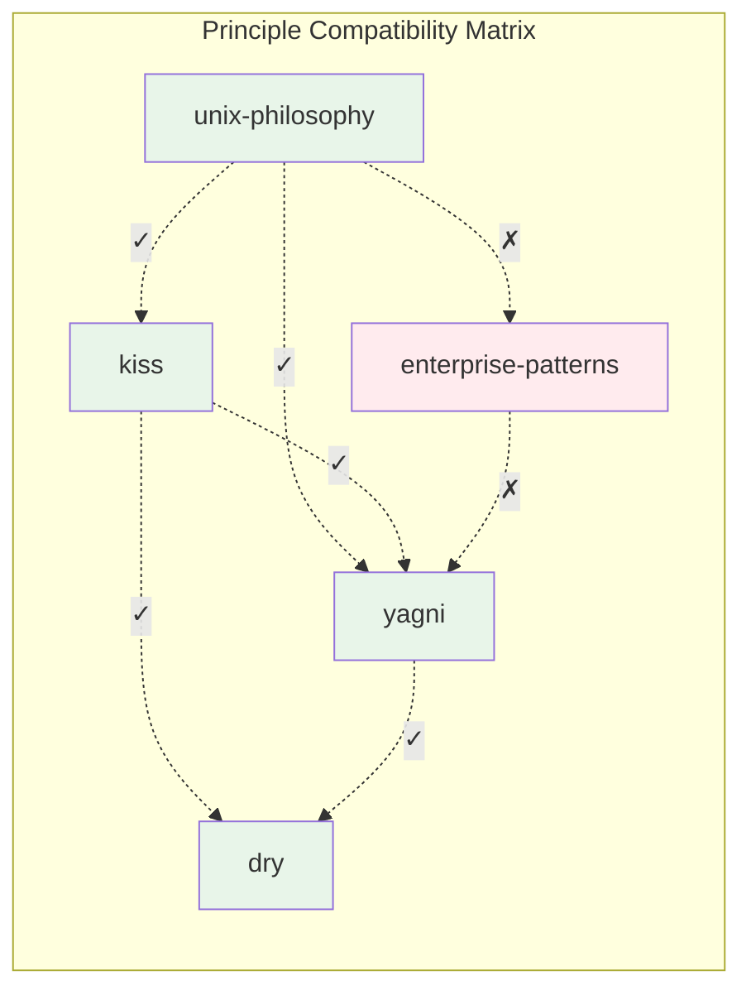

# Technical Design: Principles Guidance System

## Architecture Overview

The principles system extends aichaku's existing architecture to support guiding philosophies alongside methodologies
and standards.



## Data Structures

### Principle Interface

```typescript
interface Principle {
  // Metadata
  name: string;
  category: "software-development" | "organizational" | "engineering" | "human-centered";
  description: string;
  aliases?: string[]; // Alternative names

  // Historical Context
  history: {
    origin: string; // When and where it originated
    originators: string[]; // Key figures
    evolution: string; // How it has evolved
    significance: string; // Why it matters
  };

  // Core content
  summary: {
    tagline: string; // One-line summary
    core_tenets: Array<{
      text: string;
      guidance: string;
    }>;
    anti_patterns: Array<{
      pattern: string;
      instead: string;
    }>;
    key_practices?: string[];
  };

  // Guidance
  guidance: {
    spirit: string; // The underlying philosophy
    questions_to_ask: string[]; // Self-check questions
    when_to_apply: string[];
    exceptions: string[];
    common_mistakes: string[];
  };

  // Examples
  examples: {
    good: Array<{
      description: string;
      code?: string;
      explanation: string;
    }>;
    bad: Array<{
      description: string;
      code?: string;
      problem: string;
    }>;
    real_world: Array<{
      project: string;
      description: string;
      link?: string;
    }>;
  };

  // Compatibility
  compatibility: {
    works_well_with: string[];
    potential_conflicts: string[];
    complements: string[];
  };

  // References
  references: {
    foundational: string[]; // Original texts/papers
    modern: string[]; // Contemporary interpretations
    tools: string[]; // Tools that embody the principle
  };
}
```

### Configuration Extension

```typescript
// Extend existing AichakuConfig
interface AichakuConfig {
  // ... existing fields ...
  principles?: {
    selected: string[];
    // Future: customization options
  };
}
```

## File Organization

```
docs/
└── principles/
    ├── index.yaml                    # Principle registry
    ├── software-development/
    │   ├── unix-philosophy.yaml
    │   ├── dry.yaml
    │   ├── yagni.yaml
    │   ├── kiss.yaml
    │   └── zen-of-python.yaml
    ├── organizational/
    │   ├── agile-manifesto.yaml
    │   ├── devops-three-ways.yaml
    │   ├── lean-principles.yaml
    │   ├── theory-of-constraints.yaml
    │   └── conways-law.yaml
    ├── engineering/
    │   ├── defensive-programming.yaml
    │   ├── fail-fast.yaml
    │   ├── least-privilege.yaml
    │   └── separation-of-concerns.yaml
    └── human-centered/
        ├── design-thinking.yaml
        ├── accessibility-first.yaml
        └── privacy-by-design.yaml
```

## Implementation Patterns

### Command Pattern (matches existing)

```typescript
// src/commands/principles.ts
export async function principles(args: string[]): Promise<void> {
  const flags = parseFlags(args);

  if (flags.list) {
    await listPrinciples(flags.category);
  } else if (flags.show) {
    await showPrinciple(flags.show, { verbose: flags.verbose });
  } else if (flags.select) {
    await selectPrinciples(flags.select.split(","));
  } else if (flags.selectInteractive) {
    await selectPrinciplesInteractive();
  } else if (flags.current) {
    await showCurrentPrinciples();
  } else if (flags.remove) {
    await removePrinciples(flags.remove.split(","));
  } else if (flags.clear) {
    await clearPrinciples();
  } else {
    showPrinciplesHelp();
  }
}
```

### Loader Pattern

```typescript
// src/utils/principles-loader.ts
export class PrinciplesLoader {
  private cache: Map<string, Principle> = new Map();

  async loadAll(): Promise<Principle[]> {
    const principlesPath = path.join(getAichakuPaths().global.root, "docs/principles");
    const principles: Principle[] = [];

    for (const category of PRINCIPLE_CATEGORIES) {
      const categoryPath = path.join(principlesPath, category);
      const files = await glob(`${categoryPath}/*.yaml`);

      for (const file of files) {
        const principle = await this.loadPrinciple(file);
        if (principle) {
          principles.push(principle);
          this.cache.set(principle.name, principle);
        }
      }
    }

    return principles;
  }

  private async loadPrinciple(filepath: string): Promise<Principle | null> {
    try {
      const content = await Deno.readTextFile(filepath);
      const data = parse(content) as Principle;

      // Validate against schema
      if (!this.validatePrinciple(data)) {
        console.warn(`Invalid principle format: ${filepath}`);
        return null;
      }

      return data;
    } catch (error) {
      console.error(`Failed to load principle: ${filepath}`, error);
      return null;
    }
  }
}
```

## Agent Integration

### Principle-Aware Guidance

```typescript
// In agent-generator.ts
function generatePrincipleGuidance(selectedPrinciples: string[]): string {
  if (selectedPrinciples.length === 0) return "";

  return `
## Guiding Principles

You should be aware of these principles the user has selected:

${selectedPrinciples.map((p) => `- **${p}**: Apply this philosophy when making suggestions`).join("\n")}

When reviewing code or suggesting improvements:
- Consider if the approach aligns with these principles
- Suggest alternatives that better embody the principles
- Explain decisions in terms of principle alignment
- Be gentle and educational, not prescriptive
`;
}
```

## Migration Strategy

1. **No Breaking Changes**: Existing functionality remains unchanged
2. **Additive Only**: Principles are a new feature, not modifying existing
3. **Gradual Adoption**: Users can adopt principles at their own pace
4. **Future Proofing**: Design allows for future enhancements

## Performance Considerations

1. **Lazy Loading**: Load principles only when needed
2. **Caching**: Cache loaded principles in memory
3. **Parallel Loading**: Load all principle files concurrently
4. **Minimal Impact**: Don't slow down existing commands

## Error Handling

1. **Graceful Degradation**: Missing principles don't break the system
2. **Clear Messages**: User-friendly error messages
3. **Validation**: Validate YAML structure on load
4. **Recovery**: Allow partial principle loading if some fail

## Principle Selection Flow



## Compatibility Checking

### Implementation

```typescript
// src/utils/principle-compatibility.ts
export class PrincipleCompatibilityChecker {
  constructor(private principles: Map<string, Principle>) {}

  checkCompatibility(selectedPrinciples: string[]): CompatibilityReport {
    const conflicts: Array<[string, string, string]> = [];
    const synergies: Array<[string, string]> = [];

    for (let i = 0; i < selectedPrinciples.length; i++) {
      for (let j = i + 1; j < selectedPrinciples.length; j++) {
        const p1 = this.principles.get(selectedPrinciples[i]);
        const p2 = this.principles.get(selectedPrinciples[j]);

        if (!p1 || !p2) continue;

        // Check for conflicts
        if (p1.compatibility.potential_conflicts.includes(p2.name)) {
          conflicts.push([p1.name, p2.name, "May have conflicting approaches"]);
        }

        // Check for synergies
        if (p1.compatibility.works_well_with.includes(p2.name)) {
          synergies.push([p1.name, p2.name]);
        }
      }
    }

    return { conflicts, synergies, score: this.calculateScore(conflicts, synergies) };
  }

  visualizeMatrix(principles: string[]): string {
    // Generate compatibility matrix for display
    // Returns formatted string with symbols: ✓ = works well, ✗ = conflicts, - = neutral
  }
}
```

### Compatibility Matrix Visualization



## Future Extensions

1. **Custom Principles**: Allow users to define their own
2. **Principle Profiles**: Pre-selected sets for different contexts
3. **Advanced Conflict Resolution**: Suggest alternatives when conflicts detected
4. **Metrics**: Track which principles are most used/helpful
5. **Principle Evolution**: Track how principles are interpreted over time
