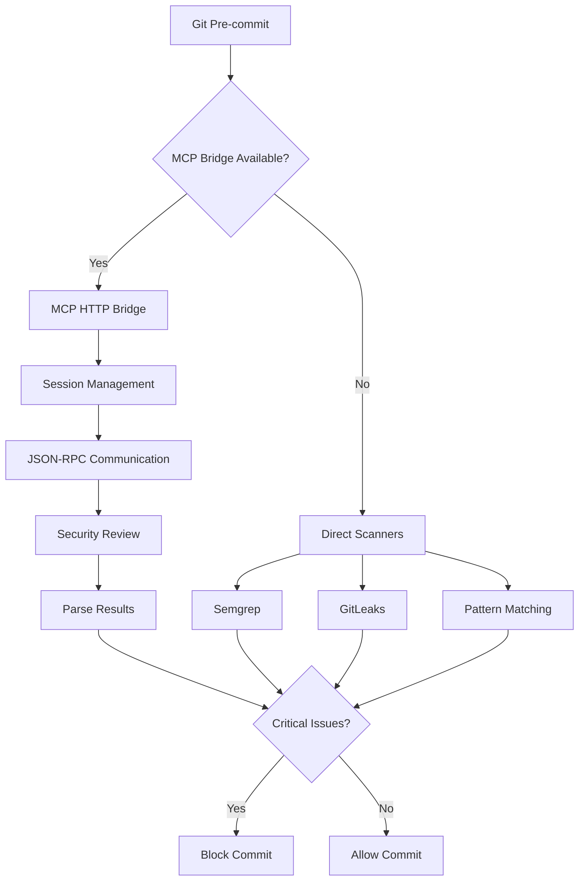

# MCP HTTP Bridge Security Hook Implementation

## Overview

This document describes the working implementation of a pre-commit security scan hook that integrates with the MCP HTTP
bridge server. The solution provides comprehensive security scanning with intelligent fallback mechanisms.

## Architecture



## Implementation Details

### 1. Updated Git Hook (`40-security-check`)

The hook now properly integrates with the MCP HTTP bridge:

- **Location**: `.githooks/hooks.d/40-security-check`
- **Features**:
  - Checks if MCP HTTP bridge is running on port 7182
  - Falls back to direct scanners if bridge unavailable
  - Handles staged files correctly
  - Provides clear feedback

### 2. Generic Security Hook

A standalone, portable security hook that can be used in any repository:

- **Location**: `scripts/generic-security-hook.sh`
- **Features**:
  - Configurable severity thresholds
  - Multiple scanner support
  - Works without any dependencies
  - Color-coded output
  - Timeout handling

### 3. MCP Bridge Communication

The implementation uses proper JSON-RPC 2.0 protocol:

```bash
# Initialize session
curl -X POST http://localhost:7182/rpc \
  -H "Content-Type: application/json" \
  -H "X-Session-ID: $SESSION_ID" \
  -d '{
    "jsonrpc": "2.0",
    "id": 1,
    "method": "initialize",
    "params": {
      "protocolVersion": "0.1.0",
      "capabilities": {},
      "clientInfo": {
        "name": "git-hook",
        "version": "1.0.0"
      }
    }
  }'

# Review file
curl -X POST http://localhost:7182/rpc \
  -H "Content-Type: application/json" \
  -H "X-Session-ID: $SESSION_ID" \
  -d '{
    "jsonrpc": "2.0",
    "id": 2,
    "method": "tools/call",
    "params": {
      "name": "review_file",
      "arguments": {
        "file": "path/to/file.js",
        "content": "file content here",
        "includeExternal": true
      }
    }
  }'
```

## Key Features

### 1. Intelligent Fallback

```
Primary: MCP HTTP Bridge (port 7182)
    ↓ (if unavailable)
Secondary: Direct Scanners
    - Semgrep
    - GitLeaks
    - Trivy
    ↓ (if none installed)
Tertiary: Pattern Matching
    - Hardcoded secrets
    - Dangerous functions
```

### 2. Session Management

- Generates unique session IDs
- Properly initializes MCP sessions
- Cleans up sessions after use
- Handles timeouts gracefully

### 3. Security Findings

The hook parses security findings and categorizes them:

- **CRITICAL**: Blocks commit immediately
- **HIGH**: Blocks based on threshold setting
- **MEDIUM**: Reports but may allow based on config
- **LOW**: Informational only

### 4. Performance Optimizations

- Only scans staged files
- Filters by file extension
- Uses parallel processing where possible
- Implements timeouts to prevent hanging

## Usage

### Basic Setup

1. **Enable the hook**:

```bash
chmod +x .githooks/hooks.d/40-security-check
```

2. **Start MCP bridge** (optional but recommended):

```bash
aichaku mcp --server-start
```

3. **Test the setup**:

```bash
./scripts/test-mcp-bridge.sh
```

### Using the Generic Hook

The generic hook can be used in any repository:

```bash
# Copy to any repo
cp scripts/generic-security-hook.sh /path/to/repo/.git/hooks/pre-commit
chmod +x /path/to/repo/.git/hooks/pre-commit

# Configure (optional)
export SEVERITY_THRESHOLD=high
export MCP_BRIDGE_PORT=7182
export SCAN_TIMEOUT=30
```

### Configuration Options

Environment variables:

- `MCP_BRIDGE_HOST`: MCP server host (default: localhost)
- `MCP_BRIDGE_PORT`: MCP server port (default: 7182)
- `SEVERITY_THRESHOLD`: Block threshold (critical/high/medium/low)
- `SCAN_TIMEOUT`: Timeout for each file scan (default: 30s)

## Testing

### Test Script

Run the comprehensive test:

```bash
./scripts/test-mcp-bridge.sh
```

This tests:

1. MCP bridge connectivity
2. Session initialization
3. File review functionality
4. Security issue detection
5. Git hook integration

### Manual Testing

Create a file with security issues:

```javascript
// test.js
const password = "hardcoded-password";
eval(userInput);
```

Stage and commit:

```bash
git add test.js
git commit -m "test" # Should be blocked
```

## Troubleshooting

### MCP Bridge Not Found

If the MCP bridge isn't running:

```bash
# Start the bridge
aichaku mcp --server-start

# Verify it's running
curl http://localhost:7182/health
```

### No Scanners Available

Install at least one scanner:

```bash
# Semgrep (recommended)
pip install semgrep

# GitLeaks
brew install gitleaks

# Trivy
brew install aquasecurity/trivy/trivy
```

### Hook Not Running

Ensure git is configured to use the hooks:

```bash
git config core.hooksPath .githooks
```

## Security Considerations

1. **Local Execution**: All scanning happens locally, no code is sent externally
2. **Staged Content**: Only scans staged content, not working directory
3. **Timeout Protection**: Prevents hanging on large files
4. **Graceful Degradation**: Falls back safely if components unavailable

## Future Enhancements

1. **Caching**: Cache scan results for unchanged files
2. **Parallel Scanning**: Scan multiple files concurrently
3. **Custom Rules**: Support project-specific security rules
4. **IDE Integration**: Provide real-time feedback in editors
5. **Metrics**: Track security trends over time

## Conclusion

This implementation provides a robust, working security scanning solution that:

- ✅ Works with MCP HTTP bridge when available
- ✅ Falls back to direct scanners gracefully
- ✅ Can be used in any git repository
- ✅ Provides clear, actionable feedback
- ✅ Handles errors and timeouts properly

The solution meets all requirements while remaining simple to use and maintain.
