# TypeScript Hooks Implementation Status

## 🌳 Project Status: Review

**Started**: 2025-01-13\
**Target**: 6-week cycle\
**Phase**: [Problem] → [Solution] → [Implementation] → [**Testing**] → [Release] ▲

## Progress Overview

### Completed ✅

- [x] Identified catastrophic bash hooks failure (40k duplicates!)
- [x] Received TypeScript guidance from Anthropic support
- [x] Documented three key pieces of advice
- [x] Created initial TypeScript hook prototypes
- [x] Fixed deprecated Deno API usage
- [x] Created Shape Up pitch document
- [x] Designed single TypeScript file with all hooks (aichaku-hooks.ts)
- [x] Implemented command-line switch routing
- [x] Created comprehensive error handling
- [x] Updated Aichaku source code to generate correct hook format
- [x] Fixed hook structure to use nested format with matcher and hooks array
- [x] Added code-review hook for MCP integration
- [x] Created GitHub integration hooks (todo-tracker, pr-checker, etc.)
- [x] Added "GitHub" hook category for easy installation

### In Progress 🔄

- [ ] Compile TypeScript to single binary (attempted but timeout issues)
- [ ] Test all hook scenarios in production

### Upcoming 📋

- [ ] Create migration documentation
- [ ] Release v0.29.0 with TypeScript hooks

## Key Decisions

1. **Single Binary Approach**: One compiled TypeScript file handles all hooks via CLI arguments
2. **Silent Failures**: Hooks exit quietly on errors to avoid disrupting Claude Code
3. **5-Second Timeouts**: Prevent runaway processes
4. **No External Dependencies**: Use only Deno built-ins

## Blockers & Issues

- ✅ Deno.readAll() deprecated - FIXED with modern API
- ✅ Hook execution not visible - FIXED with exit code 2 and stderr output
- ✅ Hook structure incorrect - FIXED with nested format
- ⚠️ Compilation timeout in Claude Code - use TypeScript directly for now

## Next Steps

1. Test all hooks in production environment
2. Create user migration guide from bash to TypeScript hooks
3. Release v0.29.0 with full TypeScript hook support
4. Monitor for any edge cases or issues

## GitHub Integration Features

- **New "GitHub" hook category** with 5 specialized hooks
- **MCP-ready** for automation with GitHub MCP servers
- **Contextual suggestions** based on file types and commands
- **Easy installation**: `aichaku hooks --install github --global`

```mermaid
graph LR
    A[🔴 Bash Hooks Failed] --> B[✅ TypeScript Design]
    B --> C[✅ Implementation]
    C --> D[🟡 Testing]
    D --> E[📦 Release]

    style D fill:#FFD93D,stroke:#333
```

