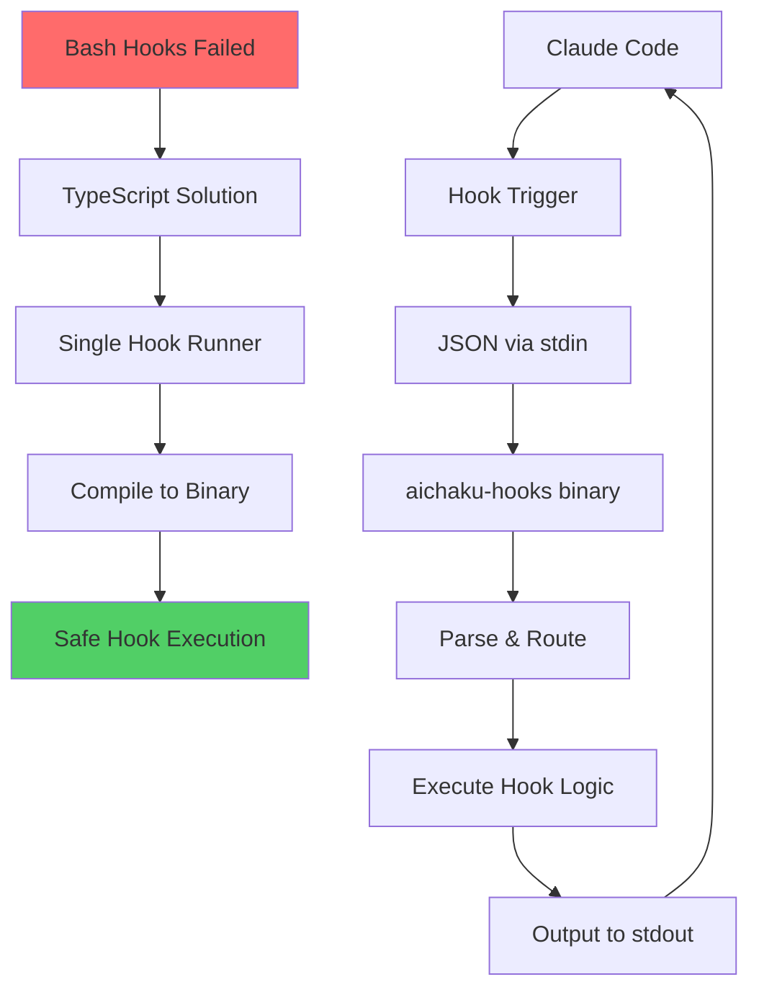

# TypeScript Hooks Implementation for Aichaku

## Problem

Our bash-based hooks implementation caused catastrophic issues:

- Endless subshell spawning leading to 40,000 duplicate hooks
- 250,000+ lines added to settings file
- Complex bash escaping issues
- No type safety or error handling
- Difficult to debug and maintain

## Appetite

6-week cycle to completely redesign hooks using TypeScript

## Solution

### 1. Single TypeScript Hook Runner

Create a unified TypeScript file that handles all hooks through command-line switches:

```typescript
// aichaku-hooks.ts
const hookType = Deno.args[0];
const hookName = Deno.args[1];

switch (hookName) {
  case "path-validator":
    await runPathValidator();
    break;
  case "owasp-checker":
    await runOwaspChecker();
    break;
    // ... other hooks
}
```

### 2. Hook Structure

Based on Anthropic's guidance, hooks must follow this structure:

```json
{
  "matcher": "Write|Edit",
  "hooks": [
    {
      "type": "command",
      "command": "deno run --allow-read /path/to/aichaku-hooks.ts owasp-checker",
      "timeout": 5
    }
  ]
}
```

### 3. Safety Implementation

Following Anthropic's three key pieces of advice:

#### Advice 1: TypeScript Execution Options

- **Direct execution**: `deno run --allow-read /path/to/script.ts`
- **Compiled JavaScript**: `node /path/to/compiled-script.js`
- **Via npx**: `npx tsx /path/to/script.ts`

#### Advice 2: Input/Output Protocol

- Scripts receive JSON input via stdin
- Must parse JSON safely with error handling
- Output to stdout for Claude Code display
- 60-second default timeout (configurable)

#### Advice 3: Safety Practices

- **Prevent recursion**: No Write hooks that write files
- **Validate inputs**: Never trust input data blindly
- **Use absolute paths**: Always use full paths to scripts
- **Set explicit timeouts**: 5-30 seconds max
- **Check stop*hook*active**: In Stop hooks to prevent loops
- **Test manually first**: Before adding to hooks system

### 4. Implementation Details

#### Single Compiled Binary

```bash
# Compile once
deno compile --allow-read --output aichaku-hooks aichaku-hooks.ts

# Use in hooks
{
  "type": "command",
  "command": "/Users/rcogley/.claude/aichaku/bin/aichaku-hooks path-validator",
  "timeout": 5
}
```

#### Input Parsing (Modern Deno API)

```typescript
const decoder = new TextDecoder();
const reader = Deno.stdin.readable.getReader();
const result = await reader.read();

if (!result.value) {
  Deno.exit(0);
}

const input = JSON.parse(decoder.decode(result.value));
```

## Rabbit Holes

### 1. Don't Create Individual Hook Files

Creating separate TypeScript files for each hook leads to:

- Multiple compilation steps
- Harder distribution
- More complex maintenance

### 2. Don't Use External Dependencies

Stick to Deno built-ins to avoid:

- Dependency management issues
- Compilation problems
- Security vulnerabilities

### 3. Don't Over-Engineer Error Handling

Hooks should fail silently to avoid disrupting Claude Code:

```typescript
try {
  // Hook logic
} catch {
  Deno.exit(0); // Silent exit
}
```

## No-Gos

1. **No bash scripts**: Pure TypeScript only
2. **No file writes in hooks**: Read-only operations
3. **No network calls**: Local operations only
4. **No user prompts**: Fully automated
5. **No recursive hooks**: Prevent infinite loops

## Nice-to-Haves

- Unit tests for each hook function
- Performance metrics logging
- Hook execution statistics
- Configuration file for hook settings

## Project Structure

```
/Users/rcogley/.claude/aichaku/
├── hooks/
│   ├── aichaku-hooks.ts      # Main hook runner
│   ├── aichaku-hooks         # Compiled binary
│   └── config.json           # Hook configuration
├── src/
│   └── commands/
│       └── hooks.ts          # Updated to generate TypeScript hooks
└── docs/
    └── hooks-migration.md    # Migration guide
```

## Success Metrics

- Zero infinite loops or recursive spawning
- All hooks execute in < 5 seconds
- No crashes or hangs in Claude Code
- Clean uninstall/reinstall process
- Type-safe hook implementations

## Timeline

- Week 1-2: Design and implement single TypeScript file
- Week 3: Compile and test extensively
- Week 4: Update Aichaku source code
- Week 5: Migration tooling and documentation
- Week 6: Release and monitor

## Lessons Learned

1. **Bash is dangerous for hooks**: Shell spawning can cascade
2. **TypeScript provides safety**: Type checking prevents many errors
3. **Single binary is simpler**: Easier to manage than multiple scripts
4. **Silent failures are better**: Don't disrupt user workflow
5. **Timeouts are critical**: Prevent runaway processes


