# 2025-07-07 Mermaid Integration Implementation - Change Log

## Summary

Added Mermaid diagram requirements to Aichaku and created reusable diagram templates.

## Changes Made

### 1. Added Section 5: Mermaid Diagram Integration

- Made diagrams mandatory in all project documentation
- Specified required diagrams for each document type:
  - STATUS.md: Project lifecycle flow
  - Shape Up pitch.md: Problem → Solution flow
  - Scrum sprint-planning.md: Gantt timeline
- Included examples with proper Mermaid syntax

### 2. Created Diagram Templates

Created `/methodologies/common/diagrams/`:

- `project-lifecycle.mmd` - Generic project flows
- `shape-up-cycle.mmd` - Shape Up specific diagrams
- `scrum-sprint.mmd` - Sprint timelines and burndown

### 3. Updated Project Lifecycle (Section 6)

- Added diagram requirements to document creation
- Specified diagram state updates during work
- Integrated diagrams into completion process

## Example Diagram

```mermaid
graph LR
    A[🌱 Started] --> B[🌿 Active]
    B --> C[🌳 Review]
    C --> D[🍃 Complete]
    style B fill:#90EE90
```

## Impact

- Visual documentation for all projects
- Better understanding of workflows
- GitHub/GitLab automatic rendering
- PDF-ready with SVG conversion

## Status

✅ Implementation complete ✅ Templates created ✅ Tests passing ✅ Ready for release
