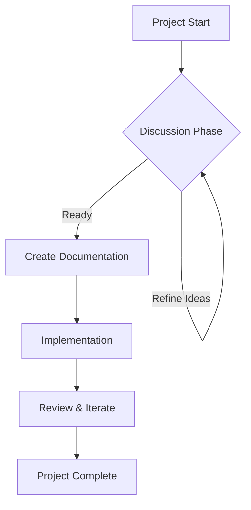

# Mermaid Diagram Integration for Aichaku

## Problem

Currently, Aichaku generates text-based documentation which lacks visual representations. Users would benefit from:

- Visual project overviews
- Workflow diagrams
- Effort-specific visualizations
- Architecture diagrams

Without visuals, complex relationships and workflows are harder to understand at a glance.

## Solution

Integrate Mermaid diagram generation into Aichaku's document creation workflow. Mermaid is ideal because:

- **Markdown-native**: Diagrams defined in Markdown code blocks
- **Version control friendly**: Text-based diagram definitions
- **Wide support**: GitHub, GitLab, many Markdown viewers render automatically
- **No external files**: Diagrams embedded directly in documents

## Implementation Approach

### 1. Standard Diagrams for All Projects

Add to every project's documentation:

````markdown
## Project Overview


````

````
### 2. Methodology-Specific Diagrams

**Shape Up Projects:**
```mermaid
graph LR
    A[Appetite: 6 weeks] --> B[Shaping]
    B --> C[Betting]
    C --> D[Building]
    D --> E[Cool-down]
````

**Scrum Projects:**

```mermaid
graph TD
    A[Product Backlog] --> B[Sprint Planning]
    B --> C[Sprint Backlog]
    C --> D[Daily Scrum]
    D --> E[Sprint Review]
    E --> F[Sprint Retrospective]
    F --> A
```

### 3. Custom Effort Diagrams

For specific efforts, generate relevant diagrams:

- Architecture diagrams
- Data flow diagrams
- State machines
- Sequence diagrams

### 4. PDF Generation Strategy

**Option A: Embedded SVG (Recommended)**

- When generating PDFs, pre-render Mermaid to SVG
- Embed SVG directly in Markdown
- Pandoc handles SVG in PDF generation

**Option B: Dual Format**

- Keep Mermaid blocks for web viewing
- Add pre-rendered PNG/SVG for PDF
- Use HTML comments to hide duplicates

**Option C: Build Script Enhancement**

```bash
# In PDF generation script
mermaid -i input.md -o output.md --svg
pandoc output.md -o final.pdf
```

## Technical Implementation

### 1. Add Mermaid to CLAUDE.md Directives

```markdown
### 5. Visual Documentation Requirements

**YOU MUST include Mermaid diagrams in:** ✅ Every PROJECT-OVERVIEW.md ✅ Every methodology-specific workflow ✅
Architecture decisions when relevant ✅ Complex process flows

**Diagram Placement:**

- After the summary section
- Before detailed descriptions
- Use clear, descriptive node labels
```

### 2. Create Diagram Templates

Store in `methodologies/common/diagrams/`:

- `project-lifecycle.mmd`
- `shape-up-cycle.mmd`
- `scrum-sprint.mmd`
- `kanban-flow.mmd`

### 3. PDF Generation Updates

Update the pandoc-based script:

```bash
#!/bin/bash
# Pre-process Mermaid blocks
npx -p @mermaid-js/mermaid-cli mmdc -i "$1" -o "$1.processed.md"
# Generate PDF with embedded diagrams
pandoc "$1.processed.md" -o "${1%.md}.pdf" --pdf-engine=xelatex
```

## Benefits

1. **Instant Understanding**: Visual overview of project structure
2. **Methodology Clarity**: See workflow at a glance
3. **Better Communication**: Diagrams transcend language barriers
4. **Living Documentation**: Diagrams update with the project
5. **PDF-Ready**: Clean export for stakeholders

## Challenges & Solutions

**Challenge**: Mermaid syntax in PDFs **Solution**: Pre-render to SVG during PDF generation

**Challenge**: Diagram complexity **Solution**: Start simple, provide templates

**Challenge**: Maintaining diagrams **Solution**: Make them part of status updates

## Success Criteria

- Every project has at least one overview diagram
- Methodology workflows visualized automatically
- PDFs include rendered diagrams
- Users can add custom diagrams easily
- No external files needed for basic viewing
