# Project Status: Progress Indicator Design

**Status**: ACTIVE - Design Phase **Started**: 2025-07-07 **Target**: Feature for v0.7.0

## Prerequisites

- Aichaku methodology library understanding
- ASCII art rendering knowledge
- CLI interface design experience

## Current Phase

📐 PLANNING MODE - You are designing optimal progress indicators

```mermaid
graph LR
    A[🌱 Research] --> B[🌿 Design]
    B --> C[🌳 Prototype]
    C --> D[🍃 Implementation]
    style B fill:#90EE90
```

## Progress

### Phase 1: Research & Design ✅

- [x] Research requirements and constraints
- [x] Design ASCII-first progress indicators
- [x] Create methodology-specific examples
- [x] Document implementation strategy

### Phase 2: Validation & Prototyping 🔄

- [ ] Review with team
- [ ] Prototype core engine
- [ ] Implement renderers

### Phase 3: Integration 📋

- [ ] Integrate with CLI
- [ ] Test with real projects
- [ ] Finalize documentation

## Key Decisions

1. **ASCII-First Design**: You maintain Claude Code compatibility with ASCII-first rendering
2. **Per-Methodology Indicators**: Each methodology gets unique workflow indicators
3. **STATUS.md Integration**: You integrate via comment markers for seamless updates
4. **Three Display Modes**: You can choose between ascii, compact, and minimal modes
5. **Zero Dependencies**: You maintain security stance with no external dependencies

## Design Highlights

### Shape Up Progress

- 6-week cycles with three phases
- Clear "You are here" indicator
- Appetite tracking

### Scrum Progress

- Sprint burndown visualization
- Daily progress dots
- Velocity tracking

### Kanban Progress

- WIP limit indicators
- Flow metrics (cycle time, throughput)
- Bottleneck detection

### Lean MVP Progress

- Build-Measure-Learn cycle
- Hypothesis validation tracking
- Time/budget indicators

### XP Progress

- TDD cycle visualization (Red-Green-Refactor)
- Pair programming tracking
- Practice adoption metrics

## Next Steps

1. **Get Design Feedback**
   - Review approach with team
   - Validate ASCII rendering choices

2. **Prototype Shape Up Renderer**
   - Build first working renderer
   - Test cycle visualization

3. **Build STATUS.md Integration**
   - Create parser/injector system
   - Test comment marker approach

4. **Create CLI Command**
   - Add progress command to CLI
   - Integrate with existing workflows

5. **Real Project Testing**
   - Validate with actual Aichaku projects
   - Gather user feedback

## Related Documents

- [`progress-indicator-design.md`](./progress-indicator-design.md) - Complete design specification
- [`progress-examples.md`](./progress-examples.md) - Visual examples for all methodologies
- [`implementation-guide.md`](./implementation-guide.md) - Step-by-step implementation plan

## Success Criteria

- [ ] Progress indicators render correctly in all ASCII environments
- [ ] Each methodology has distinct, meaningful progress visualization
- [ ] STATUS.md integration updates automatically without conflicts
- [ ] CLI integration feels natural and intuitive
- [ ] Performance remains under 50ms for rendering

## Project Completion

**Completion Date**: 2025-08-01\
**Final Status**: 🍃 COMPLETED - All progress indicator design objectives met and project deliverables completed.

This project has been successfully finished and is ready to be moved to the done directory.

---

_Project completed and archived on 2025-08-01_
