# Unified Upgrade Command

## Project Status

**Started**: 2025-07-08 **Type**: UX Enhancement **Methodology**: Shape Up
(Small Batch) **Status**: Shaping → Implementation

```mermaid
graph LR
    A[🌱 Shaping] --> B[🌿 Implementation]
    B --> C[🌳 Testing]
    C --> D[🍃 Complete]
    style A fill:#90EE90
```

## Problem

Users expect `aichaku upgrade` to upgrade everything but must run two commands:

1. `aichaku upgrade` - updates mysterious "metadata"
2. `aichaku integrate --force` - updates CLAUDE.md

This is confusing and unnatural.

## Solution

Make `aichaku upgrade` automatically update CLAUDE.md when run in projects.

## Implementation Plan

1. Modify upgrade.ts to detect project upgrades
2. Call integrate() automatically after upgrade
3. Update messages to be clearer
4. Keep integrate as standalone for special cases

## Progress

- [x] Identify UX problem
- [x] Shape solution
- [ ] Implement unified upgrade
- [ ] Test upgrade flow
- [ ] Update documentation
- [ ] Release update
