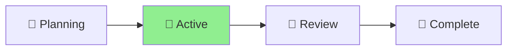

# Project Status: Aichaku Hooks Integration

## Overview

Enhancing Aichaku with Claude Code's hooks feature to provide automated
methodology enforcement and improved developer experience.

## Current Status: 🌿 Active Development

## Progress Timeline

[Shaping] → [Pitching] → [Betting] → [**Building**] → [Cool-down] ▲ Day 7/14
████████████░░░░░░░░░░░░░░░░░ 50% 🌿

## Completed Features

- ✅ Basic hooks command implementation
- ✅ Hook templates for basic, advanced, and security categories
- ✅ Installation and removal functionality
- ✅ List and validate commands
- ✅ Integration with Claude Code settings.json

## Key Decisions

- [x] Decide on hook template categories (basic, advanced, security) - DONE
- [ ] Determine role-based prompting approach
- [ ] Resolve SECURITY_WORKFLOWS.md placement
- [ ] Design modular guidance section architecture
- [ ] Fix methodology-detector hook (sets unused AICHAKU_MODE variable)

## Features to Implement

- [ ] Parse and display existing hooks from settings.json
- [ ] Support both global (~/.claude/settings.json) and local
      (.claude/settings.json) installation
- [ ] Enable individual hook installation (not just categories)
- [ ] Add reminder about restarting Claude Code after hook changes
- [ ] Interactive hook selection UI
- [ ] Hook conflict detection and resolution
- [ ] Hook testing/dry-run capability
- [ ] Implement Stop and PreCompact conversation summary hooks
- [ ] Determine best location for hook scripts (global vs installed)

## Next Steps

1. Implement existing hooks parser
2. Add global vs local installation option
3. Create individual hook installation command
4. Add restart reminder to all hook operations
5. Fix methodology-detector implementation

## Blockers

None currently

## Last Updated

2025-01-13
