# MCP Code Reviewer - Status

🪴 Aichaku: Automated Security & Standards Review Server

[Planning] → [**Designing**] → [Building] → [Testing] → [Complete] ▲

## Project Overview

Creating a Model Context Protocol (MCP) server that performs automated security
and standards review as code is produced, leveraging local tools like codeql and
devskim as a "first line of defence".

**Consolidated Design**: Merged security/standards review capabilities with
methodology compliance checking from earlier MCP design (2025-01-09).

## Current Status 🌿

```mermaid
graph LR
    A[🌱 Started] --> B[🌿 Active]
    B --> C[🌳 Review]
    C --> D[🍃 Complete]
    style B fill:#90EE90
```

## Progress Tracking

- [x] Project structure created
- [x] MCP architecture design
- [x] Review engine concept
- [x] Example implementation
- [x] Aichaku integration plan
- [x] Consolidated with methodology design
- [x] Created unified approach
- [x] Claude-MCP relationship documented
- [x] Hook integration patterns
- [x] Compilation strategy defined
- [x] Local vs hosted decision (🔒 local for privacy)
- [x] Distribution strategy (GitHub releases)
- [x] Tool integration approach (external, detected)
- [x] PR creation policy (manual only, no auto-spam)
- [x] Educational feedback system (helps Claude learn)
- [x] Advanced prompting techniques (multi-shot, decomposition, reflection)
- [ ] Full implementation
- [ ] Testing & deployment

## Key Decisions

1. **MCP Framework**: Using official MCP SDK for TypeScript
2. **Security Tools**: Integrating codeql, devskim, semgrep for local scanning
3. **Standards Engine**: Modular system matching selected Aichaku standards
4. **Methodology Review**: Shape Up, Scrum, Kanban compliance checking
5. **Hybrid Approach**: System-wide MCP with per-project configuration
6. **Review Modes**: On-demand via command or automatic on file changes

## Next Steps

1. Build MCP server foundation
2. Implement scanner integrations
3. Create hook templates in Aichaku
4. Compile and distribute binaries
5. Test with real projects

## Key Architecture Decisions

1. **🔒 Local-only**: MCP runs on user's machine - code NEVER leaves
2. **Compiled distribution**: Fast startup via GitHub releases
3. **Hook automation**: Seamless integration via Claude Code hooks
4. **Manual PR creation**: User-initiated only, prevents PR spam
5. **No Claude invocation**: MCP is a tool used BY Claude, not vice versa
6. **External tools**: DevSkim, CodeQL installed separately, detected
   automatically
7. **Progressive enhancement**: Works with built-in patterns, better with tools
8. **Educational feedback**: MCP helps Claude learn from mistakes in-session
9. **Advanced prompting**: Uses proven LLM techniques for effective behavior
   change
