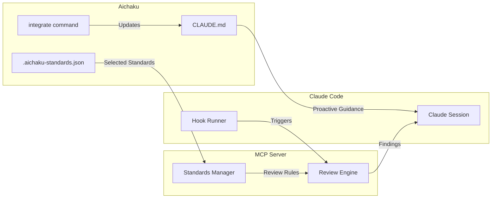

# Aichaku + MCP Code Reviewer Integration

🪴 Aichaku: Seamless Security Review Integration

## Overview

The MCP Code Reviewer integrates with Aichaku to provide automated security and
standards review based on the standards you've selected for your project.

## Integration Points



## Configuration Flow

### 1. Select Standards with Aichaku

```bash
# Choose your standards
aichaku standards --add owasp-web,15-factor,tdd

# View selected standards
aichaku standards --show

# Integrate into CLAUDE.md
aichaku integrate
```

### 2. Methodology Selection (Future Enhancement)

```json
// .claude/.aichaku-standards.json
{
  "version": "1.0.0",
  "selected": ["owasp-web", "15-factor", "tdd"],
  "methodologies": ["shape-up"], // Future: explicit methodology selection
  "customStandards": {}
}
```

### 3. MCP Reads Configuration

```typescript
// MCP automatically loads from project
const config = await loadProjectConfig(".claude/.aichaku-standards.json");

// Maps to concrete review rules
const securityRules = config.selected.map((id) => SECURITY_RULES[id]);
const methodologyRules = detectMethodologyRules(projectPath);

// Combines both types of review
const allRules = [...securityRules, ...methodologyRules];
```

### 4. Automatic Review Activation

```json
// ~/.claude/settings.json
{
  "mcpServers": {
    "mcp-code-reviewer": {
      "command": "npx",
      "args": ["@aichaku/mcp-code-reviewer"],
      "env": {
        "AUTO_REVIEW": "true"
      }
    }
  }
}
```

## Usage Scenarios

### Scenario 1: Automatic Review on Save

```typescript
// You write code
function getUserData(userId: string) {
  return db.query(`SELECT * FROM users WHERE id = ${userId}`);
}

// MCP automatically reviews and warns:
// 🔴 CRITICAL: OWASP-A03 SQL Injection
// Line 2: Use parameterized queries
// Fix: db.query('SELECT * FROM users WHERE id = ?', [userId])
```

### Scenario 2: Methodology Compliance Check

```markdown
// You're working on pitch.md

## Problem

Users can't track their expenses easily.

## Solution

Build a mobile app with AI categorization.

// MCP reviews and suggests: // ⚠️ Shape Up Compliance: WARNINGS // - Missing
appetite definition // - Missing "Rabbit holes" section // - Missing "No-gos"
section
```

### Scenario 3: On-Demand Review

```typescript
// In Claude Code, you can ask:
"Review this file for security issues";

// MCP responds with comprehensive analysis
```

### Scenario 4: Project-Wide Scan

```bash
# Review entire project against selected standards
claude-code> review project

# MCP scans all files and provides summary
```

## Aichaku Command Extensions

### New Hook for MCP Integration

```bash
# Install MCP review hook
aichaku hooks --install mcp-review

# This adds to ~/.claude/settings.json:
{
  "hooks": {
    "PostToolUse": [{
      "name": "Aichaku MCP Review",
      "command": "mcp-review-trigger ${TOOL_INPUT_FILE_PATH}",
      "matcher": "Write|Edit|MultiEdit"
    }]
  }
}
```

### Standards Sync Command

```bash
# Future: Sync standards between Aichaku and MCP
aichaku standards --sync-mcp

# Ensures MCP has latest standard definitions
```

## Review Types

### Security & Standards Reviews

#### OWASP Web Security

When `owasp-web` is selected:

- A01: Broken Access Control checks
- A02: Cryptographic failure detection
- A03: Injection vulnerability scanning
- A04: Insecure design patterns
- ... all Top 10 categories

#### 15-Factor Apps

When `15-factor` is selected:

- Codebase: Single repo checks
- Dependencies: Explicit declaration
- Config: Environment variable usage
- Backing services: Resource binding
- ... all 15 factors

#### Test-Driven Development

When `tdd` is selected:

- Test coverage analysis
- Test-first indicators
- Assertion quality
- Mock usage patterns

### Methodology Reviews

#### Shape Up

Automatically activated when pitch.md or Shape Up patterns detected:

- Appetite boundaries (6-week limit)
- Pitch completeness (all sections present)
- Hill chart progress tracking
- Cool-down period compliance

#### Scrum

Activated for sprint-planning.md or Scrum artifacts:

- Sprint goal clarity
- Story point completeness
- Velocity tracking
- Ceremony compliance

#### General

Always active:

- TODO/FIXME tracking
- Documentation completeness
- Code complexity metrics

## Benefits of Integration

1. **Consistency**: Same standards for generation AND review
2. **Context**: MCP knows your project's specific needs
3. **Efficiency**: No separate configuration needed
4. **Evolution**: Standards evolve with your project

## Implementation in Aichaku

### 1. Add MCP Awareness to Standards Command

```typescript
// src/commands/standards.ts
export async function standards(options: StandardsOptions): Promise<void> {
  // ... existing code ...

  if (options.add || options.remove) {
    // After updating standards
    console.log("\n💡 Next steps:");
    console.log("   • Run 'aichaku integrate' to update CLAUDE.md");

    // NEW: MCP integration hint
    if (await isMCPInstalled()) {
      console.log(
        "   • MCP Code Reviewer will use these standards automatically",
      );
    } else {
      console.log(
        "   • Install MCP Code Reviewer for automated security checks",
      );
      console.log("     npm install -g @aichaku/mcp-code-reviewer");
    }
  }
}
```

### 2. Add MCP Status to Integrate

```typescript
// src/commands/integrate.ts
export async function integrate(
  options: IntegrateOptions,
): Promise<IntegrateResult> {
  // ... existing integration ...

  // NEW: Check MCP status
  const mcpStatus = await checkMCPIntegration();

  if (mcpStatus.installed && selectedStandards.length > 0) {
    console.log("\n🔍 MCP Code Reviewer Status:");
    console.log(
      `   ✅ Installed and will review against ${selectedStandards.length} standards`,
    );
  }
}
```

### 3. Future: MCP Management Commands

```bash
# Check MCP status
aichaku mcp --status

# Install/update MCP
aichaku mcp --install

# Configure MCP settings
aichaku mcp --configure
```

## Security Considerations

1. **Local-Only**: All scanning happens locally
2. **No Code Transmission**: Code never leaves your machine
3. **Sandboxed Execution**: Scanners run in isolation
4. **Resource Limits**: Prevents runaway scans

## Troubleshooting

### MCP Not Detecting Standards

```bash
# Verify standards file exists
ls -la .claude/.aichaku-standards.json

# Check MCP can read it
mcp-code-reviewer validate-config
```

### Reviews Not Triggering

```bash
# Check Claude Code MCP config
claude code config show

# Verify MCP is running
ps aux | grep mcp-code-reviewer
```

### Performance Issues

```bash
# Limit concurrent scanners
export MCP_MAX_SCANNERS=2

# Disable heavy scanners
export MCP_DISABLE_CODEQL=true
```

## Roadmap

1. **Phase 1**: Basic integration (current)
2. **Phase 2**: Bi-directional sync
3. **Phase 3**: Custom rule builder
4. **Phase 4**: AI-powered rule suggestions
5. **Phase 5**: Team standards sharing
