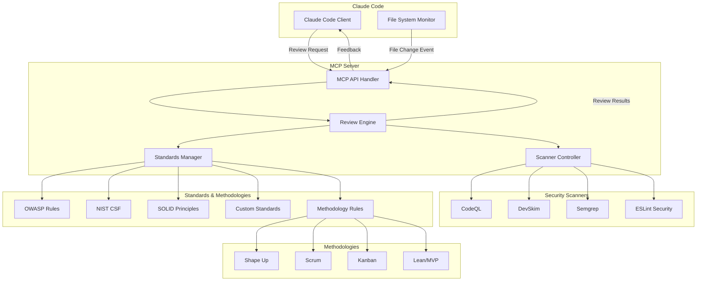
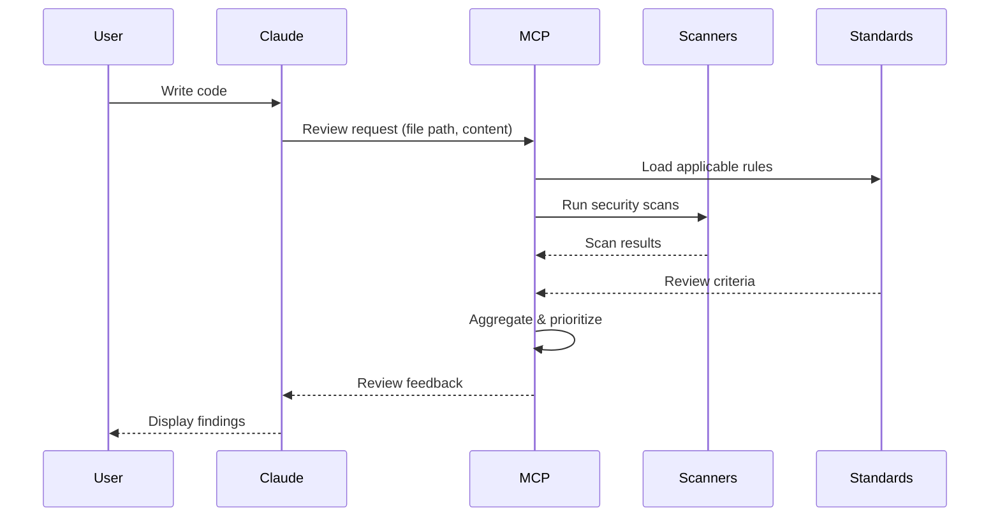

# MCP Code Reviewer Architecture

🪴 Aichaku: Design for Automated Security & Standards Review

## Architecture Overview



## Core Components

### 1. MCP API Handler

- Implements MCP protocol
- Handles review requests
- Manages client connections
- Streams results back to Claude Code

### 2. Review Engine

- Orchestrates review process
- Aggregates results from multiple sources
- Prioritizes findings by severity
- Formats feedback for developers
- **Methodology compliance checking**

### 3. Standards Manager

- Loads selected standards from Aichaku config
- Maps standards to concrete review rules
- Provides context-aware suggestions
- **Loads methodology rules from ~/.claude/methodologies/**

### 4. Scanner Controller

- Abstracts different security scanners
- Runs scanners in parallel
- Normalizes output formats
- Caches results for performance

### 5. Methodology Reviewer

- Checks code against selected methodologies (Shape Up, Scrum, etc.)
- Validates architectural decisions
- Ensures process compliance
- Reviews documentation completeness

## Review Workflow



## Scanner Integration

### CodeQL

- **Purpose**: Deep semantic analysis
- **Strengths**: Complex vulnerability patterns
- **Integration**: Local CodeQL CLI
- **Rules**: OWASP, CWE mappings

### DevSkim

- **Purpose**: Fast pattern matching
- **Strengths**: IDE-speed feedback
- **Integration**: DevSkim CLI or library
- **Rules**: Microsoft security patterns

### Semgrep

- **Purpose**: Custom rule engine
- **Strengths**: Flexible, extensible
- **Integration**: Semgrep CLI
- **Rules**: Community + custom rules

### ESLint Security

- **Purpose**: JavaScript/TypeScript specific
- **Strengths**: AST-based analysis
- **Integration**: ESLint API
- **Rules**: Security plugins

## Methodology Implementation

### Shape Up Compliance

```typescript
interface ShapeUpRule {
  id: string;           // e.g., "appetite-check"
  name: string;         // e.g., "6-week appetite limit"
  check: (project: ProjectContext) => Finding[];
  guidance: string;     // How to fix
}

// Example checks:
- Appetite boundaries (no scope creep)
- Pitch document completeness
- Hill chart progress
- Cool-down period compliance
```

### Scrum Compliance

```typescript
interface ScrumRule {
  id: string;           // e.g., "sprint-velocity"
  name: string;         // e.g., "Velocity tracking"
  check: (sprint: SprintContext) => Finding[];
  ceremony: string;     // Which ceremony addresses this
}

// Example checks:
- Sprint goal clarity
- Story point estimation
- Daily standup patterns
- Retrospective action items
```

## Standards Implementation

### OWASP Top 10 Mapping

```typescript
interface OWASPRule {
  id: string; // e.g., "A01-2021"
  name: string; // e.g., "Broken Access Control"
  scanners: Scanner[]; // Which scanners detect this
  patterns: Pattern[]; // What to look for
  remediation: string; // How to fix
}
```

### Custom Standards

```typescript
interface CustomStandard {
  id: string; // e.g., "15-factor"
  rules: Rule[]; // Concrete checks
  severity: Severity; // Priority level
  autoFix?: boolean; // Can suggest fixes
}
```

## Performance Considerations

1. **Incremental Analysis**: Only scan changed files
2. **Caching**: Store results for unchanged code
3. **Parallel Execution**: Run scanners concurrently
4. **Streaming Results**: Return findings as discovered
5. **Local-First**: No network calls for basic scans

## Security Model

1. **Sandboxed Execution**: Scanners run in isolated environments
2. **No Code Execution**: Static analysis only
3. **Path Validation**: Prevent directory traversal
4. **Resource Limits**: CPU/memory caps for scans
5. **Audit Logging**: Track all review requests

## Configuration

### Project Configuration (.claude/.aichaku-standards.json)

```json
{
  "version": "1.0.0",
  "selected": ["owasp-web", "15-factor", "tdd"],
  "methodologies": ["shape-up"],
  "customStandards": {}
}
```

### MCP Configuration (~/.config/mcp-code-reviewer.json)

```json
{
  "mcp-code-reviewer": {
    "scanners": {
      "codeql": {
        "enabled": true,
        "path": "/usr/local/bin/codeql",
        "timeout": 30000
      },
      "devskim": {
        "enabled": true,
        "rules": ["default", "custom"]
      }
    },
    "methodologies": {
      "source": "~/.claude/methodologies/",
      "defaults": ["general"]
    },
    "standards": {
      "source": ".claude/.aichaku-standards.json",
      "strict": true
    },
    "review": {
      "automatic": true,
      "threshold": "medium",
      "format": "inline",
      "includeMethodologyChecks": true
    }
  }
}
```

## Advanced Features

### Automated Fix Generation (On-Demand)

```typescript
interface AutoFix {
  finding: Finding;
  canAutoFix: boolean;
  generateFix(): string;
  applyFix(file: string): Promise<void>;
}

// Example: Command injection fix
class CommandInjectionFix implements AutoFix {
  canAutoFix = true;

  generateFix(): string {
    // Transform: bash -c "echo $VAR"
    // To: bash -c 'echo "$1"' -- "$VAR"
    return this.transformToParameterExpansion(this.finding.code);
  }
}
```

### Pull Request Creation (Manual Command Only)

```typescript
// IMPORTANT: PR creation is NEVER automatic - only via explicit command
// User must run: "Create a PR to fix the security issues"

class PRCreator {
  async createFixPR(findings: Finding[], options: PROptions): Promise<PRInfo> {
    // Require explicit confirmation
    if (!options.confirmed) {
      throw new Error("PR creation requires explicit confirmation");
    }
    const branch = `mcp-security-fixes-${Date.now()}`;

    // Create branch
    await this.git("checkout", "-b", branch);

    // Apply auto-fixes
    const fixes = await this.applyAutoFixes(findings);

    // Commit
    await this.git("add", "-A");
    await this.git("commit", "-m", this.generateCommitMessage(fixes));

    // Push and create PR
    await this.git("push", "-u", "origin", branch);
    const pr = await this.createPR({
      title: "Security fixes from MCP review",
      body: this.generatePRBody(fixes),
      branch,
    });

    return pr;
  }
}
```

## Deployment Architecture

### Local Deployment (Required for Privacy)

- **🔒 PRIVACY GUARANTEE**: Your code NEVER leaves your machine
- **Performance**: No network latency, instant feedback
- **Security**: No API keys, no cloud storage, no data transmission
- **Tools**: Direct access to local scanners
- **Cost**: Completely free for users
- **Control**: You own your data and review process

### Compilation Strategy

```bash
# Multi-platform compilation
deno compile \
  --allow-read \
  --allow-write \
  --allow-run \
  --allow-env \
  --output mcp-code-reviewer \
  src/server.ts
```

## Educational Feedback System

The MCP provides guidance to help Claude adjust behavior within sessions:

```typescript
interface ClaudeGuidance {
  reminder: string; // What CLAUDE.md/standards require
  pattern: string; // What Claude did wrong
  correction: string; // How to fix it
  example: string; // Correct approach
  reinforcement: string; // What Claude should remember
}
```

### Advanced Prompting Techniques

The MCP uses proven LLM prompting strategies:

1. **Multi-Shot Examples**: Shows bad vs good code side-by-side
2. **Context Setting**: Explains WHY rules exist, not just violations
3. **Decomposition**: Breaks fixes into manageable subtasks
4. **Sequencing**: Guides proper order for complex fixes
5. **Self-Reflection**: Prompts with questions to build awareness
6. **Step-by-Step**: Guides through the thinking process

### Example Enhanced Feedback

```
🌱 Learning Opportunity - Let's fix this properly:

📖 Context: TypeScript's type system prevents runtime errors. Using 'any'
disables this protection and makes code harder to maintain.

⚠️ Issue: Using 'any' instead of proper TypeScript types
Reminder: Your CLAUDE.md explicitly states to avoid 'any' types, but you used it 5 times.

❌ Bad Example:
const data: any = response

✅ Good Example:
interface UserData { id: string; name: string; }
const user: UserData = await getUser(id);

🔄 Step-by-Step Fix:
1. Look at how the variable is used
2. Create an interface with those properties
3. Replace 'any' with your interface
4. Fix any resulting type errors

🤔 Reflection: What made me reach for 'any' instead of defining a proper type?

📌 Note to self: I should follow the TypeScript standards in CLAUDE.md.
```

This comprehensive approach transforms the MCP from a critic into an effective teacher, dramatically improving Claude's
code quality within the session.

## Next Steps

1. Implement MCP server skeleton
2. Create scanner abstraction layer
3. Build standards rule engine
4. Integrate with Aichaku standards
5. Add hook-based automation
6. Implement PR creation features
7. Compile for distribution
8. Add educational feedback system
