# Status: Claude Home Path Analysis

## Project Overview

Analyzing all references to .claude and HOME directories in the Aichaku codebase
to understand the scope of changes needed if we move everything under
.claude/aichaku.

## Status

🌿 **Active** - Analysis complete

```mermaid
graph LR
    A[🌱 Started] --> B[🌿 Active]
    B --> C[🌳 Review]
    C --> D[🍃 Complete]
    style B fill:#90EE90
```

## Progress

- ✅ Searched for all .claude path references
- ✅ Searched for all HOME/USERPROFILE references
- ✅ Identified 12 key files with path references
- ✅ Created comprehensive analysis document
- ✅ Listed all paths that would need changing
- ✅ Identified migration considerations

## Key Findings

### Current Structure

- Global: `~/.claude/` contains methodologies, standards, user, output
- Project: `./.claude/` contains project-specific configurations

### Files Requiring Changes

1. **Core installation**: installer.ts, init.ts
2. **Commands**: init.ts, integrate.ts, standards.ts, mcp.ts, hooks.ts
3. **MCP Server**: standards-manager.ts, methodology-manager.ts, server.ts
4. **Documentation**: CLAUDE.md, README.md
5. **Tests**: Any test files with path assertions

### Path Changes Needed

- Global: `~/.claude/` → `~/.claude/aichaku/`
- All subdirectories would move accordingly
- Project paths would follow the same pattern

## Next Steps

- Decision needed on whether to proceed with the path change
- If proceeding, create migration plan and implementation strategy
