# 🪴 Aichaku MCP Visibility Enhancements

**Status**: 🌿 Active\
**Created**: 2025-07-10\
**Type**: Feature Enhancement

## Overview

Enhanced the Aichaku MCP (Model Context Protocol) server to provide better visibility when being used by Claude Code and
added document linting capabilities.

## Progress

```mermaid
graph LR
    A[🌱 Started] --> B[🌿 Active]
    B --> C[🌳 Review]
    C --> D[🍃 Complete]
    style B fill:#90EE90
```



## Completed Tasks

### 1. ✅ Enhanced MCP Visibility

Added console logging to stderr for visibility in Claude Code console:

- **Tool Invocation Logging**: Every MCP tool call now logs to console
- **File Review Logging**: Shows which file is being reviewed and what standards are being used
- **Startup Messages**: Clear indication when MCP server starts
- **Document Type Detection**: Identifies document types (Tutorial, How-to, Reference, Explanation)

Example output:

```
🪴 [Aichaku MCP] Code Reviewer Server v0.1.0 started
🪴 [Aichaku MCP] Ready to review code and documentation
🪴 [Aichaku MCP] Available tools: review*file, review*methodology, get_standards
🪴 [Aichaku MCP] Tool invoked: review_file
🪴 [Aichaku MCP] Reviewing file: /path/to/document.md
🪴 [Aichaku MCP] Using standards: diataxis, google-style
🪴 [Aichaku MCP] Review complete: 5 findings
```

### 2. ✅ Added Document Linting Capabilities

Created comprehensive documentation patterns for the MCP to lint Markdown files:

#### Diátaxis Patterns

- Tutorial structure validation
- Prerequisites section checking
- How-to guide structure validation
- Document type detection

#### Google Style Guide Patterns

- Sentence length checking (< 25 words)
- Present tense enforcement
- Second person (you) usage
- Active voice preference

#### General Documentation Quality

- Broken link detection
- Code block language specification
- Header level consistency
- Trailing whitespace removal
- Multiple blank line detection

### 3. ✅ Improved Review Output

- Differentiates between "Code Review" and "Documentation Review"
- Shows document type for Markdown files
- Provides specific guidance for documentation issues

## File Changes

1. **`/mcp-server/src/server.ts`**
   - Added console.error logging for visibility
   - Enhanced formatReviewResult for documentation
   - Added detectDocumentType method

2. **`/mcp-server/src/patterns/documentation-patterns.ts`** (NEW)
   - Complete documentation linting patterns
   - Diátaxis framework compliance
   - Google style guide enforcement

3. **`/mcp-server/src/review-engine.ts`**
   - Added documentation pattern support
   - Enhanced pattern checking for checkFn
   - File type detection for patterns

4. **`/mcp-server/src/types.ts`**
   - Updated SecurityPattern interface
   - Added documentation category
   - Added checkFn support

5. **Pattern Files Updated**
   - Fixed security-patterns.ts to match new interface
   - Fixed TypeScript-patterns.ts to match new interface

## Technical Details

### Visibility Implementation

- Uses `console.error()` to write to stderr (visible in Claude Code)
- Prefixes all messages with `🪴 [Aichaku MCP]`
- Logs at key points: startup, tool invocation, review start/end

### Document Linting

- Patterns use regex and custom check functions
- Line-specific error reporting
- Actionable fix suggestions
- Framework-specific patterns (diataxis, google-style)

## Usage

After installing the updated MCP server:

1. **Installation**: `aichaku mcp --install`
2. **Configuration**: `aichaku mcp --config`
3. **Restart Claude Code**

The MCP will now:

- Show clear activity in the console
- Lint documentation files automatically
- Provide specific guidance for doc improvements

## Benefits

1. **Transparency**: Users can see when MCP is actively reviewing files
2. **Documentation Quality**: Enforces documentation standards automatically
3. **Consistency**: Same standards applied to both code and docs
4. **Educational**: Provides specific guidance for improvements

## Next Steps

- Monitor user feedback on visibility
- Add more documentation standards (Microsoft Style, Write the Docs)
- Consider adding formatting auto-fix capabilities
- Integrate with `deno fmt` for Markdown formatting
