# Shape Up Pitch: Permanent Reference Documents System

**Problem**: Aichaku creates project-specific documentation but lacks permanent
reference documents that persist across projects and serve as authoritative
system knowledge.

**Appetite**: 6 weeks

**Solution**: Implement a `/references` folder system with Arc42-based
architecture, comprehensive Mermaid diagrams, and methodology-aware document
creation.

## Problem

Currently, Aichaku excels at creating project-specific documentation in
`.claude/output/active-*` folders, but teams struggle with:

- **Knowledge Fragmentation**: System architecture knowledge scattered across
  individual projects
- **API Documentation Gaps**: No central location for API specifications that
  multiple projects reference
- **Security Policy Confusion**: Security documentation recreated per project
  instead of system-wide policies
- **Diagram Inconsistency**: No standardized approach to technical diagrams
  across projects
- **Institutional Memory Loss**: Critical architecture decisions not captured in
  permanent form

### Current State vs. Desired State

```mermaid
graph LR
    subgraph "Current State"
        A[Project 1] --> B[Local Docs]
        C[Project 2] --> D[Local Docs]
        E[Project 3] --> F[Local Docs]
    end
    
    subgraph "Desired State"
        G[Project 1] --> H[Local Docs]
        I[Project 2] --> J[Local Docs]
        K[Project 3] --> L[Local Docs]
        H --> M[/references]
        J --> M
        L --> M
        M --> N[System Architecture]
        M --> O[API Specs]
        M --> P[Security Policies]
        M --> Q[Integration Docs]
    end
```

## Appetite

**6 weeks** - This is a significant architectural enhancement that adds
permanent knowledge management to Aichaku's methodology support.

## Solution

### Core Architecture

Implement a standardized `/references` folder structure with methodology-aware
document creation:

```
/
├── SECURITY.md                    # GitHub-discoverable summary
├── CONTRIBUTING.md                # Brief contributing guide  
├── SUPPORT.md                     # Support information
├── CODE_OF_CONDUCT.md             # Code of conduct
└── /references/
    ├── architecture/              # Arc42-based system architecture
    │   ├── 01-introduction.md
    │   ├── 02-constraints.md
    │   ├── 03-context-scope.md
    │   ├── 04-solution-strategy.md
    │   ├── 05-building-blocks.md
    │   ├── 06-runtime-view.md
    │   ├── 07-deployment-view.md
    │   ├── 08-concepts.md
    │   ├── 09-decisions.md
    │   ├── 10-quality-requirements.md
    │   ├── 11-risks-debt.md
    │   ├── 12-glossary.md
    │   └── diagrams/
    ├── api/                       # OpenAPI/AsyncAPI specifications
    │   ├── rest-api.yaml
    │   ├── events.yaml
    │   ├── cli-commands.md
    │   └── examples/
    ├── data/                      # Data models and schemas
    │   ├── entity-models.md
    │   ├── database-schema.md
    │   ├── data-dictionary.md
    │   └── diagrams/
    ├── security/                  # NIST-CSF aligned security docs
    │   ├── comprehensive-security-policy.md
    │   ├── threat-model.md
    │   ├── compliance-framework.md
    │   ├── incident-response.md
    │   └── compliance/
    ├── operations/                # DevOps and deployment
    │   ├── deployment-guide.md
    │   ├── runbooks.md
    │   ├── monitoring-guide.md
    │   ├── contributing-detailed.md
    │   ├── support-guide.md
    │   └── monitoring/
    ├── integration/               # External system interfaces
    │   ├── protocols.md
    │   ├── third-party.md
    │   ├── webhooks.md
    │   └── specifications/
    ├── protocols/                 # Custom formats and protocols
    │   ├── file-formats.md
    │   ├── communication-protocols.md
    │   └── message-schemas.md
    └── decisions/                 # Architecture Decision Records
        ├── adr-template.md
        └── decisions/
            ├── 0001-choose-database.md
            ├── 0002-api-versioning.md
            └── 0003-authentication.md
```

### Standards Integration

#### Primary: Arc42 Architecture Documentation

- **Lightweight**: Tool-agnostic, works with any format
- **Comprehensive**: 12 structured sections covering all aspects
- **Flexible**: Sections can be omitted if not needed
- **Agile-friendly**: Supports iterative development

#### Secondary: C4 Model for Visual Communication

```mermaid
graph TB
    subgraph "C4 Model Hierarchy"
        A["🌍 System Context<br/>Who uses it?"] --> B["📦 Container<br/>What does it do?"]
        B --> C["🔧 Component<br/>How does it work?"]
        C --> D["💾 Code<br/>How is it implemented?"]
    end
```



#### Supplementary: OpenAPI for API Contracts

```yaml
openapi: 3.0.0
info:
  title: Aichaku API
  version: 1.0.0
paths:
  /methodologies:
    get:
      summary: List available methodologies
      responses:
        "200":
          description: List of methodologies
```

### Mermaid Diagram Patterns

Every document type includes comprehensive diagrams:

#### Architecture Diagrams

```mermaid
graph TB
    subgraph "System Context"
        User[👤 User]
        System[📦 Aichaku System]
        Claude[🤖 Claude Code]
        Git[📁 Git Repository]
    end
    
    User --> System
    System --> Claude
    System --> Git
```



#### API Flow Diagrams


#### Data Model Diagrams


### GitHub Integration Strategy

#### Root-Level Pointer Documents

GitHub automatically discovers certain files in the root directory and displays
them as tabs. The system will generate both:

1. **Root-level summaries** for GitHub discoverability
2. **Comprehensive documents** in `/references` for detailed information

```markdown
# Root-level SECURITY.md example

# Security Policy

<!-- Generated by Aichaku methodology library - https://github.com/RickCogley/aichaku -->

## Quick Reference

- **Report vulnerabilities**: security@project.com
- **Supported versions**: See
  [references/security/supported-versions.md](references/security/supported-versions.md)
- **Response time**: 48 hours for acknowledgment

## Comprehensive Security Documentation

For detailed security information, see:

- 🛡️
  **[Complete Security Policy](references/security/comprehensive-security-policy.md)**
- 🔍 **[Threat Model](references/security/threat-model.md)**
- 📋 **[Compliance Framework](references/security/compliance-framework.md)**
- 🚨 **[Incident Response](references/security/incident-response.md)**

---

_This document was auto-generated by
[Aichaku](https://github.com/RickCogley/aichaku) and points to comprehensive
documentation in the `/references` folder._
```

#### Auto-Generated Pointer System

- **SECURITY.md** → `references/security/comprehensive-security-policy.md`
- **CONTRIBUTING.md** → `references/operations/contributing-detailed.md`
- **SUPPORT.md** → `references/operations/support-guide.md`
- **CODE_OF_CONDUCT.md** → `references/operations/code-of-conduct.md`

#### Backup and Safety Mechanism

When generating root-level pointer documents, Aichaku will:

1. **Check for existing files**: Before creating any root-level document
2. **Create timestamped backups**: Move existing files to
   `.aichaku/backups/YYYY-MM-DD-HH-MM-SS/`
3. **Log backup actions**: Record what was backed up and where
4. **Generate new pointers**: Create Aichaku-branded pointer documents
5. **Provide restoration guide**: Instructions for restoring original files if
   needed

```bash
# Example backup structure
.aichaku/
└── backups/
    └── 2025-07-10-14-30-22/
        ├── SECURITY.md.backup
        ├── CONTRIBUTING.md.backup
        ├── backup-manifest.json
        └── restore-instructions.md
```

#### Branding and Attribution

Generated root-level documents include:

- **HTML comment**: `<!-- Generated by Aichaku methodology library -->`
- **Footer attribution**: Tasteful link to Aichaku project
- **Purpose explanation**: Clear explanation of the pointer system
- **Regeneration notice**: Instructions for updating the pointer files

### Implementation Strategy

#### Phase 1: Foundation (Weeks 1-2)

- Create `/references` folder structure
- Implement Arc42 templates with Mermaid diagrams
- Add methodology detection for reference document creation
- **Create GitHub-discoverable pointer system with backup mechanism**
- **Implement timestamped backup system for existing files**
- Basic MCP integration for compliance checking

#### Phase 2: Standards Integration (Weeks 3-4)

- OpenAPI/AsyncAPI template support
- NIST-CSF security document templates
- C4 Model diagram generation
- ADR (Architecture Decision Record) system
- **Auto-generate branded root-level pointer documents**
- **Implement Aichaku attribution and branding system**

#### Phase 3: Automation & Polish (Weeks 5-6)

- Automated diagram generation from code
- CI/CD validation scripts
- Cross-referencing system between documents
- **Link validation for root → references pointers**
- **Backup system testing and restoration procedures**
- Comprehensive documentation and examples

### User Experience Flow

```mermaid
flowchart TD
    A[User: "Let's document the architecture"] --> B{🪴 Aichaku: Detect Intent}
    B --> C[Create /references/architecture/]
    C --> D[Generate Arc42 templates]
    D --> E[Include Mermaid diagrams]
    E --> F[Link to existing projects]
    F --> G[✅ Ready for editing]
    
    H[User: "We need API specs"] --> I{🪴 Aichaku: Detect Intent}
    I --> J[Create /references/api/]
    J --> K[Generate OpenAPI template]
    K --> L[Include sequence diagrams]
    L --> M[✅ Ready for specification]
    
    N[Complete ANY Methodology] --> O{🪴 Aichaku: Extract Learnings}
    O --> P[Analyze Permanent Impact]
    P --> Q[Suggest Updates]
    Q --> R[User Review & Apply]
    R --> S[Update Permanent Docs]
```

## Rabbit Holes

**Circuit Breakers - Things we won't do:**

1. **No Custom Format Invention** - Use established standards only (Arc42,
   OpenAPI, etc.)
2. **No Complex Tooling** - Maximum complexity is Markdown + Mermaid
3. **No Automatic Everything** - Manual control for sensitive architecture
   decisions
4. **No Migration Tools** - Start with new projects only initially
5. **No Complex Backup Systems** - Simple timestamped copies only, no versioning
6. **No Intrusive Branding** - Subtle attribution only, no marketing language

## No-Goes

**Things we explicitly won't support:**

- Complex XML-based formats (avoiding DITA complexity)
- Proprietary documentation tools
- Automatic code generation from documentation
- Real-time collaborative editing features
- Migration from existing documentation systems

## Success Metrics

- **Speed**: Teams can create comprehensive reference docs in <30 minutes
- **Quality**: 90%+ of generated Mermaid diagrams are publication-ready
- **Compliance**: All reference docs pass MCP compliance checks
- **Integration**: Cross-project references work seamlessly
- **Adoption**: Teams use references folder within first week
- **Safety**: 100% of existing files are backed up before replacement
- **Branding**: Clear Aichaku attribution in all generated documents without
  being intrusive

## Technical Implementation

### Aichaku Integration Points

1. **Methodology Detection**: Extend existing keyword detection to recognize
   reference document requests
2. **Template System**: Add reference document templates to methodology files
3. **MCP Integration**: Extend review capabilities to validate reference
   document compliance
4. **Cross-Project Linking**: Enable references to be shared across multiple
   projects
5. **GitHub Integration**: Auto-generate root-level pointer documents for GitHub
   discoverability
6. **Link Validation**: Ensure root-level pointers stay synchronized with
   comprehensive references
7. **Methodology-Agnostic Updates**: Extract learnings from ANY methodology
   (Shape Up, Scrum, Kanban, Lean) to update permanent docs
8. **Code Analysis Integration**: Bootstrap permanent docs from existing
   codebases during installation

### Example Implementation

```typescript
// Extended methodology detection
const referenceKeywords = {
  architecture: ["architecture", "system design", "arc42"],
  api: ["api spec", "openapi", "rest api", "graphql"],
  security: ["threat model", "security policy", "nist"],
  data: ["data model", "database schema", "erd"],
  operations: ["deployment", "runbook", "devops"],
  integration: ["integration", "webhook", "third party"],
  protocols: ["protocol", "file format", "message schema"],
  decisions: ["adr", "architecture decision", "technical decision"],
};

// Template generation with GitHub integration
async function generateReferenceDocument(type: string, projectPath: string) {
  const referencePath = path.join(projectPath, "references", type);
  await ensureDir(referencePath);

  // Generate comprehensive reference document
  const template = await loadTemplate(`reference-${type}`);
  const content = await renderTemplate(template, {
    projectName: path.basename(projectPath),
    timestamp: new Date().toISOString(),
    methodology: await detectMethodology(projectPath),
  });

  await writeFile(path.join(referencePath, "index.md"), content);

  // Auto-generate GitHub-discoverable pointer document
  if (type === "security") {
    await generateGitHubPointer(
      projectPath,
      "SECURITY.md",
      "references/security/comprehensive-security-policy.md",
    );
  } else if (type === "operations") {
    await generateGitHubPointer(
      projectPath,
      "CONTRIBUTING.md",
      "references/operations/contributing-detailed.md",
    );
    await generateGitHubPointer(
      projectPath,
      "SUPPORT.md",
      "references/operations/support-guide.md",
    );
  }
}

// Generate GitHub-discoverable pointer documents with backup
async function generateGitHubPointer(
  projectPath: string,
  rootFile: string,
  referencePath: string,
) {
  const rootFilePath = path.join(projectPath, rootFile);

  // Check if file exists and create backup
  if (await fileExists(rootFilePath)) {
    await createBackup(projectPath, rootFile);
  }

  const pointerTemplate = await loadTemplate(
    `github-pointer-${rootFile.toLowerCase()}`,
  );
  const content = await renderTemplate(pointerTemplate, {
    projectName: path.basename(projectPath),
    referencePath,
    generatedBy: "Aichaku methodology library",
    generatedAt: new Date().toISOString(),
    aichakuUrl: "https://github.com/RickCogley/aichaku",
  });

  await writeFile(rootFilePath, content);
  console.log(`✅ Generated ${rootFile} (original backed up if existed)`);
}

// Create timestamped backup of existing files
async function createBackup(projectPath: string, fileName: string) {
  const timestamp = new Date().toISOString().replace(/[:.]/g, "-").slice(0, 19);
  const backupDir = path.join(projectPath, ".aichaku", "backups", timestamp);
  await ensureDir(backupDir);

  const originalFile = path.join(projectPath, fileName);
  const backupFile = path.join(backupDir, `${fileName}.backup`);

  await copyFile(originalFile, backupFile);

  // Create backup manifest
  const manifest = {
    timestamp,
    backedUpFiles: [fileName],
    reason: "Aichaku reference document generation",
    restoreInstructions: `To restore: cp ${backupFile} ${originalFile}`,
  };

  await writeFile(
    path.join(backupDir, "backup-manifest.json"),
    JSON.stringify(manifest, null, 2),
  );

  console.log(`📦 Backed up existing ${fileName} to ${backupDir}`);
}
```

## Cool-down Activities

After the 6-week implementation:

1. **Team Training**: Create training materials for using the reference system
2. **Documentation Review**: Comprehensive review of all generated templates
3. **Performance Analysis**: Measure adoption rates and usage patterns
4. **Feedback Integration**: Collect user feedback and plan iterative
   improvements
5. **Standards Update**: Update any methodology guides based on learnings
6. **Backup System Review**: Validate backup and restoration procedures work
   correctly
7. **Branding Assessment**: Evaluate user reception of Aichaku attribution and
   branding

This feature transforms Aichaku from a project-specific tool into a
comprehensive knowledge management system that maintains institutional memory
across all development work.
