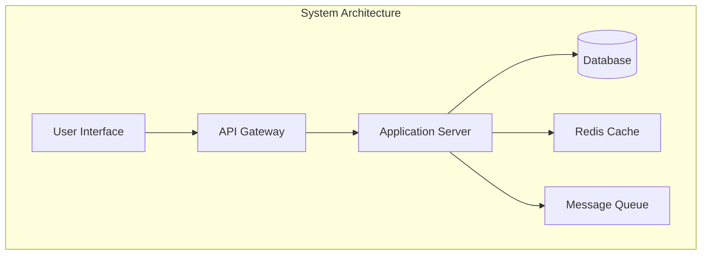
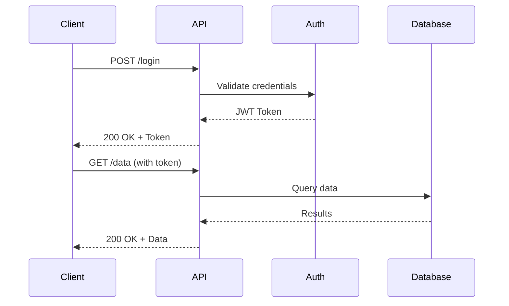
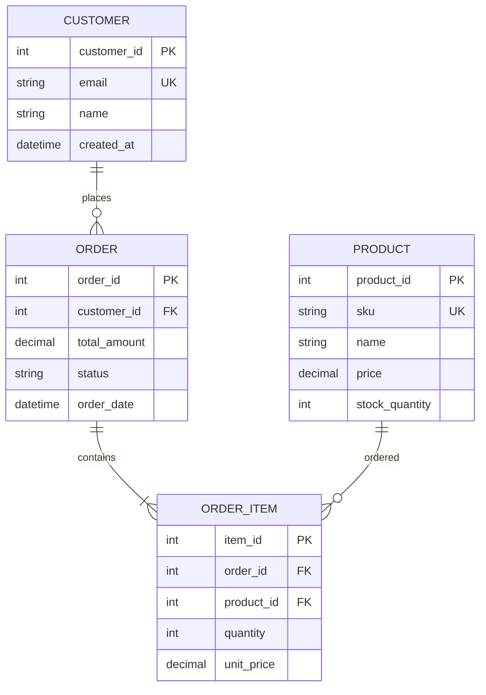
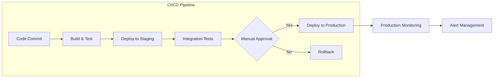
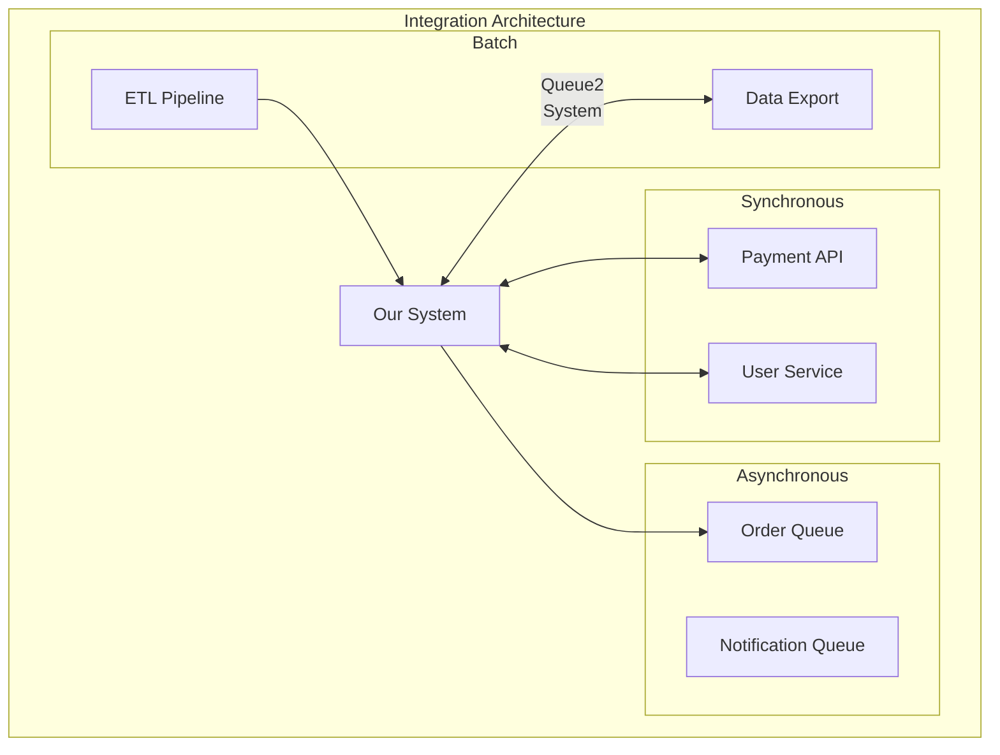
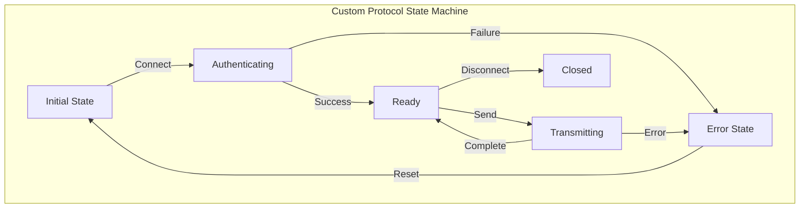
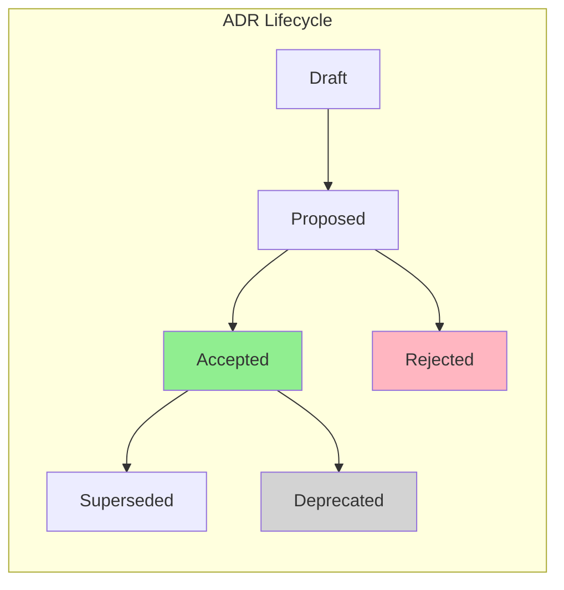

# Software Project Reference Documentation Analysis

This document categorizes and analyzes the essential types of permanent reference documents that software projects
typically need, based on industry best practices and examples from well-documented projects.

## 1. Architecture Documents

### Purpose

Capture high-level system design, component relationships, and architectural decisions.

### Common Formats and Structures

- **System Overview**: High-level description of the system's purpose and goals
- **Component Architecture**: Detailed breakdown of system components and their relationships
- **Physical Architecture**: Infrastructure, deployment topology, hardware requirements
- **Process Architecture**: Background processes, service interactions, lifecycle management
- **Data Flow Diagrams**: How information moves through the system
- **Technology Stack**: Languages, frameworks, databases, and tools used

### Essential Sections

1. **Executive Summary**: Non-technical overview for stakeholders
2. **System Context**: External interfaces and boundaries
3. **Architectural Patterns**: MVC, microservices, event-driven, etc.
4. **Component Descriptions**: Detailed explanation of each major component
5. **Integration Points**: How components communicate
6. **Scalability Considerations**: How the system handles growth
7. **Security Architecture**: Security controls and boundaries

### Mermaid Diagram Opportunities



### Update Frequency

- Major updates: When architecture changes significantly
- Minor updates: Quarterly or with each major release
- Review cycle: Annual architecture review

### Cross-References

- Links to ADRs for specific architectural decisions
- References to deployment guides for implementation details
- Connection to API documentation for interface specifications

## 2. API References

### Purpose

Document all programmatic interfaces for internal and external consumers.

### Common Formats and Structures

#### REST API Documentation

- **OpenAPI/Swagger Specification**: Machine-readable API definition
- **Endpoint Catalog**: Complete list of available endpoints
- **Request/Response Examples**: Real-world usage examples
- **Authentication Methods**: OAuth, API keys, JWT tokens
- **Rate Limiting**: Quotas and throttling policies
- **Error Codes**: Comprehensive error reference

#### GraphQL Documentation

- **Schema Definition**: Complete type system
- **Query/Mutation Examples**: Common operations
- **Subscription Patterns**: Real-time data access
- **Field Descriptions**: Detailed field documentation
- **Deprecation Strategy**: How fields are phased out

#### CLI Documentation

- **Command Reference**: All available commands and subcommands
- **Option Flags**: Detailed flag descriptions and defaults
- **Configuration Files**: Format and location
- **Exit Codes**: Meaning of different return values
- **Shell Completion**: Installation instructions

### Essential Sections

1. **Quick Start Guide**: Get running in 5 minutes
2. **Authentication & Authorization**: How to access the API
3. **Common Use Cases**: Solve real problems
4. **SDKs and Client Libraries**: Language-specific implementations
5. **Versioning Policy**: How versions are managed
6. **Migration Guides**: Moving between versions
7. **Sandbox/Testing Environment**: Safe experimentation

### Mermaid Diagram Opportunities



### Update Frequency

- Real-time: Generated from code annotations
- Version releases: With each API version
- Breaking changes: Advance notice period

### Cross-References

- Architecture documents for system context
- Security documentation for auth details
- Data models for payload structures

## 3. Data Models and Schemas

### Purpose

Define the structure, relationships, and constraints of data within the system.

### Common Formats and Structures

- **Entity-Relationship Diagrams (ERDs)**: Visual representation of data relationships
- **Data Dictionary**: Comprehensive field-level documentation
- **Schema Definitions**: DDL scripts, migrations, constraints
- **Data Flow Documentation**: How data moves and transforms
- **Business Logic Rules**: Validation and processing rules
- **Data Lifecycle**: Creation, retention, archival, deletion policies

### Essential Sections

1. **Conceptual Model**: High-level business entities
2. **Logical Model**: Normalized relationships
3. **Physical Model**: Actual implementation details
4. **Field Specifications**: Type, size, constraints, defaults
5. **Indexing Strategy**: Performance optimization
6. **Partitioning Scheme**: Data distribution
7. **Backup and Recovery**: Data protection strategies

### Mermaid Diagram Opportunities



### Update Frequency

- Schema changes: With each migration
- Documentation: Within same sprint as changes
- Full review: Quarterly data model review

### Cross-References

- API documentation for data transfer objects
- Security docs for data classification
- Architecture for data layer design

## 4. Security Documentation

### Purpose

Document security controls, threat models, and compliance requirements.

### Common Formats and Structures

#### Threat Models

- **STRIDE Analysis**: Spoofing, Tampering, Repudiation, Information Disclosure, DoS, Elevation of Privilege
- **Attack Surface Documentation**: Entry points and vulnerabilities
- **Risk Assessment Matrix**: Likelihood vs. impact analysis
- **Mitigation Strategies**: Controls for identified threats

#### Security Policies

- **Access Control Policies**: RBAC, ABAC definitions
- **Data Classification**: Public, internal, confidential, restricted
- **Encryption Standards**: At-rest and in-transit requirements
- **Key Management**: Rotation, storage, access procedures
- **Incident Response Plan**: Escalation and remediation procedures

#### Compliance Documentation

- **Regulatory Mapping**: GDPR, CCPA, HIPAA, PCI-DSS
- **Audit Trails**: What, when, who, where logging
- **Security Controls**: NIST CSF, ISO 27001 implementation
- **Vulnerability Management**: Scanning, patching, disclosure

### Essential Sections

1. **Security Architecture Overview**: Zones, boundaries, controls
2. **Authentication & Authorization**: Identity management approach
3. **Data Protection**: Encryption, masking, anonymization
4. **Network Security**: Firewalls, segmentation, monitoring
5. **Application Security**: Input validation, output encoding
6. **Security Testing**: SAST, DAST, penetration testing
7. **Incident Response**: Detection, containment, recovery

### Mermaid Diagram Opportunities

```mermaid
graph TB
    subgraph "Security Zones"
        subgraph "DMZ"
            WAF[Web Application Firewall]
            LB[Load Balancer]
        end

        subgraph "Application Zone"
            APP[Application Servers]
            API[API Services]
        end

        subgraph "Data Zone"
            DB[(Encrypted Database)]
            FS[Secure File Storage]
        end
    end

    Internet --> WAF
    WAF --> LB
    LB --> APP
    APP --> API
    API --> DB
    API --> FS

    style DMZ fill:#ffcccc
    style "Application Zone" fill:#ffffcc
    style "Data Zone" fill:#ccffcc
```

### Update Frequency

- Threat models: Annual review + major changes
- Security policies: Quarterly review
- Incident response: After each incident
- Compliance: Per regulatory requirements

### Cross-References

- Architecture for security boundaries
- Operations guides for security procedures
- ADRs for security decisions

## 5. Deployment and Operations Guides

### Purpose

Enable reliable deployment, operation, and maintenance of the system.

### Common Formats and Structures

#### Deployment Documentation

- **Infrastructure as Code**: Terraform, CloudFormation templates
- **Container Orchestration**: Kubernetes manifests, Helm charts
- **CI/CD Pipelines**: Build, test, deploy automation
- **Environment Configuration**: Dev, staging, production settings
- **Rollback Procedures**: Recovery from failed deployments

#### Operations Runbooks

- **System Startup/Shutdown**: Proper sequence and checks
- **Monitoring Setup**: Metrics, alerts, dashboards
- **Log Management**: Collection, retention, analysis
- **Backup Procedures**: Schedules, verification, restoration
- **Disaster Recovery**: RTO/RPO targets, procedures

#### Troubleshooting Guides

- **Common Issues**: Symptoms, causes, solutions
- **Diagnostic Tools**: Commands, scripts, queries
- **Performance Tuning**: Optimization techniques
- **Emergency Contacts**: Escalation matrix
- **Post-Mortem Templates**: Learning from incidents

### Essential Sections

1. **Prerequisites**: Required tools, access, knowledge
2. **Step-by-Step Procedures**: Clear, numbered instructions
3. **Verification Steps**: How to confirm success
4. **Rollback Procedures**: Undo changes safely
5. **Automation Scripts**: Reduce manual work
6. **Monitoring Integration**: What to watch
7. **Security Considerations**: Safe operational practices

### Mermaid Diagram Opportunities



### Update Frequency

- Runbooks: After each operational change
- Deployment guides: With infrastructure updates
- Troubleshooting: As new issues discovered
- Full review: Semi-annual operations review

### Cross-References

- Architecture for system layout
- Security docs for access procedures
- Monitoring specs for alert definitions

## 6. Integration Specifications

### Purpose

Define how the system integrates with external systems and services.

### Common Formats and Structures

- **Integration Patterns**: Synchronous, asynchronous, batch, streaming
- **Protocol Specifications**: REST, SOAP, GraphQL, gRPC, WebSocket
- **Message Formats**: JSON, XML, Protocol Buffers, Avro
- **Event Schemas**: Event-driven architecture specifications
- **Service Agreements**: SLAs, rate limits, quotas
- **Authentication Methods**: OAuth, SAML, mutual TLS

### Essential Sections

1. **Integration Inventory**: All external touchpoints
2. **Data Mapping**: Field-level transformations
3. **Error Handling**: Retry logic, circuit breakers
4. **Testing Strategies**: Mock services, contract tests
5. **Versioning Strategy**: Backward compatibility
6. **Monitoring Requirements**: Success rates, latencies
7. **Security Considerations**: Data in transit protection

### Mermaid Diagram Opportunities



### Update Frequency

- New integrations: Before implementation
- API changes: With version updates
- SLA updates: Per agreement changes
- Review cycle: Quarterly integration health check

### Cross-References

- API documentation for internal interfaces
- Security docs for auth/encryption
- Operations guides for monitoring

## 7. Protocol/Format Specifications

### Purpose

Define custom protocols, file formats, or data interchange formats.

### Common Formats and Structures

- **Wire Protocols**: Binary formats, custom TCP/UDP protocols
- **File Formats**: Custom data files, configuration formats
- **Serialization Formats**: Custom encoding/decoding rules
- **Communication Protocols**: Handshakes, state machines
- **Compression Algorithms**: Custom compression schemes
- **Encoding Standards**: Character sets, data representation

### Essential Sections

1. **Format Overview**: Purpose and design goals
2. **Detailed Specification**: Byte-level layout
3. **Examples**: Hex dumps with annotations
4. **Validation Rules**: Checksums, magic numbers
5. **Version Evolution**: How format changes
6. **Reference Implementation**: Code examples
7. **Test Vectors**: Known good inputs/outputs

### Mermaid Diagram Opportunities



### Update Frequency

- Format changes: Major version bumps only
- Documentation: With each change
- Examples: As edge cases discovered
- Review: Annual compatibility review

### Cross-References

- Integration specs for usage context
- Security docs for encryption layers
- API docs for protocol endpoints

## 8. Architecture Decision Records (ADRs)

### Purpose

Capture important architectural decisions with their context and consequences.

### Common Formats and Structures

- **Title**: Brief, descriptive name (ADR-001: Use PostgreSQL for primary datastore)
- **Status**: Draft, Proposed, Accepted, Deprecated, Superseded
- **Context**: Forces, constraints, and background
- **Decision**: What was decided and why
- **Consequences**: Positive, negative, and neutral outcomes
- **Alternatives Considered**: Other options evaluated

### Essential Sections

1. **Metadata**: Date, decision makers, stakeholders
2. **Problem Statement**: What issue is being addressed
3. **Decision Drivers**: Key factors influencing decision
4. **Considered Options**: Alternatives with pros/cons
5. **Decision Outcome**: Chosen option with rationale
6. **Implementation Plan**: How to execute decision
7. **Review Triggers**: When to revisit decision

### Mermaid Diagram Opportunities



### Update Frequency

- New ADRs: As decisions are made
- Status updates: When decisions change
- Reviews: During architecture reviews
- Never modified: ADRs are immutable once accepted

### Cross-References

- Architecture docs implement ADR decisions
- Related ADRs for context
- Implementation PRs/commits

## Documentation Maintenance Strategy

### Living Documentation Principles

1. **Proximity**: Keep docs close to code
2. **Automation**: Generate from code where possible
3. **Validation**: Test documentation accuracy
4. **Versioning**: Docs versioned with code
5. **Review Cycles**: Regular accuracy checks
6. **Ownership**: Clear maintainers assigned
7. **Feedback Loops**: User input channels

### Documentation Debt Management

- Track outdated sections
- Prioritize by user impact
- Allocate time each sprint
- Measure documentation quality
- Celebrate improvements

### Tools and Automation

- **Static Site Generators**: MkDocs, Docusaurus, Sphinx
- **API Doc Tools**: Swagger UI, Redoc, GraphQL Playground
- **Diagram Tools**: Mermaid, PlantUML, Draw.io
- **Version Control**: Git, with meaningful commits
- **CI/CD Integration**: Automated publishing
- **Search**: Algolia, ElasticSearch integration
- **Analytics**: Track most/least used pages

## Conclusion

Well-maintained reference documentation is crucial for:

- **Onboarding**: New team members productive quickly
- **Compliance**: Regulatory and audit requirements
- **Operations**: Reliable system management
- **Evolution**: Informed decision making
- **Quality**: Consistent implementation
- **Knowledge Transfer**: Reduced key person dependencies

The key to successful documentation is treating it as a first-class deliverable, maintained with the same rigor as code,
and continuously improved based on user feedback and system evolution.
