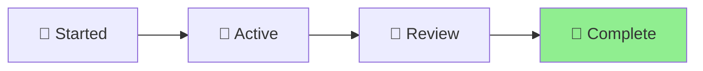

# Standards Help Integration - Status

🪴 Aichaku: Making Standards Knowledge Accessible

[Planning] → [Designing] → [Building] → [Testing] → [**Complete**] ▲

## Project Overview

Enhancing the `aichaku help` command to include modular standards information,
creating a comprehensive knowledge base for developers.

## Current Status 🍃

## Progress Tracking

- [x] Analyzed current help system
- [x] Identified integration points
- [x] Design standards help format
- [x] Create standard guide templates
- [x] Implement help enhancements
- [x] Test integration

## Key Decisions

1. **Integration Approach**: Extend existing help command with `--standards`
   option
2. **Content Format**: Similar to methodology guides with diagrams
3. **Categories**: Maintain existing categories (security, architecture, etc.)
4. **Cross-linking**: Connect help and standards commands

## Next Steps

1. Design standard help content format
2. Create example guides for key standards
3. Implement help command enhancements
4. Add navigation between methodologies and standards
