# Project Status: Standards Integration

## 🪴 Aichaku: Standards Integration Progress

[Planning] → [Development] → [**Testing**] → [Complete] ▲

Progress: ████████████████░░░░ 80% 🌿

```mermaid
graph LR
    A[🌱 Started] --> B[🌿 Active]
    B --> C[🌳 Testing]
    C --> D[🍃 Complete]
    style C fill:#90EE90
```

## Current Phase: Testing & Refinement

### Completed Tasks

- ✅ Hooks command implementation
- ✅ Standards command with user choice interface
- ✅ Enhanced integrate command with dual sections
- ✅ Standard content files creation
- ✅ User feedback incorporated (branding, UX improvements)

### In Progress

- 🔄 Testing integration workflow
- 🔄 Documentation updates
- 🔄 Fix `help --all` to show documentation standards
- 🔄 Polish CLI help output consistency (`--help` vs `help`)

### Upcoming

- 📋 Role-based prompting system
- 📋 MCP code reviewer implementation
- 📋 SECURITY_WORKFLOWS.md placement

## Key Achievements

1. **Modular Standards System**: Users can now select from 15+ standards
2. **Enhanced Integration**: CLAUDE.md supports both methodology and standards
3. **Improved UX**: Clear guidance on what users CAN do next
4. **Consistent Branding**: 🪴 Aichaku identity throughout

## Risk Areas

- None identified - implementation proceeding smoothly

## Next Actions

1. Complete testing of all command combinations
2. Begin role-based prompting system design
3. Plan MCP server architecture

---

_Last Updated: 2025-01-13_
