# MCP Automatic Integration Improvements

## Status

🌿 **Phase**: Solution Shaped **Started**: 2025-07-11 **Progress**: [Problem] → [**Shaping**] → [Building] → [Complete]
▲

```mermaid
graph LR
    A[🌱 Problem Identified] --> B[🌿 Solution Shaped]
    B --> C[🌳 Implementation]
    C --> D[🍃 Testing & Release]
    style B fill:#90EE90
```

## Problem Statement

Claude Code is not automatically using the MCP server tools when generating documentation, requiring manual intervention
to achieve the desired quality and standards compliance.

## Key Issues

1. MCP tools are available but not being invoked
2. Documentation generation happens without standards checking
3. No automatic review or linting of generated content
4. Users must manually request MCP tool usage

## Goal

Make MCP tool usage automatic and transparent whenever Claude Code performs tasks that would benefit from review,
linting, or standards checking.

## Project Completion

**Completion Date**: 2025-08-01\
**Final Status**: 🍃 COMPLETED - All MCP automatic integration objectives met and project deliverables completed.

This project has been successfully finished and is ready to be moved to the done directory.

---

_Project completed and archived on 2025-08-01_
