# MCP Server Management Improvements

## Status

🌳 **Phase**: Implementation Complete - Ready for Testing
**Started**: 2025-07-11
**Last Updated**: 2025-07-14
**Progress**: [Shaping] → [Building] → [**Testing**] → [Complete]
                                         ▲

```mermaid
graph LR
    A[🌱 Problem Identified] --> B[🌿 Solution Shaped]
    B --> C[🌳 Implementation Complete]
    C --> D[🍃 Testing & Release]
    style C fill:#90EE90
```



## Implementation Status - MOSTLY COMPLETE ✅

### ✅ **Phase 1: Process Management** - COMPLETED
- ✅ **PIDManager class** - Full PID file tracking implementation
- ✅ **MCPProcessManager** - Cross-platform process management  
- ✅ **Start/Stop/Restart commands** - Working across platforms
- ✅ **Process metadata** - Uptime, memory, CPU tracking

### ✅ **Phase 2: Enhanced Status Display** - COMPLETED
- ✅ **Rich status output** - Shows version, PID, uptime, memory usage
- ✅ **Installation detection** - Binary path and version info
- ✅ **Multi-server support** - Tracks multiple MCP servers
- ✅ **Color-coded status** - Visual indicators for running/stopped

### ✅ **Phase 3: Better UX** - COMPLETED
- ✅ **HTTP/SSE Server** - For multiple Claude Code instances
- ✅ **Server status command** - Process ID tracking and session management
- ✅ **Cross-platform compatibility** - Works on macOS, Linux, Windows
- ✅ **Clear command structure** - All planned commands implemented

## Current Implementation

### Available Commands:
```bash
aichaku mcp --status         # Enhanced status with PID, version, uptime ✅
aichaku mcp --start          # Start MCP server ✅
aichaku mcp --stop           # Stop MCP server ✅  
aichaku mcp --restart        # Restart MCP server ✅
aichaku mcp --start-server   # Start HTTP/SSE server ✅
aichaku mcp --server-status  # Show HTTP/SSE server status with PID ✅
```

### Status Display Example:
```
🔍 MCP Servers Status
✓ Installed - Binary: ~/.aichaku/mcp-servers/aichaku-code-reviewer
○ Not running - Start: aichaku mcp --start-aichaku-reviewer
Tools: 7 available

🔍 MCP HTTP/SSE Server Status
✅ Server is running - URL: http://127.0.0.1:7182
Process ID: 38184 - Active sessions: 0
```

## Remaining Work

### ⏳ **Minor Improvements Needed:**
- [ ] `--upgrade` command implementation (version checking + binary replacement)
- [ ] Enhanced version display in status (current vs latest available)
- [ ] Embedded version info in binaries
- [ ] Auto-update confirmation flow

### 📋 **Next Steps:**
1. Complete upgrade command functionality
2. Add version checking against GitHub releases
3. Test upgrade flow end-to-end
4. Move to done/ folder

## Assessment

**90% COMPLETE** - All major functionality implemented including PID management, process control, enhanced status display, and cross-platform support. Only upgrade functionality remains.